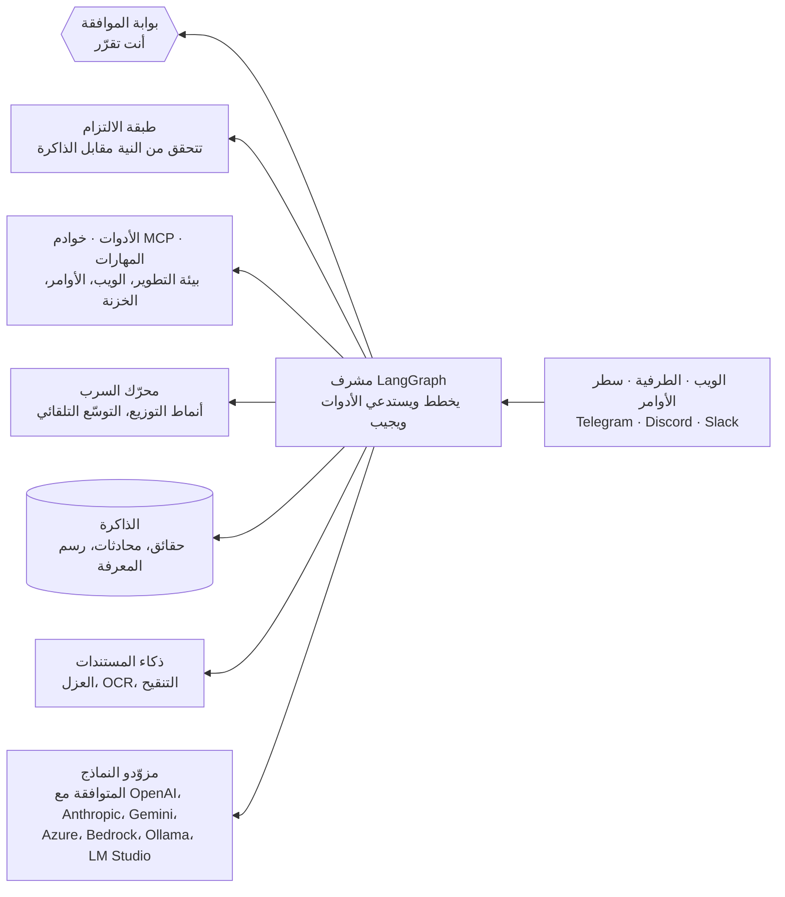

<div align="center">

  

  # كاظمه

  **وكيل ذكاء اصطناعي مستضاف ذاتيًا يستأذنك قبل أن يتصرّف.**

  وكيل واحد يتحدث العربية والإنجليزية على حدٍّ سواء، تصل إليه من المتصفح
  والطرفية وTelegram وDiscord وSlack. يعمل في مستودعك، ويبحث ويكتب وينشر،
  ويدير مواعيدك؛ ويتوقف لينتظر موافقتك قبل أي خطوة فيها خطر، ويتذكر ما
  تخبره به، ويقول لك صراحةً حين يفشل بدل أن يختلق جوابًا.

  <p>
    <a href="https://github.com/Mubder/kazma/actions/workflows/ci.yml"></a>
    <a href="LICENSE"></a>
    <a href="https://www.python.org/downloads/"></a>
    <a href="https://kazma.ai/ar/docs/security/prompt-injection/"></a>
    <a href="https://kazma.ai/ar/"></a>
  </p>

  <b><a href="#البدء-السريع">التثبيت</a></b> ·
  <b><a href="https://kazma.ai/ar/docs/">التوثيق</a></b> ·
  <b><a href="#ما-تحصل-عليه">الميزات</a></b> ·
  <b><a href="#الأمان-بالأرقام">الأمان</a></b> ·
  <b><a href="README.md">English</a></b>

</div>

<p align="center">
  
</p>

---

## البدء السريع

**تحتاج إلى:** Python من 3.11 إلى 3.14 (يُنصح بـ 3.12 أو 3.13)، وGit، ونموذج
واحد: مفتاح API من مزوّد (OpenAI أو Anthropic أو Google أو DeepSeek أو
OpenRouter و[غيرها](https://kazma.ai/ar/docs/configuration/))، أو نموذج يعمل
محليًا في Ollama أو LM Studio.

### 1. سكربت الإعداد (موصى به)

**على Linux أو macOS أو WSL**

```bash
git clone https://github.com/Mubder/kazma.git
cd kazma
./setup.sh
source .venv/bin/activate
kazma serve
```

**على Windows (PowerShell)**

```powershell
git clone https://github.com/Mubder/kazma.git
cd kazma
.\setup.ps1
.venv\Scripts\Activate.ps1
kazma serve
```

افتح **http://127.0.0.1:9090**. في الزيارة الأولى تطلب صفحة المحادثة مزوّدًا
ومفتاحه ونموذجًا، وبعدها تصبح كاظمه جاهزة للحديث.

يثبّت السكربت [`uv`](https://docs.astral.sh/uv/) إن لم يكن موجودًا، وينشئ
`.venv` مع الحزم الإضافية `rag` و`dev` و`tui`، وينسخ `.env.example` إلى
`.env`، ويتحقق من الاستيرادات الأساسية.

### 2. Docker Compose

```bash
git clone https://github.com/Mubder/kazma.git
cd kazma
cp .env.example .env
docker compose up -d --build
```

قبل التشغيل، ضع في `.env` قيمةً لـ `KAZMA_SECRET` (ولّدها بـ
`openssl rand -hex 32`) ومفتاح مزوّد. تجيب كاظمه على
**http://localhost:9090** (غيّر `HOST_PORT` لاستخدام منفذ آخر). ملاحظات
الإنتاج وPostgres وKubernetes في [النشر](https://kazma.ai/ar/docs/deployment/).

<details>
<summary><b>3. التثبيت اليدوي (uv أو pip)</b></summary>

```bash
# uv
uv venv --python 3.13
uv sync --extra rag --extra dev --extra tui     # or: uv sync --all-extras

# pip — Linux / macOS / WSL
python3 -m venv .venv && source .venv/bin/activate
pip install -e ".[rag,dev,tui]"

# pip — Windows PowerShell
py -3.13 -m venv .venv
.venv\Scripts\Activate.ps1
pip install -e ".[rag,dev,tui]"
```

التثبيت العادي `pip install -e .` يشمل بالفعل الوكيل وواجهة الويب والواجهة
الطرفية وبوابات تطبيقات المحادثة والسرب، والحزمة الإضافية `rag` تضيف ذاكرة
المتجهات. لا توجد حزمة إضافية باسم `[cli]`، فأمر `kazma-cli` مضمّن في الحزمة.
تُثبَّت كاظمه من هذا المستودع، وأسماؤها على PyPI محجوزة ولا تحمل أي شيفرة.

</details>

### طرق أخرى للوصول

```bash
kazma ask "ما الملفات التي تبني رسم المشرف؟"   # إجابة واحدة تُبثّ في الطرفية
kazma-tui                                       # الواجهة الطرفية
```

<div dir="rtl">

| الصفحة | العنوان |
|---|---|
| المحادثة | `http://127.0.0.1:9090/` |
| لوحة التحكم | `http://127.0.0.1:9090/dashboard` |
| بيئة التطوير المتكاملة | `http://127.0.0.1:9090/ide` |
| الذاكرة | `http://127.0.0.1:9090/memory` |
| المستندات | `http://127.0.0.1:9090/documents` |

</div>

للوصول إلى كاظمه من Telegram أو Discord أو Slack، أضف رمز البوت في
**الإعدادات ← المحوّلات والمسارات**، وزر **اختبار** هناك يخبرك بما يعمل وما
ينقص. انظر [البوابات والمنصات](https://kazma.ai/ar/docs/gateways-and-platforms/).

### التحديث

من مجلد التثبيت، والبيئة الافتراضية مفعّلة:

```bash
python -m kazma_cli update
```

يسحب الأمر الفرع `main`، ويعيد تثبيت الحزم، وفي التثبيت الذي يشرف عليه
الحارس يوقف الخادم ويعيد تشغيله نيابةً عنك. على Windows شغّله بهذه الطريقة لا
بـ `kazma update`، لأن `kazma.exe` العامل لا يستطيع استبدال نفسه. انظر
[تحديث كاظمه](https://kazma.ai/ar/docs/ops/kazma-update/).

<details>
<summary><b>التشغيل كخدمة (الحارس)</b></summary>

على جهاز يشرف فيه الحارس `KazmaAgent` على الخادم (مهمة مجدولة في Windows، أو
systemd، أو launchd)، طبّق `git pull` بأمر واحد بدل إيقاف `python` يدويًا، فالحارس
سيقاوم ذلك:

```bash
.venv/bin/python scripts/service/kazma_guard.py --reload   # Windows: .venv\Scripts\python.exe
.venv/bin/python scripts/service/kazma_guard.py --status
```

ينتظر `--reload` ظهور `Kazma is up. build …`، ويبلّغ `--status` عن
`supervision : active` و`server : healthy (ready)`. لتثبيت الحارس:
`python scripts/service/kazma_guard.py --install`. وعلى Windows شغّل كاظمه عبر
`kazma serve` أو الحارس، لا عبر `python -m uvicorn`. متى يعيد الحارس التشغيل
ومتى يتجاوز العطل: [النشر §6](https://kazma.ai/ar/docs/deployment/).

</details>

خطوة بخطوة، مع الإعداد وحل المشكلات: [البدء السريع](https://kazma.ai/ar/docs/quickstart/).

---

## ما تحصل عليه

**موافقة قبل الخطوات الخطرة.** كتابة الملفات وتشغيل الأوامر وإرسال الرسائل
والنشر كلها تنتظر موافقتك، على كل واجهة، من سجل موافقات واحد، فكل موافقة تسمّي
السؤال الذي تجيب عنه. وأي أداة لم يصنّفها أحد تُحجز افتراضيًا. وقبل أي أثر
دائم، كتذكير أو تغيير في الإعداد، تتحقق طبقة الالتزام منه مقابل ما أخبرت به
كاظمه، فلا يستطيع النموذج أن يستبدل كلامك بتخمين.
← [الأمان والسلامة](https://kazma.ai/ar/docs/security-and-safety/)

**ذاكرة تراها وتصحّحها.** تحفظ الحقائق متى قيلت ومتى كانت صحيحة. لا تصل
ذكرى إلى النموذج إلا إذا تجاوزت عتبةً مقيسة، وكل إجابة تُظهر الذاكرة التي
استخدمتها. اكتب نص **«عني»** الذي تقرؤه كل إجابة، وانسَ ذكرى أو محادثة كاملة،
وأبقِ محادثة خارج الذاكرة، وصدّر كل شيء. والأرشفة تنقل الذكرى إلى تخزين بارد
ولا تمحوها أبدًا. ← [الذاكرة](https://kazma.ai/ar/docs/memory-and-rag/)

**وكيل واحد في كل القنوات.** واجهة الويب والواجهة الطرفية وأمر `kazma`
وTelegram وDiscord وSlack كلها تتحدث إلى الوكيل نفسه. يعرض `/sessions`
محادثاتك من كل القنوات، ويستأنف `/session` أيًّا منها حيثما كنت. لكل تطبيق
محادثة قائمة سماح خاصة به، ومعرّفات المنصات تبقى خارج حالة الوكيل.
← [البوابات والمنصات](https://kazma.ai/ar/docs/gateways-and-platforms/)

**شيفرتك مع بيئة تطوير على الويب.** ملفات محصورة في مساحة العمل، وgit وGitHub،
وفهرس للشيفرة، ومراجعة للتعديلات مع تراجع لكل جزء منها، وكلها خلف بوابة
الموافقة نفسها. وجّه مهمة قيد التشغيل بـ `/steer` أو أوقفها بـ `/abort`.
← [المهارات وMCP والأدوات](https://kazma.ai/ar/docs/skills-mcp-and-tools/)

**المكتبة المعرفية والبحث المعمّق.** مكتبات من مستنداتك وصفحاتك ومواقعك يبحث
فيها الوكيل حين يحتاجها السؤال، أو تُضمّ إلى كل طلب في المكتبات التي تختارها.
والبحث المعمّق خط معالجة متعدد المصادر ينتهي بتقرير مكتوب كامل، لا بإجابة بحث
سريعة. ← [المكتبة المعرفية](https://kazma.ai/ar/docs/knowledge-base-and-rag/) ·
[البحث على الويب](https://kazma.ai/ar/docs/web-research/)

**استوديو إكس.** اكتب منشورات X وجدولها وأدرها عبر الواجهة البرمجية الرسمية،
والمنشور الذي يكتبه الوكيل ينتظر موافقتك قبل أن يُنشر.
← [ناشر X](https://kazma.ai/ar/docs/x-publisher/)

**تنسيق السرب.** ستة أنماط توزيع (الإرسال، والبث، وخط المعالجة بنقاط تحقق،
والتفرّع مع التصويت، والاستشارة، والتوزيع المشروط)، وعمّال يُنشَؤون من قوالب
عند الحاجة، وأفضل نموذج لكل مهمة، وقاطع دائرة لكل عامل.
← [تنسيق السرب](https://kazma.ai/ar/docs/swarm-orchestration/)

**المستندات.** استلام معزول، وفحوص للسياسات، وClamAV اختياري، وتحليل وOCR في
عمليات فرعية محدودة الموارد، وتحويل وتنقيح وفهرسة في المكتبات المعرفية. وتظهر
المستندات العربية ومختلطة الاتجاه بشكل صحيح، كتلةً كتلة.
← [ذكاء المستندات](https://kazma.ai/ar/docs/document-intelligence/)

**أي نموذج.** كل واجهة برمجية متوافقة مع OpenAI، إضافةً إلى Anthropic وGemini
وAzure OpenAI وAWS Bedrock بدعم أصلي، وOllama وLM Studio محليًا، وأدوات أي خادم
MCP. والانتقال إلى نموذج بديل يُعلَن دائمًا.
← [الإعداد](https://kazma.ai/ar/docs/configuration/)

**العربية والإنجليزية على حدٍّ سواء.** واجهة عربية كاملة من اليمين إلى اليسار،
ونص يتبع لغته في أيٍّ من الواجهتين، ومعالجة للهجتين الخليجية والكويتية، وOCR
عربي، وصوت عربي. ← [الميزات العربية والثقافية](https://kazma.ai/ar/docs/arabic-cultural-features/) ·
[الصوت والوسائط](https://kazma.ai/ar/docs/voice-and-media/)

**تدير نفسها.** حارس يعيد التشغيل عند العطل الحقيقي ويتجاوز انقطاع قاعدة
البيانات العابر، ونسخ احتياطية مشفّرة خارج الموقع مع تمرين استعادة يومي، وفحص
صحة عميق، وتقرير أسبوعي بآليات التعافي التي عملت فعلًا.
← [التعافي من الكوارث](https://kazma.ai/ar/docs/ops/disaster-recovery/)

كل شيء في قائمة واحدة مُتحقَّق منها مقابل الشيفرة (بالإنجليزية): [What Kazma does](docs/FEATURES.md).

<div dir="rtl">

| العربية | English |
|---|---|
|  |  |

</div>

---

## تنسيق السرب في 30 ثانية

```bash
kazma swarm dispatch auto "راجع أمان الشيفرة واكتب تقريرًا"

kazma swarm worker add researcher --role researcher
kazma swarm worker add coder --role coder
kazma swarm pipeline --workers researcher,coder "ابحث في تدفق رمز الجهاز في OAuth2 ثم نفّذ مزوّدًا له"
kazma swarm fanout --workers researcher,coder --aggregation vote "اختر أفضل فهرس لهذا المخطط"
kazma swarm history
```

مع `auto` تختار كاظمه عاملًا للمهمة، أو تنشئ واحدًا من قوالبها. وتُجمع نتائج
التفرّع بإحدى الطرق: `collect` أو `first_valid` أو `merge_all` أو `vote` أو
`synthesize`. وتعرض **لوحة السرب** على الويب (`/swarm`) عمليات التوزيع الجارية
وحالة العمّال وسجل المهام، وفي الواجهة الطرفية تبويب للسرب. والمحرّك مفعّل في
ملف `kazma.yaml` المرفق:

```yaml
swarm:
  enabled: true
```

---

## كيف تعمل



كل واجهة تشغّل رسم المشرف نفسه. واستدعاء الأداة الخطرة يتوقف عند بوابة
الموافقة في مساراتها الثلاثة كلها: مقاطعة الرسم في المحادثة، وناقل السرب، ونقاط
تحقق خطوط المعالجة. والنص غير الموثوق (صفحات الويب، ونتائج البحث، والمستندات،
والذاكرة المسترجعة، ومخرجات MCP) يصل إلى النموذج داخل سياج يصفه بأنه بيانات لا
تعليمات.

للتعمق: [البنية المعمارية](https://kazma.ai/ar/docs/architecture/) ·
[خريطة النظام](https://kazma.ai/ar/docs/reference/architecture-system-map/) ·
[خريطة التشخيص](https://kazma.ai/ar/docs/diagnosis-map/).

**التوسّع.** يمكن تشغيل مهام المستندات على عدة نسخ (عبر مطالبات `SKIP LOCKED`
في Postgres)، أما بيانات المستندات الوصفية ومخازن SQLite فتعمل على نسخة واحدة.
وكاظمه مصممة لـ**مشغّل واحد لكل تثبيت**: من يشغّلها يملك السيطرة الكاملة
ويستطيع إيقاف أي حماية، والحمايات تحميك من الوكيل ومن المحتوى غير الموثوق الذي
يقرؤه. انظر [لمن صُمّمت كاظمه](https://kazma.ai/ar/docs/security/threat-model/).

---

## الأمان بالأرقام

تنشر كاظمه قياساتها الأمنية: المنهج، والأرقام، والنتائج التي لا تصبّ في صالحها.

**حقن التعليمات على [AgentDojo](https://agentdojo.spylab.ai)**، وهو معيار عام
بنته مجموعة مستقلة (Debenedetti وآخرون، NeurIPS 2024)، بواقع 996 تشغيلة لكل
شرط، وكل شرط قيس أربع مرات:

<div dir="rtl">

| الشرط | نجاح الهجوم | التصرّف بناءً على الحمولة |
|---|:---:|:---:|
| بلا حماية | 18.1% | 24.1% |
| Spotlighting (فاصل من 4 محارف، من الأدبيات) | 11.6% | 18.6% |
| **سياج كاظمه** (لافتة داخل النص بنحو 800 محرف) | **10.4%** | **14.8%** |

</div>

تسييج مخرجات الأدوات غير الموثوقة **ينجح** (p < 0.001 مقارنةً بغياب الحماية)،
و**لا يمكن تمييزه عن فاصل من أربعة محارف** (p = 0.39). نذكر الأمرين معًا لأن
المراجع يحتاج إلى الثاني. وكل رقم يُعاد اشتقاقه من سجلات التشغيل المحفوظة في
المستودع، دون مفتاح API.

<div dir="rtl">

| | |
|---|---|
| [**حقن التعليمات: الأرقام**](https://kazma.ai/ar/docs/security/prompt-injection/) | القياس كاملًا، والحمولات التي ما زالت تنجح، وإعادة إنتاج مجانية دون اتصال |
| [**نموذج التهديد**](https://kazma.ai/ar/docs/security/threat-model/) | ما يوقفه كل حدّ وما لا يوقفه. الموافقة رضا، لا احتواء |
| [**الثغرات المعروفة**](https://kazma.ai/ar/docs/security/known-gaps/) | أين تقف الأمور: العيوب المفتوحة، وقرارات المالك، والحدود المقبولة، مؤرّخة ومع الأدلة |

</div>

---

## التوثيق

التوثيق الكامل على **[kazma.ai/ar/docs](https://kazma.ai/ar/docs/)** بالعربية،
و[بالإنجليزية](https://kazma.ai/docs/).

<div dir="rtl">

| ابدأ من هنا | شغّلها | افهمها |
|---|---|---|
| [البدء السريع](https://kazma.ai/ar/docs/quickstart/) | [النشر](https://kazma.ai/ar/docs/deployment/) | [البنية المعمارية](https://kazma.ai/ar/docs/architecture/) |
| [الإعداد](https://kazma.ai/ar/docs/configuration/) | [قائمة الإنتاج](https://kazma.ai/ar/docs/production-checklist/) | [الذاكرة](https://kazma.ai/ar/docs/memory-and-rag/) |
| [متغيرات البيئة](https://kazma.ai/ar/docs/environment-variables/) | [التعافي من الكوارث](https://kazma.ai/ar/docs/ops/disaster-recovery/) | [تنسيق السرب](https://kazma.ai/ar/docs/swarm-orchestration/) |
| [البوابات والمنصات](https://kazma.ai/ar/docs/gateways-and-platforms/) | [تحديث كاظمه](https://kazma.ai/ar/docs/ops/kazma-update/) | [الأمان والسلامة](https://kazma.ai/ar/docs/security-and-safety/) |
| [أوامر الشرطة المائلة](https://kazma.ai/ar/docs/slash-commands/) | [خريطة التشخيص](https://kazma.ai/ar/docs/diagnosis-map/) | [الجديد في كاظمه](https://kazma.ai/ar/docs/recent-features/) |

</div>

---

## هيكل المستودع

<div dir="rtl">

| الحزمة | المسار | ما تحتويه |
|---|---|---|
| **`kazma-core`** | [`kazma-core/`](kazma-core/) | مشغّل الوكيل، ومزوّدو النماذج، ومحرّك السرب، والذاكرة، وخلفية بيئة التطوير، وخدمات الأمان والمستندات |
| **`kazma-gateway`** | [`kazma-gateway/`](kazma-gateway/) | محوّلات Telegram وDiscord وSlack، وأوامر الشرطة المائلة، والتوجيه أثناء التنفيذ |
| **`kazma-ui`** | [`kazma-ui/`](kazma-ui/) | تطبيق الويب (FastAPI): محادثة متدفقة، ولوحة تحكم، وبيئة تطوير، ووحدة تحكم الذاكرة |
| **`kazma-tui`** | [`kazma-tui/`](kazma-tui/) | الواجهة الطرفية (Textual)، والمحرر، ومدير المستندات |
| **`kazma-skills`** | [`kazma-skills/`](kazma-skills/) | المهارات الأصلية: منصة المستندات، والخزنة، والبحث، والزاحف، وقواعد البيانات وغيرها |
| **`kazma-cli`** | [`kazma-cli/`](kazma-cli/) | أمر `kazma`: `serve` و`ask` و`swarm` و`migrate` و`update` و`docs` وACP |

</div>

---

## التطوير

```bash
python scripts/fast_test.py        # المجموعة الكاملة، على دفعات ومتحمّلة للأعطال (10-20 دقيقة)
pytest tests/test_static_gates.py  # بوابات الفئات وحدها
```

تعمل اختبارات الوحدات والتكامل والأمان والمتصفح (Playwright) في CI مع كل دفع،
ونجاحها تُظهره [شارة CI](https://github.com/Mubder/kazma/actions/workflows/ci.yml)
لا رقم مكتوب هنا. كل إصلاح يصل مع اختبار للخطأ، وبوابة لفئة الخطأ كلها، ودليل
على أن البوابة تفشل على الشيفرة القديمة، والقواعد في [`AGENTS.md`](AGENTS.md).
ولا يُسمح لعدد معالجات الاستثناءات العمياء إلا بالنقصان، وتُبقي بوابات ثابتة
الاستدعاءات المعطِّلة بعيدًا عن حلقة الأحداث.

---

## أصل الاسم

أُخذ اسم كاظمه من **كاظمة**، الواحة الساحلية في الكويت: شبكة من آبار المياه
العذبة على طرق التجارة بين الحضارات. وفي عام 633م كانت موقع **معركة ذات
السلاسل**، حين هُزم جيش ربط صفوفه بالسلاسل في جدار واحد جامد أمام مناورة مرنة
لا مركزية. وتستعير كاظمه الصورة: آبار عميقة من الذاكرة، وبوابة واحدة إلى قنوات
كثيرة، وأسراب بدل خطوط معالجة هشّة.

---

## المساهمة والأمان والتواصل

- **المساهمة:** [CONTRIBUTING.md](CONTRIBUTING.md) · [سجل التغييرات](CHANGELOG.md) (بالإنجليزية)
- **بلاغات الأمان:** [SECURITY.md](SECURITY.md)، أو
  [بلاغ خاص](https://github.com/Mubder/kazma/security/advisories/new)، أو
  [admin@kazma.ai](mailto:admin@kazma.ai)
- **الموقع:** [kazma.ai](https://kazma.ai/ar/)
- **التجارب والشراكات:** [admin@kazma.ai](mailto:admin@kazma.ai)

## الترخيص

تصدر كاظمه بموجب [رخصة MIT](LICENSE).
