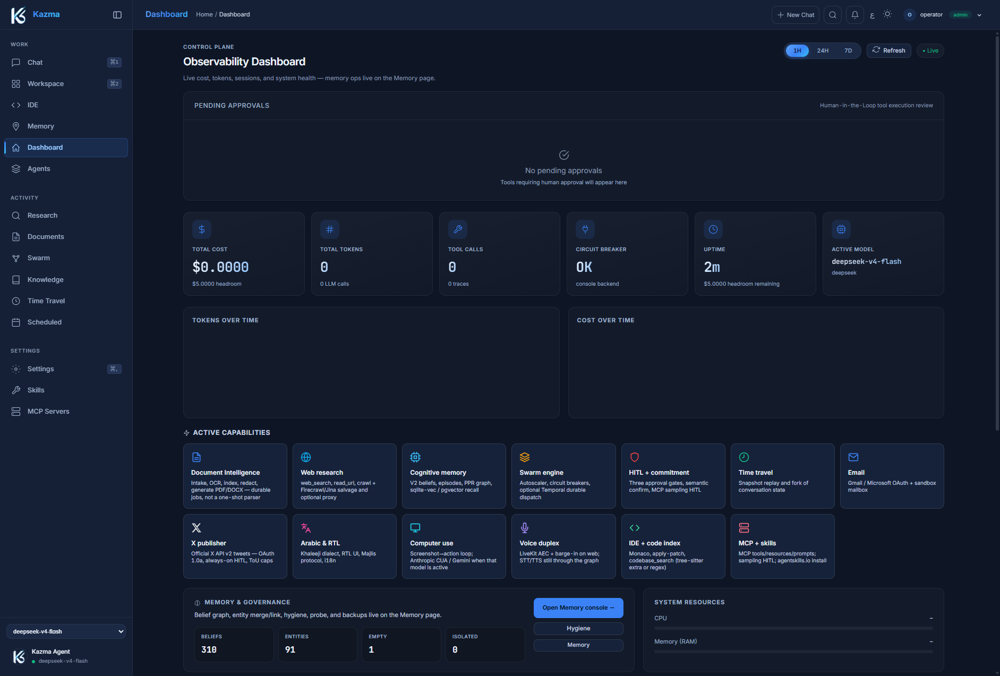
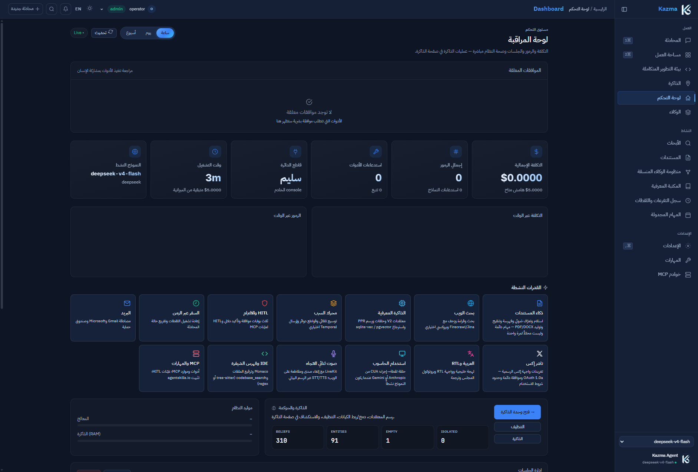

<div align="center">

  

  # Kazma Agent Framework

  **A self-hosted AI agent that can edit your repository, message your team and run your schedule — and that stops, asks, or fails honestly instead of inventing an answer.**

  <p align="center">
    <a href="LICENSE"></a>
    <a href="https://www.python.org/downloads/"></a>
    <a href="https://github.com/Mubder/kazma/actions/workflows/ci.yml"></a>
    <a href="https://github.com/Mubder/kazma/actions"></a>
    <a href="docs/INJECTION.md"></a>
    <a href="https://github.com/Mubder/kazma/commits/main"></a>
    <a href="https://kazma.ai"></a>
  </p>

  <a href="#quick-start">Quick start</a> ·
  <a href="docs/docs/guide/architecture.md">Architecture</a> ·
  <a href="docs/INJECTION.md">Safety measurements</a> ·
  <a href="docs/KNOWN_GAPS.md">Known gaps</a> ·
  <a href="docs/docs/intro.md">Documentation</a>

</div>

---

## Overview

Kazma is an open-source, self-hosted agent platform. One LangGraph supervisor
serves every surface — Web, TUI, CLI, Telegram, Discord and Slack — with
human approval before dangerous actions, a commitment layer that resolves
intent against memory before acting, and a long-term memory you can inspect
and correct. When a model call fails, Kazma says so (`⚠️`) rather than
producing a plausible reply.

<!-- Metrics auto-verified from METRICS.md -->
| Codebase Volume | Test Suite | Engineering Depth | Platforms Supported |
|---|---|---|---|
| **~484K LOC** (384K Python code + 40K JS) | **8,876 test functions** (731 test files) | **3,922+ commits** across 7 packages | **Web, TUI, CLI, Telegram, Discord, Slack** |

<p align="center">
  
</p>

---

## Quick start

> **Prerequisites:** Python 3.11–3.14 (3.12 or 3.13 recommended). The setup
> script installs [`uv`](https://docs.astral.sh/uv/) if it is missing.

```bash
git clone https://github.com/Mubder/kazma.git
cd kazma
./setup.sh          # Linux / macOS / WSL   (Windows: .\setup.ps1)
kazma serve         # http://127.0.0.1:9090
```

The setup script creates `.venv`, syncs the `rag`, `dev` and `tui` extras,
copies `.env.example` to `.env` if needed, and checks the core imports. On
first run the web UI asks for one provider key and one model.

| Page | URL |
|---|---|
| Chat | `http://127.0.0.1:9090/` |
| Dashboard and control plane | `http://127.0.0.1:9090/dashboard` |
| Web IDE | `http://127.0.0.1:9090/ide` |
| Documents | `http://127.0.0.1:9090/documents` |
| Memory and belief graph | `http://127.0.0.1:9090/memory` |

Other entry points:

```bash
kazma ask "What files define the supervisor graph?"   # one-shot, streams to stdout
kazma-tui                                              # terminal UI
```

<details>
<summary><b>Manual installation (uv or pip)</b></summary>

```bash
# uv
uv venv --python 3.13
uv sync --extra rag --extra dev --extra tui     # or: uv sync --all-extras

# pip — Linux / macOS / WSL
python3 -m venv .venv && source .venv/bin/activate
pip install -e ".[rag,dev,tui]"

# pip — Windows PowerShell
py -3.13 -m venv .venv
.venv\Scripts\Activate.ps1
pip install -e ".[rag,dev,tui]"
```

There is no `[cli]` extra — `kazma-cli` ships in the wheel. Provider keys
other than `OPENAI_API_KEY` are set in **Settings → Providers** or
`kazma.yaml`; see [Configuration](docs/docs/guide/configuration.md).

</details>

<details>
<summary><b>Running under the supervisor (applying updates)</b></summary>

On a host where the `KazmaAgent` guard supervises the server (Scheduled
Task, systemd or launchd), apply a `git pull` with one command. Killing
`python` or `uvicorn` by hand fights the guard.

```bash
.venv/bin/python scripts/service/kazma_guard.py --reload   # Windows: .venv\Scripts\python.exe
.venv/bin/python scripts/service/kazma_guard.py --status
```

Wait for `Kazma is up. build …`. `--status` should report
`supervision : active` and `server : healthy (ready)`. First-time install:
`python scripts/service/kazma_guard.py --install`. On Windows, start through
`kazma serve` or the guard rather than `python -m uvicorn`, which forces an
event loop the Postgres checkpointer cannot use. What the guard does and does
not restart for: [Deployment §6](docs/docs/guide/deployment.md).

</details>

Full guide: [Quickstart](docs/docs/guide/quickstart.md).

---

## Measured, not asserted

Kazma publishes its safety measurements — the method, the numbers, and the
results that do not flatter it.

**Prompt injection on [AgentDojo](https://agentdojo.spylab.ai)**, a public
benchmark by an independent group (Debenedetti et al., NeurIPS 2024), 996 runs
per condition, each condition measured four times:

| Condition | Attack success | Acted on the payload |
|---|:---:|:---:|
| Undefended | 18.1% | 24.1% |
| Spotlighting — 4-character delimiter, from the literature | 11.6% | 18.6% |
| **Kazma's fence** — ~800-character in-band banner | **10.4%** | **14.8%** |

Fencing untrusted tool output **works** (p < 0.001 against undefended). It
also **cannot be distinguished from a four-character delimiter** (p = 0.39).
Both statements are reported because a reviewer needs the second one. The same
page records that two of the four suites measure nothing on the model used,
a favourable result that was refused, and a measured 5.7-point noise floor at
temperature 0.

Every figure re-derives from the committed run logs, without an API key:

```bash
scripts/agentdojo_bench.py --analyze --suite banking   # raw counts + obedience
scripts/agentdojo_bench.py --report slack,banking      # pooled figures + p-values
```

| | |
|---|---|
| [**Prompt injection: the numbers**](docs/INJECTION.md) | The full measurement, the payloads that still land, and a free offline reproduction |
| [**Threat model**](docs/THREAT_MODEL.md) | What each boundary stops and, stated plainly, what it does not. Approval is consent, not containment |
| [**Known gaps**](docs/KNOWN_GAPS.md) | Open weaknesses, dated, with the evidence for each |

---

## Architecture

```
                                 ┌──────────────────────────────────────────────────────────┐
                                 │          Client Layer (Web / TUI / Chat / CLI)           │
                                 └────────────────────────────┬─────────────────────────────┘
                                                              │
                                                              ▼
┌─────────────────────────────────────────────────────────────────────────────────────────────────────────────────────────────┐
│                                                   KAZMA GATEWAY & SUPERVISOR                                                │
│  ┌───────────────────────────────┐     ┌───────────────────────────────┐     ┌───────────────────────────────────────────┐  │
│  │     Platform Isolation        │ ──► │   LangGraph ReAct Supervisor  │ ◄─► │          Three-Path HITL Gate             │  │
│  │ (SessionStore / Zero Leakage) │     │ (Context Trim / Turn Ledger)  │     │  (Graph Interrupt / Swarm Bus / Pipeline) │  │
│  └───────────────────────────────┘     └───────────────┬───────────────┘     └───────────────────────────────────────────┘  │
│                                                        │                                                                    │
│  ┌───────────────────────────────┐     ┌───────────────┴───────────────┐     ┌───────────────────────────────────────────┐  │
│  │   Document Intelligence       │ ──► │     Commitment Layer Gate     │ ◄── │          Local & Native Tools             │  │
│  │ (CAS / Subprocess OCR / Parse)│     │     (Resolve-Before-Act)      │     │    (IDE / Web / Bash / Python / Vault)    │  │
│  └───────────────────────────────┘     └───────────────┬───────────────┘     └───────────────────────────────────────────┘  │
└────────────────────────────────────────────────────────┼────────────────────────────────────────────────────────────────────┘
                                                         │
                                                         ▼
┌─────────────────────────────────────────────────────────────────────────────────────────────────────────────────────────────┐
│                                              SWARM & MEMORY TIER                                                            │
│  ┌─────────────────────────────────────────────┐                    ┌────────────────────────────────────────────────────┐  │
│  │                SwarmEngine                  │                    │               V2 Cognitive Memory                  │  │
│  │  • 6 Dispatch Patterns (Fan-Out/Pipeline/..)│                    │  • Bi-Temporal Belief Graph (valid_from/until)     │  │
│  │  • Dynamic Autoscaler (Coder/Researcher/..) │                    │  • Local Ego-Graph Personalized PageRank (PPR)     │  │
│  │  • ReliabilityRegistry (Breakers & Retries) │                    │  • Sparse (FTS5) + Dense (sqlite-vec / pgvector)   │  │
│  │  • Best-Model-Per-Task Prompt Classifier    │                    │  • Procedural DAGs + 24h Reconsolidation           │  │
│  └─────────────────────────────────────────────┘                    └────────────────────────────────────────────────────┘  │
└────────────────────────────────────────────────────────┬────────────────────────────────────────────────────────────────────┘
                                                         │
                                                         ▼
┌─────────────────────────────────────────────────────────────────────────────────────────────────────────────────────────────┐
│                                           EXECUTION & PROVIDER INFRASTRUCTURE                                               │
│  OpenAI-Compatible Layer • Anthropic Native • Google Gemini (ADC) • Azure OpenAI • AWS Bedrock • Ollama / LM Studio • MCP   │
└─────────────────────────────────────────────────────────────────────────────────────────────────────────────────────────────┘
```

Deep dives: [System architecture](docs/docs/guide/architecture.md) ·
[Monorepo system map](docs/ARCHITECTURE_AND_SYSTEM_MAP.md) ·
[Diagnosis map](docs/docs/ops/diagnosis-map.md).

---

## Capabilities

### Safety and human approval
- **Fail-closed approval gates.** Dangerous tools pause for a human on three
  independent paths — the graph interrupt (chat), the swarm bus (multi-agent
  and IDE) and pipeline checkpoints — backed by one gate registry, so an
  approval always names the question it answers. Unclassified tools are gated
  by default.
- **Commitment layer.** Before a durable effect (a reminder, a post, a config
  change) Kazma resolves it against memory; a model cannot overwrite what you
  told it with something it inferred.
- **Honest boundaries.** Approval is consent, not containment — it does not
  sandbox what you approve. `KAZMA_ALLOW_YOLO=1` turns the gate off for most
  danger tools. See the [Threat model](docs/THREAT_MODEL.md).
- **Platform allowlists.** Telegram, Discord and Slack each take an
  **Allowed user IDs** list (Settings → Connectors). Behind a reverse proxy,
  declare it in `KAZMA_TRUSTED_PROXIES`.
- **Supporting controls.** HMAC-verified skills, an AES-256-GCM credential
  vault, and untrusted content — web pages, search results, recalled memory,
  documents, MCP resources — wrapped in a prompt fence
  ([measured above](#measured-not-asserted)).

### Memory
- **Bi-temporal beliefs** with assertion and validity time, so knowledge can
  change without rewriting history.
- **Associative recall** through a personalized-PageRank ego graph, and hybrid
  episode retrieval (FTS5 plus dense vectors via `sqlite-vec`, or pgvector on
  Postgres).
- **Rule-based lifecycle.** Memories you still recall are never archived, and
  an archived one keeps a summary. See [Memory](docs/docs/guide/memory-and-rag.md).
- **Backups you can restore.** WAL-safe SQLite copies, a filtered `pg_dump`,
  and graph exports, snapshotted into encrypted, deduplicated
  [restic](https://restic.net) repositories (local and offsite), with a
  daily restore drill. See [Disaster recovery](docs/docs/ops/disaster-recovery.md).

### Swarm orchestration
- **Six dispatch patterns:** dispatch, broadcast, pipeline (with checkpoint
  gates), fan-out (with aggregation or voting), consult and conditional.
- **Autoscaling** from templates with best-model-per-task selection — no
  pre-registered workers required.
- **Reliability:** per-worker circuit breakers with half-open probes, retry
  policies, output validators and handoff-cycle guards.

### Documents
- **Quarantined intake:** content-addressed storage, MIME/OOXML/PDF policy
  checks, macro rejection and optional ClamAV scanning.
- **Isolated processing:** parsing and OCR for PDF, DOCX, XLSX and PPTX in
  resource-limited subprocesses.
- **Operations:** leased background jobs, dead-letter queues, conversion,
  split/merge/redaction, and indexing into Knowledge Libraries. Arabic and
  mixed-direction documents render correctly per block.

### Workspace and interfaces
- **Web IDE and TUI editor** with workspace-scoped execution and file-aware
  chat; all writes go through the same approval gate.
- **In-flight steering:** `/steer`, `/steer!` and `/abort` redirect a running
  task.
- **Platform isolation:** chat and user IDs stay in the session store and
  never enter the agent's graph state.
- **Arabic-native:** Gulf and Kuwaiti dialect handling and full
  right-to-left Web and TUI interfaces.

### Operations
- A **supervisor (guard)** that restarts on real failure, not on a missed
  probe or a machine out of ports, and pages over Telegram.
- A **weekly resilience report** that counts which recovery mechanisms
  actually fired, including event-loop stalls.
- A **deep health canary** (`/health/deep`) that performs a real round trip
  through config, memory recall, workspace binding and the database.

---

## Swarm Orchestration in 30 seconds

```bash
kazma swarm dispatch --workers auto "Analyze the codebase security posture and produce a report"
kazma swarm pipeline --workers researcher,coder,validator "Implement an OAuth2 device code provider"
kazma swarm fanout --workers a,b,c --aggregation vote "Select optimal database schema indexing"
kazma swarm history
kazma swarm metrics
```

The web **Swarm Panel** (`/swarm`) shows live dispatch telemetry, worker
status and task history; the TUI has a Swarm tab. Enable the engine in
`kazma.yaml`:

```yaml
swarm:
  enabled: true
  workers: []   # the autoscaler spawns specialists on demand
```

**Multi-replica honesty: Jobs can multi-replica** (document jobs, via
Postgres `SKIP LOCKED` claims); document metadata and the SQLite stores remain
single-replica — see [Document Intelligence](docs/docs/guide/document-intelligence.md).

---

## Where Kazma fits

Kazma is an application, not a library: it ships the agent, its interfaces,
its memory and its operations together. It is a good fit if you want

- one agent reachable from a browser, a terminal and your team's chat tools;
- human approval in front of anything that writes, sends or executes;
- long-lived memory you can inspect, correct and restore from backup;
- to run it yourself, on your own hardware, under the MIT license.

If you need a framework to compose your own agent from primitives, a library
such as LangGraph — which Kazma is built on — is the better starting point.

---

## Interface

Observability dashboard in English and Arabic:

| English | Arabic |
|---|---|
|  |  |

---

## Repository layout

| Package | Path | Description |
|---|---|---|
| **`kazma-core`** | [`kazma-core/`](kazma-core/) | Agent runner, provider layer, swarm engine, V2 memory, IDE backend, safety and document services |
| **`kazma-gateway`** | [`kazma-gateway/`](kazma-gateway/) | Telegram, Discord and Slack adapters, slash commands, in-flight steering |
| **`kazma-ui`** | [`kazma-ui/`](kazma-ui/) | FastAPI web application, streaming chat, dashboard, Web IDE, memory console |
| **`kazma-tui`** | [`kazma-tui/`](kazma-tui/) | Textual terminal UI, editor and documents manager |
| **`kazma-skills`** | [`kazma-skills/`](kazma-skills/) | Native skills (document platform, vault, research, crawler, database, …) |
| **`kazma-cli`** | [`kazma-cli/`](kazma-cli/) | The `kazma` command (`serve`, `ask`, `swarm`, `migrate`, `docs`, ACP) |

---

## Engineering practice

- **Every fix lands with a gate for its class.** A regression test for the
  bug, a static check that enumerates the sibling code paths, and a negative
  control proving the check fails on the old code. The rules are in
  [`AGENTS.md`](AGENTS.md); the evidence for each is in
  [Known gaps](docs/KNOWN_GAPS.md).
- **Debt may only go down.** Blind and silent exception handlers are counted
  by a ratchet that fails the build if the number rises.
- **The event loop is protected.** Static gates keep blocking database, DNS,
  TLS-setup and known-slow helper calls out of async code, and loop stalls
  are recorded with full stacks and reported weekly.

---

## Testing

The suite covers unit, integration, swarm reliability, security and browser
(Playwright) layers. Whether it passes is the [CI badge](https://github.com/Mubder/kazma/actions/workflows/ci.yml),
not a number written here.

```bash
python scripts/fast_test.py        # full suite, chunked and crash-tolerant (~10 min)
pytest tests/test_static_gates.py  # the class gates on their own
ruff check kazma-core/
```

`scripts/fast_test.py` is the supported way to run everything: it isolates
chunks so a native-library crash in one file cannot hide the results of the
rest.

---

## Documentation

| Guide | Description |
|---|---|
| [Documentation home](docs/docs/intro.md) | Map of every guide |
| [System architecture](docs/docs/guide/architecture.md) | Supervisor graph, ReAct loop and engine internals |
| [Monorepo system map](docs/ARCHITECTURE_AND_SYSTEM_MAP.md) | Every module and how they connect |
| [Memory](docs/docs/guide/memory-and-rag.md) | Beliefs, recall, lifecycle and consolidation |
| [Swarm orchestration](docs/docs/guide/swarm-orchestration.md) | Dispatch patterns, reliability and autoscaling |
| [Document Intelligence](docs/docs/guide/document-intelligence.md) | Intake, quarantine, OCR and redaction |
| [Security and HITL](docs/docs/guide/security-and-safety.md) | Approval paths, prompt fencing and the vault |
| [Configuration](docs/docs/guide/configuration.md) · [Environment variables](docs/docs/reference/environment-variables.md) | `kazma.yaml`, Settings and the environment |
| [Disaster recovery](docs/docs/ops/disaster-recovery.md) | Backups, retention and restore |
| [Production checklist](docs/docs/ops/production-checklist.md) | Before exposing Kazma to other users |
| [Threat model](docs/THREAT_MODEL.md) · [Prompt injection](docs/INJECTION.md) · [Known gaps](docs/KNOWN_GAPS.md) | What is protected, how well, and what is not |
| [Changelog](CHANGELOG.md) | What changed and why |

---

## Origin of the name

**Kazma** (كاظمة) was a coastal oasis in Kuwait — a network of freshwater
wells and a gateway on the trade routes between civilizations. In 633 CE it
was the site of the **Battle of Chains** (ذات السلاسل), where an army that had
chained its ranks into one rigid wall was defeated by adaptive, decentralized
manoeuvre. The architecture borrows the image: deep wells of memory, one
gateway to many channels, and decentralized swarms instead of brittle
pipelines.

---

## Contributing, security and contact

- **Contributing:** see [CONTRIBUTING.md](CONTRIBUTING.md).
- **Security reports:** see [SECURITY.md](SECURITY.md), open a
  [private advisory](https://github.com/Mubder/kazma/security/advisories/new),
  or email [admin@kazma.ai](mailto:admin@kazma.ai).
- **Website:** [kazma.ai](https://kazma.ai) · **Live demo:** [kazma-demo.fly.dev](https://kazma-demo.fly.dev/)
- **Pilots and partnerships:** [admin@kazma.ai](mailto:admin@kazma.ai)

## License

Kazma is released under the [MIT License](LICENSE).
