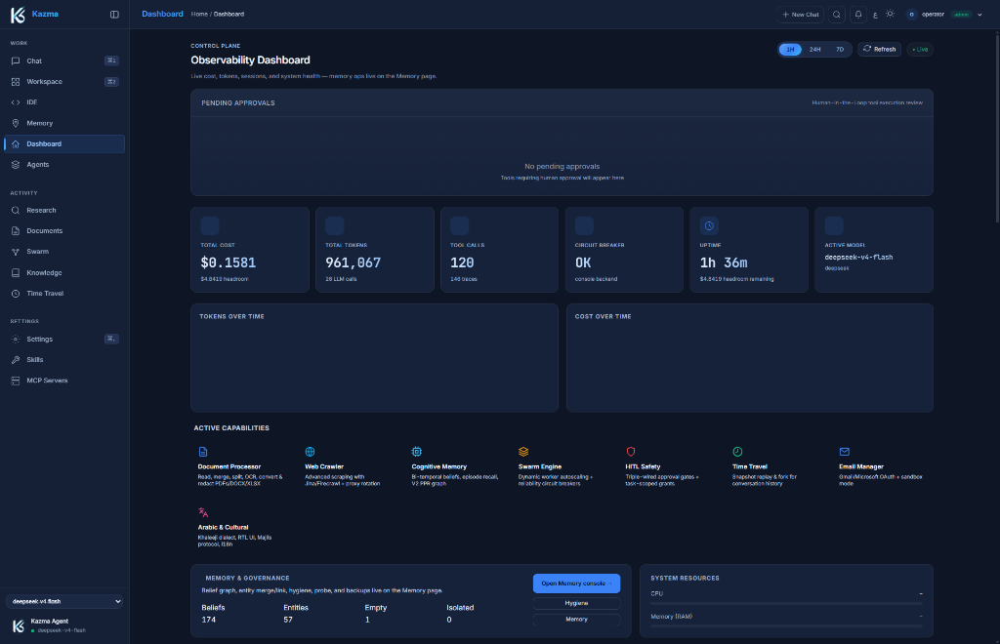

<div align="center">

  

  # Kazma Agent Framework

  **Multi-Agent AI System with Bi-Temporal Cognitive Memory, Swarm Orchestration, and Autonomous Reliability**

  <p align="center">
    <a href="LICENSE"></a>
    <a href="https://www.python.org/downloads/"></a>
    <a href="https://github.com/Mubder/kazma/actions"></a>
    <a href="https://github.com/Mubder/kazma/commits/main"></a>
    <a href="https://kazma.ai"></a>
  </p>

</div>

---

## ⚡ Executive Summary & Metrics

Kazma is an open-source, self-hosted multi-agent framework architected for continuous autonomous operation. Built on a LangGraph supervisor core, Kazma integrates a **Pure V2 Cognitive Memory Engine** (bi-temporal belief graph + PPR associative recall), **autonomous swarm orchestration** with dynamic template autoscaling, **triple-wired Human-In-The-Loop (HITL) safety gates**, an **enterprise document intelligence platform**, and **cross-platform dispatch** (Web, TUI, CLI, Telegram, Discord, Slack) with native Arabic and Khaleeji dialect intelligence.

<!-- Metrics auto-verified from METRICS.md -->
| Codebase Volume | Test Suite | Engineering Depth | Platforms Supported |
|---|---|---|---|
| **~315K LOC** (252K Python code + 28K JS) | **5,608 automated tests** (394 test suites) | **2,430+ commits** across 7 packages | **Web, TUI, CLI, Telegram, Discord, Slack** |

<p align="center">
  
</p>

---

## 📖 Origin & Architectural Philosophy

**Kazma** (كاظمة) was an ancient coastal oasis in Kuwait — a vital network of freshwater wells and a flourishing gateway connecting global trade routes between civilizations. In 633 CE, it was the site of the historic **Battle of Chains** (ذات السلاسل): an opposing army chained its ranks into a rigid, monolithic wall, which Khalid ibn al-Walid decisively dismantled through adaptive, decentralized maneuvering.

Kazma's architecture reflects those foundational principles:

- 🏜️ **The Wells (Cognitive Memory)** — Deep, persistent memory that retains context across months of sessions, allowing agents to draw from bi-temporal knowledge graphs rather than forgetting across turns.
- 🚪 **The Gateway (Multi-Platform Control)** — A unified supervisor brain seamlessly routing execution between Web UI, Textual TUI, CLI, and team messaging channels (Telegram, Discord, Slack).
- ⚔️ **Breaking the Chains (Decentralized Swarms)** — Monolithic, rigid pipelines inevitably fail in real-world deployments. Kazma replaces brittle linear chains with decentralized swarm dispatch patterns, dynamic worker autoscaling, and self-healing execution loops.

---

## 🏛️ System Architecture

```
                                 ┌──────────────────────────────────────────────────────────┐
                                 │          Client Layer (Web / TUI / Chat / CLI)           │
                                 └────────────────────────────┬─────────────────────────────┘
                                                              │
                                                              ▼
┌─────────────────────────────────────────────────────────────────────────────────────────────────────────────────────────────┐
│                                                   KAZMA GATEWAY & SUPERVISOR                                                │
│  ┌───────────────────────────────┐     ┌───────────────────────────────┐     ┌───────────────────────────────────────────┐  │
│  │     Platform Isolation        │ ──► │   LangGraph ReAct Supervisor  │ ◄─► │         Triple-Wired HITL Gate            │  │
│  │ (SessionStore / Zero Leakage) │     │  (80% Compaction / Turn Ledger)│     │  (Graph Interrupt / Swarm Bus / Pipeline) │  │
│  └───────────────────────────────┘     └───────────────┬───────────────┘     └───────────────────────────────────────────┘  │
│                                                        │                                                                    │
│  ┌───────────────────────────────┐     ┌───────────────┴───────────────┐     ┌───────────────────────────────────────────┐  │
│  │   Document Intelligence       │ ──► │     Commitment Layer Gate     │ ◄── │          Local & Native Tools             │  │
│  │ (CAS / Subprocess OCR / Parse)│     │     (Resolve-Before-Act)      │     │    (IDE / Web / Bash / Python / Vault)    │  │
│  └───────────────────────────────┘     └───────────────┬───────────────┘     └───────────────────────────────────────────┘  │
└────────────────────────────────────────────────────────┼────────────────────────────────────────────────────────────────────┘
                                                         │
                                                         ▼
┌─────────────────────────────────────────────────────────────────────────────────────────────────────────────────────────────┐
│                                             AUTONOMOUS SWARM & MEMORY TIER                                                  │
│  ┌─────────────────────────────────────────────┐                    ┌────────────────────────────────────────────────────┐  │
│  │                SwarmEngine                  │                    │            Pure V2 Cognitive Memory                │  │
│  │  • 6 Dispatch Patterns (Fan-Out/Pipeline/..)│                    │  • Bi-Temporal Belief Graph (valid_from/until)     │  │
│  │  • Dynamic Autoscaler (Coder/Researcher/..) │                    │  • Local Ego-Graph Personalized PageRank (PPR)     │  │
│  │  • ReliabilityRegistry (Breakers & Retries) │                    │  • Sparse (FTS5) + Dense (sqlite-vec / pgvector)  │  │
│  │  • Best-Model-Per-Task Prompt Classifier    │                    │  • Parametric Action DAGs + 24h Auto-Consolidation │  │
│  └─────────────────────────────────────────────┘                    └────────────────────────────────────────────────────┘  │
└────────────────────────────────────────────────────────┬────────────────────────────────────────────────────────────────────┘
                                                         │
                                                         ▼
┌─────────────────────────────────────────────────────────────────────────────────────────────────────────────────────────────┐
│                                           EXECUTION & PROVIDER INFRASTRUCTURE                                               │
│  OpenAI-Compatible Layer • Anthropic Native • Google Gemini (ADC) • Azure OpenAI • AWS Bedrock • Ollama / LM Studio • MCP   │
└─────────────────────────────────────────────────────────────────────────────────────────────────────────────────────────────┘
```

---

## 🌟 Core Capabilities

### 🧠 Pure V2 Cognitive Memory Engine
- **Bi-Temporal Beliefs**: Tracks factual assertions with both assertion time and validity time (`valid_from` / `valid_until`) to manage evolving knowledge without hallucination or historical corruption.
- **Associative PPR Graph**: Multi-hop associative recall via Local Ego-Graph Personalized PageRank over belief entities.
- **Hybrid Episode Retrieval**: Recalls past dialogues and actions using Reciprocal Rank Fusion (RRF) over lexical search (SQLite FTS5, or ILIKE on Postgres-primary) and dense embeddings (`sqlite-vec` on one node, **pgvector** when Postgres is on).
- **Automated Ops & Hygiene**: Background task queue (`memory_ops.db`) for post-turn extraction, entity reconciliation, micro-consolidation, and automated backups — WAL-safe SQLite copies, `pg_dump` of Postgres and a JSONL export of the graph, snapshotted into deduplicated, encrypted [restic](https://restic.net) repositories (local + offsite) with time-based retention and a verified one-command restore. See [Disaster Recovery](docs/docs/ops/disaster-recovery.md).
- **Prompt-Fenced Injection**: Wraps untrusted text in `<kazma:data untrusted>` fences that tell the model the enclosed content is observation data, never instructions. Covers recalled memories, compaction summaries, procedural hints, skill frontmatter, document knowledge, swarm phonebook entries, and — since the 2026-08-29 audit — fetched web pages (`read_url`), search results (`web_search`), saved research chunks, and third-party MCP resource bodies. Note this is a mitigation, not a guarantee: a fence lowers the authority of injected text, it does not make the model immune to it.

### 🔁 Operator reload & Windows event loop
- **Pick up code with one command:** `python scripts/service/kazma_guard.py --reload`. Do not kill `python`/`uvicorn` by hand — the `KazmaAgent` scheduled task will otherwise supervise a stale port holder or refuse to start. Cold start is typically 3–5 minutes; wait for `Kazma is up. build …`.
- **Windows:** the server runs a `SelectorEventLoop` so psycopg-async (LangGraph `AsyncPostgresSaver`) can connect. `python -m uvicorn` hardcodes Proactor on Windows and silently falls back to SQLite checkpoints — start via `kazma serve` / the guard, not raw uvicorn.
- **Filesystem tools** (`file_search`, `file_read`, `file_list`, …) offload disk I/O off the event loop so a large tree cannot freeze SSE, WebSockets, or `/health/ready`.

### 🐝 Swarm Orchestration & Dynamic Autoscaler
- **6 Dispatch Patterns**: `dispatch` (single specialist), `broadcast` (all workers), `pipeline` (sequential handoffs with checkpoint gates), `fan-out` (parallel execution with aggregation/voting), `consult` (independent expert reviews + synthesis), and `conditional` (router-driven execution).
- **Dynamic Autoscaling**: Zero pre-configured worker requirement. Automatically classifies task prompts and dynamically spins up specialized workers (`coder`, `researcher`, `generalist`) with best-model-per-task selection (coding, reasoning, vision).
- **Reliability & Circuit Breakers**: Per-worker circuit breakers, half-open probes, exponential retry policies, output schema validators, and handoff cycle guards ($depth \le 5$).

### 🛡️ Non-Stop Execution & Self-Healing Watchdog
- **Heartbeat & Stall Detection**: `supervised_invoke()` watchdog tracks execution heartbeats across graph nodes and automatically mitigates stalls.
- **Checkpoint Rollback & Reflection**: Automatically rolls back corrupted turns to clean checkpoint states and injects `[KAZMA RECOVERY]` system reflection notes to re-steer the model.
- **Model Failover Chains**: Transparent multi-provider failover with per-provider cooldown timers and durable SQLite call ledgers (`kazma-data/llm_calls.db`).

### 🔒 Triple-Wired HITL Safety Architecture
- **Default-deny HITL (2026-08-29 audit):** unclassified tools are gated; a Settings `require_approval_for` list **adds** to the tier floor and can no longer un-gate `shell_exec` by omission. Behind a reverse proxy, set `KAZMA_TRUSTED_PROXIES` to the proxy's address (peer 127.0.0.1 is not a credential).
- **Layer 1 (Graph Interrupt)**: Single-agent execution pauses at the LangGraph level before mutating actions (`file_write`, `shell_exec`, `vault_retrieve`). Resumable from Web, TUI, or chat channels.
- **Layer 2 (Swarm Bus)**: Multi-agent and CLI swarm dispatches enforce fail-closed approval gates on platform adapters (`FanOutBusAdapter` across Telegram/Discord/Slack).
- **Layer 3 (Pipeline Checkpoints)**: Multi-stage pipeline tasks pause at designated approval milestones.
- **Security & Sandboxing**: HMAC-SHA256 skill verification, prompt-fenced Soul mutation deltas, and AES-256-GCM encrypted credential vault.

### 📄 Enterprise Document Intelligence Platform
- **Intake & Quarantine**: Content-addressed storage (CAS) with MIME/OOXML/PDF policy validation, macro rejection, and optional ClamAV malware scanning.
- **Isolated Subprocess Processing**: Secure OCR and document parsing for PDF, DOCX, XLSX, and PPTX formats in isolated sub-processes.
- **Document Ops**: Background job leases (`SKIP LOCKED`), dead-letter queues, format conversions, PDF split/merge/redaction, and one-click indexing into Knowledge Library corpora.

### 💻 Dual IDE & Multi-Platform Gateway
- **Web IDE & Textual TUI**: Integrated editor with syntax highlighting, multi-tab navigation, workspace-scoped terminal execution, and file-aware AI chat.
- **Live In-Flight Steering**: Intercept and guide active operations in real time using `/steer` (soft nudge), `/steer!` (pause & inject), or `/abort`.
- **Zero-Leak Platform Isolation**: Session identifiers (`chat_id`, `user_id`) remain isolated within `SessionStore` and never pollute LangGraph state.

### 🌐 Arabic-Native & Cultural Alignment
- **Majlis Protocol**: Native handling of Arabic nuances, formal MSA, and Gulf/Kuwaiti dialect expressions.
- **Bilingual Interface**: Full Right-To-Left (RTL) Web and TUI interfaces with culturally aligned interaction models.

---

## 🆚 Why Kazma?

| Capability | Kazma | LangChain / LangGraph | CrewAI | AutoGPT | n8n |
|---|:---:|:---:|:---:|:---:|:---:|
| **Architecture** | **Full-Stack Autonomous System** | Library / Graph Primitive | Multi-Agent Framework | Autonomous Agent | Workflow Automation |
| **Cognitive Memory** | ✅ **Bi-temporal + PPR Graph** | ⚠️ Basic Vector Store | ⚠️ Simple RAG | ⚠️ Basic Memory | ❌ None |
| **HITL Safety Gates** | ✅ **Triple-Wired (Fail-Closed)** | ⚠️ Manual code wiring | ❌ None | ⚠️ Basic prompt | ⚠️ Workflow pause |
| **Swarm Orchestration** | ✅ **6 Patterns + Autoscaler** | ⚠️ Custom Graph | ✅ Role-based | ❌ Single loop | ❌ Node based |
| **Built-in Web & TUI IDE**| ✅ **Included (Dual Interface)** | ❌ None | ❌ None | ❌ None | ❌ None |
| **Observability Control Plane**| ✅ **Live Dashboard Included** | ⚠️ External (LangSmith) | ❌ None | ❌ None | ⚠️ Execution log |
| **Document Intelligence**| ✅ **Quarantine + OCR + Redact**| ⚠️ Ad-hoc loaders | ❌ None | ❌ None | ⚠️ Basic parsers |
| **Multi-Platform Gateways**| ✅ **Web, TUI, Telegram, Discord, Slack** | ❌ None | ❌ None | ❌ None | ⚠️ Webhook triggers |
| **Arabic-Native & RTL** | ✅ **Full Native & Dialect Support** | ❌ None | ❌ None | ❌ None | ❌ None |
| **Self-Hosted License** | ✅ **MIT (100% Open Source)** | ✅ MIT | ✅ MIT | ✅ MIT | ⚠️ Fair-Code |

---

## 📸 Interface Showcase *(Legacy Previews — Updating Soon)*

> [!NOTE]
> The screenshots below reflect earlier UI builds. Updated high-resolution previews for the IDE, Swarm Builder, and Skills consoles matching the latest V2 Control Plane design system are currently being refreshed.

| Observability Dashboard | Integrated Web IDE | Real-Time Chat & HITL |
|---|---|---|
|  |  |  |

| Swarm Task Builder | Native Skills Manager | MCP Server Marketplace |
|---|---|---|
|  |  |  |

---

## 🚀 Quick Start

> **Prerequisites:** Python 3.11+ (Python 3.12 or 3.13 recommended).

### 1. Installation

```bash
git clone https://github.com/Mubder/kazma.git
cd kazma
```

**Recommended: `uv` (Fast & Reproducible)**
```bash
uv venv --python 3.13
uv sync --all-extras
```

**Alternative: `pip` + `venv`**
```bash
# Linux / macOS / WSL
python3 -m venv .venv
source .venv/bin/activate
pip install -e ".[all]"

# Windows (PowerShell)
py -3.13 -m venv .venv
.venv\Scripts\Activate.ps1
pip install -e ".[all]"
```

### 2. Environment Configuration

```bash
# Copy template environment file
cp .env.example .env    # Linux / macOS
Copy-Item .env.example .env  # Windows PowerShell
```

Edit `.env` to configure your preferred LLM provider key:
```dotenv
# OpenAI, DeepSeek, Anthropic, Gemini, Groq, or Local Ollama
OPENAI_API_KEY=sk-...
# Optional: DEEPSEEK_API_KEY=... | ANTHROPIC_API_KEY=... | GEMINI_API_KEY=...
```

### 3. Launch Kazma

```bash
# Start the full Web UI & Gateway (http://127.0.0.1:9090)
kazma serve

# Run the agent without the web server (tokens stream to stdout)
kazma ask "What files define the supervisor graph?"

# Or launch the Terminal User Interface (TUI)
kazma-tui
```

Navigate to:
- **Dashboard & Control Plane**: `http://127.0.0.1:9090/`
- **Web IDE**: `http://127.0.0.1:9090/ide`
- **Document Intelligence**: `http://127.0.0.1:9090/documents`
- **Memory & Belief Graph**: `http://127.0.0.1:9090/memory`

---

## 🐝 Swarm Orchestration in 30 Seconds

```bash
# 1. Dispatch a dynamic specialist task (Autoscaler selects best model)
kazma swarm dispatch --workers auto "Analyze the codebase security posture and produce a report"

# 2. Run a structured multi-stage pipeline
kazma swarm pipeline --workers researcher,coder,validator "Implement an OAuth2 device code provider"

# 3. Parallel consensus voting (Fan-Out)
kazma swarm fanout --workers a,b,c --aggregation vote "Select optimal database schema indexing"

# 4. View live telemetry and history
kazma swarm history
kazma swarm metrics
```

Prefer a UI? The web **Swarm Panel** (`/swarm`) shows live dispatch telemetry,
worker status, and task history — and the TUI has a Swarm tab. Enable the
engine in `kazma.yaml`:

```yaml
swarm:
  enabled: true
  workers: []   # the autoscaler spawns specialists on demand
```

**Multi-replica honesty: Jobs can multi-replica** (document jobs, via
Postgres `SKIP LOCKED` claims); document *metadata* and the SQLite stores
remain single-replica — see `docs/docs/guide/document-intelligence.md`.

---

## 📦 Monorepo Package Structure

| Package | Path | Description |
|---|---|---|
| **`kazma-core`** | [`kazma-core/`](file:///G:/GitHubRepos/kazma/kazma-core) | Agent runner, LLM provider matrix, SwarmEngine, V2 Cognitive Memory, IDE backend, Safety & Document services |
| **`kazma-gateway`** | [`kazma-gateway/`](file:///G:/GitHubRepos/kazma/kazma-gateway) | Multi-platform adapters (Telegram, Discord, Slack), slash commands, in-flight task steering (`/steer`) |
| **`kazma-ui`** | [`kazma-ui/`](file:///G:/GitHubRepos/kazma/kazma-ui) | FastAPI web application, SSE streaming chat, Observability Dashboard, Web IDE, and Memory console |
| **`kazma-tui`** | [`kazma-tui/`](file:///G:/GitHubRepos/kazma/kazma-tui) | Textual-based rich terminal dashboard, interactive IDE, and Documents manager |
| **`kazma-skills`** | [`kazma-skills/`](file:///G:/GitHubRepos/kazma/kazma-skills) | Native certified skills (Document Platform, Encrypted Vault, Deep Research, Crawler, Database) |
| **`kazma-cli`** | [`kazma-cli/`](file:///G:/GitHubRepos/kazma/kazma-cli) | Unified command-line interface (`kazma ask`, `kazma acp`, `kazma swarm`, `kazma migrate`, `kazma serve`) |

---

## 🧪 Testing & Verification

Kazma maintains rigorous test coverage with **5,600+ automated test cases** across unit, integration, swarm reliability, and security layers:

```bash
# Run complete test suite
pytest

# Code quality and type validation
ruff check kazma-core/
mypy kazma-core/
```

---

## 📚 Documentation Reference

| Guide | Description |
|---|---|
| [System Architecture](docs/docs/guide/architecture.md) | In-depth breakdown of supervisor graph, ReAct loops, and engine internals |
| [Monorepo System Map](docs/ARCHITECTURE_AND_SYSTEM_MAP.md) | Comprehensive structural map of all monorepo modules and dependencies |
| [V2 Cognitive Memory](docs/docs/guide/memory-and-rag.md) | Bi-temporal belief stores, PPR graphs, and automated reconsolidation |
| [Swarm Orchestration](docs/docs/guide/swarm-orchestration.md) | Dispatch patterns, reliability breakers, autoscaling, and worker lifecycle |
| [Document Intelligence](docs/docs/guide/document-intelligence.md) | Secure ingestion pipelines, quarantined OCR, and redaction operations |
| [Security & HITL](docs/docs/guide/security-and-safety.md) | Triple-wired approval architecture, prompt fencing, and vault encryption |
| [Configuration Reference](docs/docs/guide/configuration.md) | Detailed `kazma.yaml`, environment variables, and provider settings |

---

## 📬 Community & Contact

- 🌐 **Official Website**: [kazma.ai](https://kazma.ai)
- 🐙 **GitHub Repository**: [github.com/Mubder/kazma](https://github.com/Mubder/kazma)
- 💬 **Live Demonstration**: [kazma-demo.fly.dev](https://kazma-demo.fly.dev/)
- 📧 **Pilots, Partnerships & Inquiries**: [admin@kazma.ai](mailto:admin@kazma.ai)
- 🛡️ **Security Vulnerability Reporting**: [admin@kazma.ai](mailto:admin@kazma.ai) · [Security Advisory](https://github.com/Mubder/kazma/security/advisories/new)

---

## 📜 License

This project is licensed under the **MIT License** — see the [LICENSE](LICENSE) file for details.
