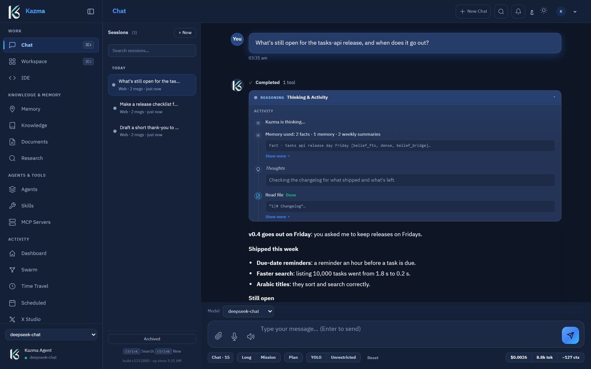
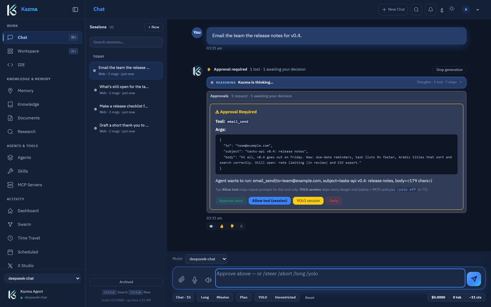
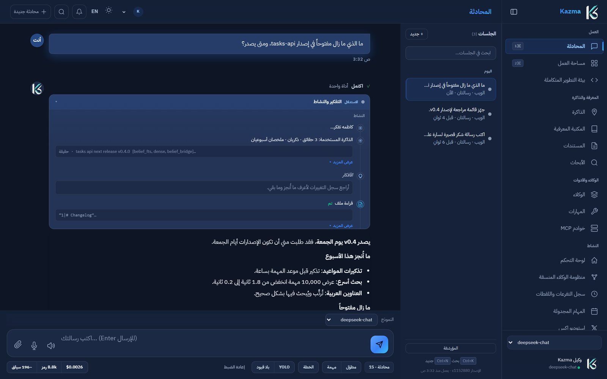
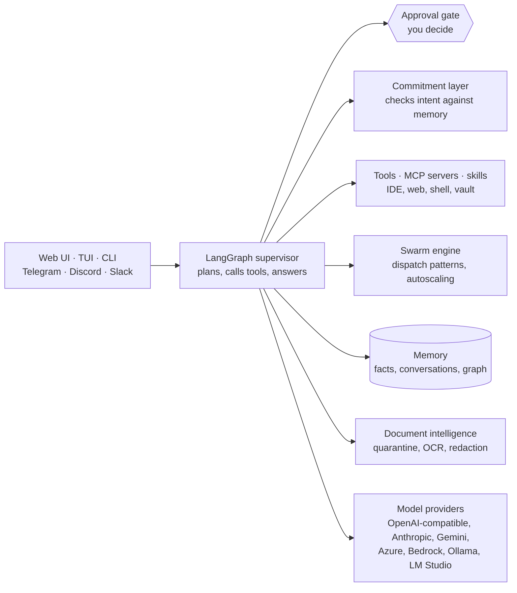

<div align="center">

  

  # Kazma

  **The self-hosted AI agent that asks before it acts.**

  One agent, bilingual in English and Arabic, that you reach from the browser,
  the terminal, Telegram, Discord or Slack. It works in your repository,
  researches, writes and posts, and runs your schedule; it pauses for your
  approval before anything risky, remembers what you tell it, and says so when
  it fails instead of inventing an answer.

  <p>
    <a href="https://github.com/Mubder/kazma/actions/workflows/ci.yml"></a>
    <a href="LICENSE"></a>
    <a href="https://www.python.org/downloads/"></a>
    <a href="https://github.com/Mubder/kazma/actions/workflows/ci.yml"></a>
    <a href="https://kazma.ai/docs/security/prompt-injection/"></a>
    <a href="https://kazma.ai"></a>
  </p>

  <b><a href="#quick-start">Install</a></b> ·
  <b><a href="https://kazma.ai/docs/">Documentation</a></b> ·
  <b><a href="#what-you-get">Features</a></b> ·
  <b><a href="#measured-not-asserted">Security</a></b> ·
  <b><a href="README.ar.md">العربية</a></b>

</div>

<p align="center">
  
</p>

<!-- Metrics auto-verified from METRICS.md -->
| Codebase | Test suite | History | Talk to it from |
|---|---|---|---|
| **~574K LOC** (457K Python code + 43K JS) | **13,234 tests** (970 test files) | **4,192+ commits** across 6 packages | Web · TUI · CLI · Telegram · Discord · Slack |

---

## Quick start

**You need:** Python 3.11 to 3.14 (3.12 or 3.13 recommended), Git, and one model:
an API key from a provider (OpenAI, Anthropic, Google, DeepSeek, OpenRouter and
[others](https://kazma.ai/docs/configuration/)) or a model running locally in
Ollama or LM Studio.

### 1. Setup script (recommended)

**Linux, macOS or WSL**

```bash
git clone https://github.com/Mubder/kazma.git
cd kazma
./setup.sh
source .venv/bin/activate
kazma serve
```

**Windows (PowerShell)**

```powershell
git clone https://github.com/Mubder/kazma.git
cd kazma
.\setup.ps1
.venv\Scripts\Activate.ps1
kazma serve
```

Open **http://127.0.0.1:9090**. On the first visit the chat page asks for a
provider, its key and a model; after that, Kazma is ready to talk.

The script installs [`uv`](https://docs.astral.sh/uv/) if it is missing,
creates `.venv` with the `rag`, `dev` and `tui` extras, copies `.env.example`
to `.env`, and checks the core imports.

### 2. Docker Compose

```bash
git clone https://github.com/Mubder/kazma.git
cd kazma
cp .env.example .env    # set KAZMA_SECRET (openssl rand -hex 32) and a provider key
docker compose up -d --build
```

Kazma answers on **http://localhost:9090** (set `HOST_PORT` to use another
port). Production notes, Postgres and Kubernetes: [Deployment](https://kazma.ai/docs/deployment/).

<details>
<summary><b>3. Manual install (uv or pip)</b></summary>

```bash
# uv
uv venv --python 3.13
uv sync --extra rag --extra dev --extra tui     # or: uv sync --all-extras

# pip — Linux / macOS / WSL
python3 -m venv .venv && source .venv/bin/activate
pip install -e ".[rag,dev,tui]"

# pip — Windows PowerShell
py -3.13 -m venv .venv
.venv\Scripts\Activate.ps1
pip install -e ".[rag,dev,tui]"
```

A plain `pip install -e .` already has the agent, the web UI, the TUI, the
chat-app gateways and the swarm; the `rag` extra adds vector memory. There is
no `[cli]` extra: `kazma-cli` ships in the package. Kazma installs from this
repository; the Kazma names on PyPI are reserved placeholders with no code.

</details>

### Other ways in

```bash
kazma ask "What files define the supervisor graph?"   # one answer, streamed to the terminal
kazma-tui                                              # the terminal UI
```

| Page | Address |
|---|---|
| Chat | `http://127.0.0.1:9090/` |
| Dashboard | `http://127.0.0.1:9090/dashboard` |
| Web IDE | `http://127.0.0.1:9090/ide` |
| Memory | `http://127.0.0.1:9090/memory` |
| Documents | `http://127.0.0.1:9090/documents` |

To reach Kazma from Telegram, Discord or Slack, add the bot's token in
**Settings → Adapters & Routes**; its **Test** button says what works and
what is missing. See [Gateways and platforms](https://kazma.ai/docs/gateways-and-platforms/).

### Updating

From the install folder, with the virtual environment active:

```bash
python -m kazma_cli update
```

It pulls `main`, reinstalls the packages and, on a supervised install, stops
and restarts the server for you. On Windows, run it this way rather than
`kazma update`: a running `kazma.exe` cannot replace itself. See
[Kazma update](https://kazma.ai/docs/ops/kazma-update/).

<details>
<summary><b>Running as a service (the guard)</b></summary>

On a host where the `KazmaAgent` guard supervises the server (a Windows
Scheduled Task, systemd or launchd), apply a `git pull` with one command
instead of killing `python` by hand, which the guard would fight:

```bash
.venv/bin/python scripts/service/kazma_guard.py --reload   # Windows: .venv\Scripts\python.exe
.venv/bin/python scripts/service/kazma_guard.py --status
```

`--reload` waits for `Kazma is up. build …`; `--status` reports
`supervision : active` and `server : healthy (ready)`. To install the guard:
`python scripts/service/kazma_guard.py --install`. On Windows, start Kazma
through `kazma serve` or the guard, never `python -m uvicorn`. What the guard
restarts for, and what it rides out: [Deployment §6](https://kazma.ai/docs/deployment/).

</details>

Step by step, with configuration and troubleshooting: [Quickstart](https://kazma.ai/docs/quickstart/).

---

## What you get

**Approval before risky actions.** Writing files, running commands, sending
messages and posting wait for your yes, on every surface, from one approval
registry, so an approval always names the question it answers. A tool nobody
classified is gated by default. Before a durable effect such as a reminder or
a config change, a commitment layer checks it against what you told Kazma, so
the model cannot overwrite your words with a guess.
→ [Security and safety](https://kazma.ai/docs/security-and-safety/)

**Memory you can see and correct.** Facts keep both when they were said and
when they held. A memory reaches the model only when it clears a measured
threshold, and every answer shows the memory it used. Write an **About me**
that every reply reads; forget a memory or a whole chat, keep a chat out of
memory, export everything. Archiving moves a memory to cold storage and never
erases it. → [Memory](https://kazma.ai/docs/memory-and-rag/)

**One agent, every channel.** The web UI, the TUI, the `kazma` command,
Telegram, Discord and Slack all talk to the same agent. `/sessions` lists your
conversations from every channel, and `/session` picks one up wherever you
are. Each chat app has its own allowlist, and platform IDs stay out of the
agent's state.
→ [Gateways and platforms](https://kazma.ai/docs/gateways-and-platforms/)

**Your code, with a Web IDE.** Workspace-scoped files, git, GitHub, a code
index and patch review with per-hunk rollback, all behind the same approval
gate. Steer a running task with `/steer` or stop it with `/abort`.
→ [Skills, MCP and tools](https://kazma.ai/docs/skills-mcp-and-tools/)

**Knowledge Base and Deep Research.** Libraries of your own documents, pages
and sites that the agent searches when a question needs them, or folds into
every prompt for the libraries you choose. Deep Research runs a multi-source
pipeline that ends in a full written report, not a quick search answer.
→ [Knowledge Base](https://kazma.ai/docs/knowledge-base-and-rag/) · [Deep Research](https://kazma.ai/docs/web-research/)

**X Studio.** Compose, schedule and manage X posts through the official API;
a post the agent writes waits for your approval before it goes out.
→ [X publisher](https://kazma.ai/docs/x-publisher/)

**Swarm orchestration.** Six dispatch patterns (dispatch, broadcast,
pipeline with checkpoints, fan-out with voting, consult, conditional),
workers spawned from templates on demand, the best model per task, and
circuit breakers per worker. → [Swarm orchestration](https://kazma.ai/docs/swarm-orchestration/)

**Documents.** Quarantined intake, policy checks and optional ClamAV,
parsing and OCR in resource-limited subprocesses, conversion, redaction, and
indexing into knowledge libraries. Arabic and mixed-direction documents
render correctly, block by block. → [Document intelligence](https://kazma.ai/docs/document-intelligence/)

**Any model.** Every OpenAI-compatible API, plus native Anthropic, Gemini,
Azure OpenAI and AWS Bedrock, local Ollama and LM Studio, and tools from any
MCP server. A fallback to another model is always announced.
→ [Configuration](https://kazma.ai/docs/configuration/)

**English and Arabic as equals.** A full Arabic interface laid out right to
left, text that follows its own language in either interface, Gulf and
Kuwaiti dialect handling, Arabic OCR and Arabic voice.
→ [Arabic features](https://kazma.ai/docs/arabic-cultural-features/) · [Voice](https://kazma.ai/docs/voice-and-media/)

**Runs itself.** A guard that restarts on real failure and rides out a
database blip, encrypted offsite backups with a daily restore drill, a deep
health check, and a weekly report of which recovery mechanisms actually fired.
→ [Disaster recovery](https://kazma.ai/docs/ops/disaster-recovery/)

Everything, in one list checked against the code: [What Kazma does](docs/FEATURES.md).

| English | العربية |
|---|---|
|  |  |

---

## Swarm Orchestration in 30 seconds

```bash
kazma swarm dispatch auto "Review the codebase's security posture and write a report"

kazma swarm worker add researcher --role researcher
kazma swarm worker add coder --role coder
kazma swarm pipeline --workers researcher,coder "Research OAuth2 device flow, then implement a provider"
kazma swarm fanout --workers researcher,coder --aggregation vote "Pick the best index for this schema"
kazma swarm history
```

`auto` lets Kazma choose a worker, or spawn one from its templates, for the
task. A fan-out's results are combined by `collect`, `first_valid`,
`merge_all`, `vote` or `synthesize`. The web **Swarm Panel** (`/swarm`) shows
live dispatches, worker status and task history, and the TUI has a Swarm tab.
The engine is on in the shipped `kazma.yaml`:

```yaml
swarm:
  enabled: true
```

---

## How it works


```mermaid
flowchart LR
    U["Web UI · TUI · CLI<br/>Telegram · Discord · Slack"] --> S
    S["LangGraph supervisor<br/>plans, calls tools, answers"]
    S --> H{{"Approval gate<br/>you decide"}}
    S --> C["Commitment layer<br/>checks intent against memory"]
    S --> T["Tools · MCP servers · skills<br/>IDE, web, shell, vault"]
    S --> W["Swarm engine<br/>dispatch patterns, autoscaling"]
    S --> M[("Memory<br/>facts, conversations, graph")]
    S --> D["Document intelligence<br/>quarantine, OCR, redaction"]
    S --> P["Model providers<br/>OpenAI-compatible, Anthropic, Gemini,<br/>Azure, Bedrock, Ollama, LM Studio"]
```

Every surface runs the same supervisor graph. A dangerous tool call stops at
the approval gate on all three of its paths: the chat's graph interrupt, the
swarm bus and pipeline checkpoints. Untrusted text (web pages, search results,
documents, recalled memory, MCP output) reaches the model inside a fence that
marks it as data, not instructions.

Deep dives: [Architecture](https://kazma.ai/docs/architecture/) ·
[System map](https://kazma.ai/docs/reference/architecture-system-map/) ·
[Diagnosis map](https://kazma.ai/docs/diagnosis-map/).

**Scaling out.** Document jobs can run on several replicas (Postgres
`SKIP LOCKED` claims); document metadata and the SQLite stores are
single-replica. Kazma is built for **one operator per install**: whoever runs
it has full control and can switch any safeguard off, and the safeguards
protect you from the agent and the untrusted content it reads. See
[who Kazma is for](https://kazma.ai/docs/security/threat-model/).

---

## Measured, not asserted

Kazma publishes its safety measurements: the method, the numbers, and the
results that do not flatter it.

**Prompt injection on [AgentDojo](https://agentdojo.spylab.ai)**, a public
benchmark by an independent group (Debenedetti et al., NeurIPS 2024), 996 runs
per condition, each condition measured four times:

| Condition | Attack success | Acted on the payload |
|---|:---:|:---:|
| Undefended | 18.1% | 24.1% |
| Spotlighting (a 4-character delimiter, from the literature) | 11.6% | 18.6% |
| **Kazma's fence** (an ~800-character in-band banner) | **10.4%** | **14.8%** |

Fencing untrusted tool output **works** (p < 0.001 against undefended), and it
**cannot be told apart from a four-character delimiter** (p = 0.39). Both are
reported, because a reviewer needs the second. Every figure re-derives from
the committed run logs without an API key.

| | |
|---|---|
| [**Prompt injection: the numbers**](https://kazma.ai/docs/security/prompt-injection/) | The full measurement, the payloads that still land, and a free offline reproduction |
| [**Threat model**](https://kazma.ai/docs/security/threat-model/) | What each boundary stops and what it does not. Approval is consent, not containment |
| [**Known gaps**](https://kazma.ai/docs/security/known-gaps/) | Where things stand: open defects, owner decisions and accepted limits, dated, with the evidence |

---

## Documentation

The full documentation is on **[kazma.ai/docs](https://kazma.ai/docs/)**, in
English and [Arabic](https://kazma.ai/ar/docs/).

| Start here | Run it | Understand it |
|---|---|---|
| [Quickstart](https://kazma.ai/docs/quickstart/) | [Deployment](https://kazma.ai/docs/deployment/) | [Architecture](https://kazma.ai/docs/architecture/) |
| [Configuration](https://kazma.ai/docs/configuration/) | [Production checklist](https://kazma.ai/docs/production-checklist/) | [Memory](https://kazma.ai/docs/memory-and-rag/) |
| [Environment variables](https://kazma.ai/docs/environment-variables/) | [Disaster recovery](https://kazma.ai/docs/ops/disaster-recovery/) | [Swarm orchestration](https://kazma.ai/docs/swarm-orchestration/) |
| [Gateways and platforms](https://kazma.ai/docs/gateways-and-platforms/) | [Kazma update](https://kazma.ai/docs/ops/kazma-update/) | [Security and safety](https://kazma.ai/docs/security-and-safety/) |
| [Slash commands](https://kazma.ai/docs/slash-commands/) | [Diagnosis map](https://kazma.ai/docs/diagnosis-map/) | [What's new](https://kazma.ai/docs/recent-features/) |

---

## Repository layout

| Package | Path | What it holds |
|---|---|---|
| **`kazma-core`** | [`kazma-core/`](kazma-core/) | Agent runner, model providers, swarm engine, memory, IDE backend, safety and document services |
| **`kazma-gateway`** | [`kazma-gateway/`](kazma-gateway/) | Telegram, Discord and Slack adapters, slash commands, in-flight steering |
| **`kazma-ui`** | [`kazma-ui/`](kazma-ui/) | FastAPI web app: streaming chat, dashboard, Web IDE, memory console |
| **`kazma-tui`** | [`kazma-tui/`](kazma-tui/) | Textual terminal UI, editor and documents manager |
| **`kazma-skills`** | [`kazma-skills/`](kazma-skills/) | Native skills: document platform, vault, research, crawler, database and more |
| **`kazma-cli`** | [`kazma-cli/`](kazma-cli/) | The `kazma` command: `serve`, `ask`, `swarm`, `migrate`, `update`, `docs`, ACP |

---

## Development

```bash
python scripts/fast_test.py        # the full suite, chunked and crash-tolerant (~10-20 min)
pytest tests/test_static_gates.py  # the class gates on their own
```

Unit, integration, security and browser (Playwright) tests run in CI on every
push; whether they pass is the [CI badge](https://github.com/Mubder/kazma/actions/workflows/ci.yml),
not a number written here. Every fix lands with a test for the bug, a gate
for its class of bug, and proof that the gate fails on the old code; the
rules are in [`AGENTS.md`](AGENTS.md). Counts of blind exception handlers may
only go down, and blocking calls are kept off the event loop by static gates.

---

## Origin of the name

**Kazma** (كاظمة) was a coastal oasis in Kuwait, a network of freshwater wells
on the trade routes between civilizations. In 633 CE it was the site of the
**Battle of Chains** (ذات السلاسل), where an army that had chained its ranks
into one rigid wall lost to adaptive, decentralized manoeuvre. Kazma borrows
the image: deep wells of memory, one gateway to many channels, and swarms
instead of brittle pipelines.

---

## Contributing, security and contact

- **Contributing:** [CONTRIBUTING.md](CONTRIBUTING.md) · [Changelog](CHANGELOG.md)
- **Security reports:** [SECURITY.md](SECURITY.md), a
  [private advisory](https://github.com/Mubder/kazma/security/advisories/new),
  or [admin@kazma.ai](mailto:admin@kazma.ai)
- **Website:** [kazma.ai](https://kazma.ai)
- **Pilots and partnerships:** [admin@kazma.ai](mailto:admin@kazma.ai)

## License

Kazma is released under the [MIT License](LICENSE).
