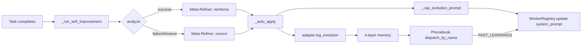

# Swarm Orchestration

> The complete swarm system: the engine, six dispatch patterns, aggregation strategies, the reliability layer (circuit breakers, retries, timeouts, validators, concurrency), the worker registry, pipeline checkpoints, and metrics — all source-referenced.

---

## 1. The SwarmEngine

`SwarmEngine` (`kazma-core/kazma_core/swarm/engine.py:103`) is the central async orchestrator. A backward-compatible `SwarmManager` façade wraps it (`manager.py:17`, sharing `self._workers = self.engine._workers`).

### 1.1 Constructor

```python
def __init__(
    self,
    config: SwarmConfig | None = None,
    *,
    result_aggregator: ResultAggregator | None = None,
    task_store: TaskStore | None = None,
    metrics_collector: MetricsCollector | None = None,
    tracing_emitter: TracingEmitter | None = None,
) -> None: ...
```

### 1.2 Key attributes

| Attribute | Type | Purpose |
|---|---|---|
| `_workers` | `dict[str, SwarmWorker]` | Registered workers. |
| `_active_tasks` | `dict[str, SwarmTask]` | In-flight tasks. |
| `_task_handles` | `dict[str, asyncio.Task]` | Handles for cancel. |
| `_task_history` | `dict[str, SwarmTask]` | LRU-capped (`_max_history=500`). |
| `_routing_engine` | `UnifiedRouter` | Auto-routing for `workers=["auto"]`. |
| `_reliability` | `ReliabilityRegistry` | Breakers/retries/timeouts/validators/concurrency. |
| `_checkpoint_handler` | `HITLCheckpointHandler` | Paused-pipeline state. |
| `_checkpoint_mgr` | `CheckpointManager` | Checkpoint persistence + timeouts. |
| `_task_store` | `TaskStore` | SQLite persistence. |
| `_metrics_collector` | `MetricsCollector` | In-memory + SQLite metrics. |
| `_tracing_emitter` | `TracingEmitter` | In-house span emitter. |
| `_phonebook` | `WorkerPhonebook` | Topology/DAG worker lookup. |
| `_sse` | `SseBridge` | SSE event bridge. |

> The constructor signature is unchanged after the P2-1 refactor that split the original 1878-line god class into focused modules. Test fixtures work without modification.

---

## 2. The six dispatch patterns

`TaskType` enum (`swarm/task.py:65-73`): `DISPATCH`, `BROADCAST`, `PIPELINE`, `FAN_OUT`, `CONSULT`, `CONDITIONAL`. Routing lives in `dispatch_inner.py` (called from `engine.dispatch` → `engine._dispatch_inner`).

| Pattern | Engine entry | Implementing function | Description |
|---|---|---|---|
| **dispatch** | `engine.dispatch` (312) → `dispatch_inner` (35) | inline single-worker + optional fallback chain | One worker handles the task. |
| **broadcast** | `engine.broadcast` (367) | `broadcast.broadcast_task` (`broadcast.py:31`) | All workers receive the same prompt. |
| **pipeline** | `dispatch_inner.py:72-107` | `patterns.execute_pipeline` (`patterns.py:234`) | Ordered stages sharing a blackboard; supports HITL checkpoints. |
| **fan_out** | `dispatch_inner.py:109-157` | `patterns.execute_fan_out` (`patterns.py:639`) | Parallel execution with bounded concurrency + aggregation. |
| **consult** | `dispatch_inner.py:159-201` | `consultation.execute_consult` (`consultation.py:124`) | Parallel opinions + LLM synthesis. |
| **conditional** | `dispatch_inner.py:203-229` | `patterns.execute_conditional` (`patterns.py:504`) | Router decides which route map entry to dispatch to. |

### 2.1 Auto-routing

`workers=["auto"]` is resolved in `dispatch_inner.py:44-70` via `engine._routing_engine.route(...)` (UnifiedRouter), with an auto-scaling fallback (lines 53-61) via `engine.get_autoscaler().maybe_scale(...)`.

### 2.2 Pipeline specifics

- **Shared blackboard** — each stage sees prior stages' outputs.
- **HITL checkpoints** — `task.metadata["hitl_checkpoints"]` is a set of 1-based step indices (`patterns.py:252`). At a checkpoint, execution pauses with `status="paused"` and checkpoint metadata (lines 328-354, 458-484).
- **Resume** — `patterns.resume_pipeline` (`patterns.py:365`).
- **Post-processing** (`_finalize_pipeline`, `patterns.py:139-202`) runs four hooks: LLM "Refiner" synthesis, self-improvement, pipeline logger, then returns `PatternExecution`.

### 2.3 Fan-out status mapping

| Condition | Status |
|---|---|
| all workers succeed | `success` |
| some succeed | `partial` |
| none succeed | `failed` |

---

## 3. Aggregation strategies

`ResultAggregator.aggregate` (`aggregator.py:44-121`), keyed by `task.aggregation` (default `"collect"`):

| Strategy | Behavior |
|---|---|
| `collect` | Metadata only; no aggregated output. |
| `first_valid` | First successful result. |
| `merge_all` | Join `[worker] output` blocks. |
| `vote` | Majority tally; ties broken by first-seen order (lines 98-104). |
| `synthesize` | LLM synthesis via `_SYNTHESIS_SYSTEM_PROMPT` (lines 20-26); deterministic fallback `_fallback_synthesis` (line 194). |
| *(unknown)* | Raises `ValueError`. |

---

## 4. Handoffs & cycle detection

When a worker hands off to another worker mid-task, `_handle_handoff()` (`engine.py:625-743`) recurses. Infinite loops (A→B→A) are prevented by two guards in `swarm/handoff_guards.py`:

| Constant | Value | Meaning |
|---|---|---|
| `MAX_HANDOFF_DEPTH` | `5` | Max recursion depth. |
| `MAX_VISITS` | `2` | Max times a single worker may be revisited (allows legitimate A→B→A *return* handoffs). |

Mechanics:

1. `_visited` is a `dict[str, int]` of per-worker visit counts (not a boolean set).
2. `_register_handoff_visit` increments the source worker's count.
3. `_handoff_guard_error` trips on depth > 5 or per-worker visits > 2.
4. `_depth` is incremented inside `worker_dispatch.dispatch_worker` when it calls `engine._handle_handoff(..., _depth=_depth + 1)` (`worker_dispatch.py:148-160`).
5. On success/failure, the breaker's `record_success`/`record_failure` is called (lines 729, 740).

> **Symbol naming note:** `engine.py:646` docstring refers textually to `_MAX_VISITS`, but the exported symbol is `MAX_VISITS` (`handoff_guards.py:17`). Same value (2).

---

## 5. The reliability layer

`ReliabilityRegistry` (`swarm/reliability_registry.py:31`) is a **config holder**. The actual state machines live in `swarm/reliability.py`. Six components:

### 5.1 CircuitBreaker (`reliability.py:238-389`)

| Aspect | Detail |
|---|---|
| States | `CLOSED`, `OPEN`, `HALF_OPEN` (`CircuitState` StrEnum, lines 219-224). |
| `failure_threshold` | default `5`. |
| `cooldown_seconds` | default `60.0`. |
| OPEN → HALF_OPEN | auto-transition when `time.monotonic() - _opened_at >= cooldown` (state property, lines 260-272). |
| **Half-open single-probe** | `allow_probe()` (lines 278-294) lets exactly ONE dispatch through; gated by `_probe_in_flight` (line 254). Both `record_success()` and `record_failure()` reset it. **Never remove this flag** — concurrent calls would bypass probe semantics. |
| `record_success` | resets `consecutive_failures`, clears `_probe_in_flight`, HALF_OPEN → CLOSED. |
| `record_failure` | clears `_probe_in_flight`; HALF_OPEN → re-OPEN with fresh timer; CLOSED → increment, trip at threshold. |
| Persistence | `to_dict()` / `from_dict()` (lines 364-389); registry `save_breaker_state`/`load_breaker_state`. |

### 5.2 RetryPolicy (`reliability.py:66-211`)

| Field | Default |
|---|---|
| `max_retries` | `3` |
| `base_delay` | `1.0` s |
| `max_delay` | `60.0` s |
| `jitter` | `True` |

Exponential backoff: `base_delay * 2**(attempt-1)` (line 92). **Non-retryable** patterns (lines 45-50): 401/403, auth/unauthorized/forbidden, api key, not found, rate limit, quota, billing. Retries on exceptions and on `status in ("error","timeout")` dicts.

### 5.3 TimeoutGuard (`reliability.py:397-480`)

| Field | Default |
|---|---|
| `default_timeout` | `300.0` s |
| `on_timeout` | `fail` \| `retry` \| `skip` |

Uses `asyncio.wait_for`. On timeout returns `{"status": "timeout", ...}` with optional `retry=True` / `skipped=True`.

### 5.4 OutputValidator (`reliability.py:488-689`)

Supports three schema kinds:

- **Pydantic `BaseModel`**
- **JSON Schema** (via `jsonschema` if installed, else built-in fallback)
- **Simple type dict** (`{"name": "str"}`)

Auto-parses string output as JSON when the schema expects an object/array.

### 5.5 FallbackChain (`reliability.py:734-864`)

Sequential fallbacks after primary failure. Each fallback gets a `HandoffRecord`. First success ends the chain; exhaustion returns a summary error.

### 5.6 BoundedConcurrency (`reliability.py:872-909`)

`asyncio.Semaphore` wrapper, default `max_concurrent=5`; async context manager that always releases on exit.

### 5.7 Per-worker configuration (via engine delegates)

| Method | Configures |
|---|---|
| `set_circuit_breaker_config(worker, failure_threshold, cooldown_seconds)` | Breaker thresholds. |
| `set_retry_policy(worker, policy)` | Retry policy. |
| `set_timeout_guard(worker, guard)` | Timeout. |
| `set_output_validator(worker, validator)` | Output schema. |
| `get_bounded_concurrency(task_max_concurrent)` | Concurrency (task override > engine default). |

---

## 6. TaskStore

`swarm/task_store.py:82`, default DB `kazma-data/swarm_tasks.db`.

### 6.1 Concurrency

PRAGMAs applied centrally via `apply_sqlite_pragmas()` from `config_store`:

```sql
PRAGMA journal_mode=WAL;
PRAGMA busy_timeout=5000;
PRAGMA synchronous=NORMAL;
```

Single shared connection + `threading.Lock`.

### 6.2 Schema

**`swarm_tasks`** (lines 33-52): `id, type, prompt, status, workers (JSON), result, context, dependencies, fallback_chain, validation_schema, aggregation, timeout, created_at, started_at, completed_at, cost, tokens, metadata`. Indexes on `status`, `type`, `completed_at`, `created_at`.

**`swarm_worker_metrics`** (lines 59-68): `worker, date, tasks_completed, tasks_failed, avg_latency, total_tokens, total_cost`, PK `(worker, date)`.

### 6.3 Auto-migration

After `executescript(_SCHEMA)`, reads `PRAGMA table_info(swarm_tasks)` and `ALTER TABLE … ADD COLUMN` for any of `context, dependencies, fallback_chain, validation_schema, aggregation, timeout` that are missing (lines 111-124, wrapped in try/except).

### 6.4 Worker filter (exact match)

`list_tasks()` (lines 205-279) filters by worker using `json_each()` — **not** `LIKE`:

```sql
WHERE EXISTS (SELECT 1 FROM json_each(workers) WHERE value = ?)
```

This avoids substring false-positives (e.g. worker `"a"` matching `"ab"`).

---

## 7. Worker registry & phonebook

- **`WorkerRegistry`** (`swarm/registry.py`) — JSON-backed registry, loaded from `swarm_registry.json` (root) at singleton construction. Each `WorkerEntry` has: `name, expertise, roles, model, provider, worker_type, system_prompt, enabled, tools, metadata`.
- **`WorkerPhonebook`** (`swarm/phonebook.py:23`) — bypasses the reliability layer for direct summon-and-dispatch from topology/DAG executors. `summon(name)` returns an `InProcessWorker` (legacy TelegramWorker subprocess path removed). `dispatch_by_name` injects episodic memory context from the 4-layer adapter before dispatching.
- **`worker_factory._IN_PROCESS_TYPES`** = `{"in_process", "telegram_bot"}` — both resolve to `InProcessWorker`.

> **No predefined role/preset catalog.** Roles are free-form strings. `swarm_registry.json` ships ~57 entries (mostly test fixtures like `a`/`b`/`c` for handoff-cycle tests, plus `primary`/`fallback-alpha`/`fallback-beta` for fallback-chain tests). All have empty `system_prompt`, so `is_generalist` (`registry.py:67-74`) treats them as generalists despite expertise tags.

---

## 8. Pipeline checkpoints (HITL)

A pipeline can pause at configured steps for human approval.

| Component | Role |
|---|---|
| `HITLCheckpoint` / `HITLCheckpointHandler` | `swarm/checkpoint.py:24,50` — dataclass + pause/approve/reject coordination with `asyncio.Event`s. |
| `CheckpointManager` | `swarm/checkpoint_manager.py:28` — owns paused-pipeline state, auto-reject timeout, SQLite persistence. |

### 8.1 Flow

1. `SwarmEngine._handle_pipeline_checkpoint` (`engine.py:889`) delegates to `CheckpointManager.handle_pipeline_checkpoint`.
2. The manager stores state, **arms an auto-reject timeout** if `task.metadata["checkpoint_timeout"] > 0` (lines 96-104), sets task status to `PAUSED`, and persists to SQLite.
3. Approval: `SwarmEngine.approve_checkpoint` (`engine.py:920-988`) cancels the timeout, sets `checkpoint.status="approved"`, pops the paused entry, and resumes from `next_step = checkpoint.step + 1` via `resume_pipeline(...)`.
4. Rejection: `SwarmEngine.reject_checkpoint` (`engine.py:990`) delegates to the handler.
5. **Crash recovery:** `restore_paused_tasks()` (`checkpoint_manager.py:182`) reloads paused tasks from SQLite and **re-arms timeouts** (lines 222-230).

### 8.2 HTTP endpoints

- `POST /api/swarm/tasks/{task_id}/approve` (`swarm_panel/routes_tasks.py:612`) → `engine.approve_checkpoint(task_id)`.
- `POST /api/swarm/tasks/{task_id}/reject` (line 657).

---

## 9. Metrics

`MetricsCollector` (`swarm/metrics.py:56`) — thread-safe in-memory accumulator backed by an optional `TaskStore`. Per-`(worker, date)` snapshots:

| Metric | Meaning |
|---|---|
| `tasks_completed` | Successful tasks. |
| `tasks_failed` | Failed tasks. |
| `avg_latency` | Weighted running average. |
| `total_tokens` | Token sum. |
| `total_cost` | USD sum. |

Flushes to `TaskStore.record_worker_metric` on every record. Exposed via REST at `GET /api/swarm/workers/{name}/metrics`.

> **No Prometheus.** The swarm has no `prometheus_client` dependency, no `/metrics` endpoint. Metrics are custom in-memory + SQLite only. See [Architecture → Observability](architecture.md#9-observability-current-state).

---

## 10. Tracing

`TracingEmitter` / `Span` / `InMemorySpanExporter` (in-house, per `swarm/__init__.py:57`). **Not OpenTelemetry.** Spans are emitted for dispatch, handoff, and checkpoint events.

---

## 11. Self-improvement engine (feedback loop)

The self-improvement skill (`skills/self_improvement.py`) automatically learns from task outcomes and mutates worker system prompts to improve future performance.

### 11.1 The feedback loop



### 11.2 How it works

1. **Hook fires** after every pipeline, fan-out, and conditional pattern completion (`patterns.py:_run_self_improvement`).
2. **Each worker is analyzed** against only its own result (not all stages — fixed from the old behavior).
3. The **Meta-Refiner LLM** generates a 2-3 sentence delta (reinforcement for success, correction for failure).
4. The delta is **auto-applied** to the worker's system prompt via `_cap_evolution_prompt` (max 12 blocks, 8000 chars).
5. The applied delta is **persisted** to the 4-layer memory adapter via `adapter.log_evolution()`.
6. On future dispatches, the phonebook retrieves relevant past learnings and injects them as `PAST_LEARNINGS_FOR_THIS_WORKER` context.

### 11.3 Status tracking

- `_mutation_log` records every applied delta (worker, delta, timestamp, status).
- `stats()` returns `{"enabled": ..., "mutations_applied": N}`.
- `mutation_history` returns the last 50 mutations.

---

## 12. Predefined pipelines (`kazma.yaml`)

| Pipeline | Stages |
|---|---|
| `standard` | `researcher` (worker `core`) → `refiner` (worker `bridge`) → `builder` (worker `core`) → `validator` (worker `bridge`). |
| `quick` | `researcher` (worker `core`) → `builder` (worker `core`). |

Each stage carries a `system_prompt`. See [Configuration → pipelines](configuration.md#pipelines-lines-129-162).

---

## 13. CLI swarm commands

The full `kazma swarm` surface (dispatch, broadcast, consult, pipeline, fanout, history, metrics, approve, reject, circuit-breaker, …) is documented in [CLI Reference → swarm](cli-reference.md#6-kazma-swarm).

---

## Documentation Audit Notes

- **`reliability_registry.py` is config-only.** The half-open `_probe_in_flight` logic lives on the `CircuitBreaker` dataclass in `reliability.py`. Anyone modifying breaker semantics must edit `reliability.py`, not the registry.
- **Symbol `_MAX_VISITS` vs `MAX_VISITS`:** the engine docstring uses the underscored form, but the exported constant is `MAX_VISITS`. Same value (2).
- **`swarm_registry.json` is mostly test fixtures.** Do not assume the shipped workers are production-grade — they have empty `system_prompt` fields.
- **Prometheus is absent.** Anyone planning to scrape Kazma with Prometheus needs to add that integration; it does not exist today.
