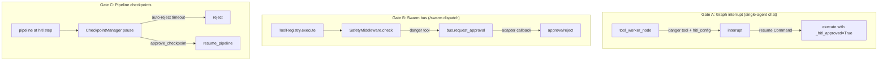

# Security & Safety

> Kazma's safety model in full: the **three independent HITL gates**, the three danger-tool lists, fail-closed behavior everywhere, cryptographic integrity (HMAC skills, Ed25519 delegation), and hardening recommendations. Every claim is source-referenced.

---

## 1. The three HITL gates (and why there are three)

Kazma has **three independent** Human-in-the-Loop mechanisms. Each covers a different execution path. Breaking any one creates an unattended-danger-tool security gap.



| Gate | Path | Where it lives | Approval surface |
|---|---|---|---|
| **A** | Single-agent chat (Web/Telegram/Discord/Slack) | `agent/graph_builder.py` | `POST /api/approve/{thread_id}` or `/hitl approve\|deny` |
| **B** | `/swarm` dispatch | `swarm/safety.py` + `tool_registry.py` | Bus adapter buttons (Telegram/Discord/Slack) |
| **C** | Swarm PIPELINE tasks | `swarm/checkpoint.py` + `checkpoint_manager.py` | `POST /api/swarm/tasks/{id}/approve` |

---

## 2. Gate A — the graph gate (single-agent chat)

### 2.1 How it works

`tool_worker_node` (`graph_builder.py:336`) is where the gate lives. When `hitl_config` is supplied:

1. Each pending tool call is tested with `requires_approval(tc["name"], hitl_config)` (imported from `kazma_core.safety.hitl`, line 356). Tools split into `safe_tools` / `danger_tools` (lines 418-429).
2. For each danger tool, an `approval_input` dict is built (`type: "hitl_approval"`, tool name, args, message) and **`interrupt(approval_input)`** is called (line 493) — the graph **suspends**.
3. On approval, the tool call is copied and **`approved_tc_args["_hitl_approved"] = True`** is injected (lines 495-503) so `tool_registry.execute()` skips the redundant bus check.
4. On denial, a `ToolResult` with `is_error=True` is returned via `_denied_result` (lines 467-475).

> **Dormant by default:** if `hitl_config` is falsy, **all** tools go to `safe_tools` (line 429). The gate is only active when `hitl_config` is passed to `build_supervisor_graph()`.

### 2.2 The build sites that activate the gate

`hitl_config` must be passed at build time. There are **three** build sites; two pass it (active), one does not (dormant):

| Build site | File:line | Passes `hitl_config`? |
|---|---|---|
| `KazmaAgent.get_streaming_graph()` | `agent_runner.py:530-539` | ✅ Active (SSE chat path) |
| `KazmaAgent._ensure_graph()` | `agent_runner.py:566-576` | ✅ Active (run path) |
| `app.py` startup recompile | `kazma-ui/kazma_ui/app.py:741-751` | ✅ Active |
| `create_supervisor_graph()` factory | `graph_builder.py:974-985` | ❌ Dormant (CLI/3rd-party entry) |

> **AGENTS.md line-number correction:** older notes cite "app.py ~line 966". That is **inaccurate** — `graph_builder.py:966` is an unrelated `aiosqlite.connect` inside `create_supervisor_app()`, which does *not* pass `hitl_config`. The real startup recompile is at `kazma-ui/kazma_ui/app.py:741-751`.

### 2.3 Resume mechanism

The graph resumes via LangGraph `Command(resume=...)`. The approval endpoint is `POST /api/approve/{thread_id}` in `kazma-ui/kazma_ui/routes_direct.py:454` (function `approve_tool`, line 455) — **not** in `app.py`:

```python
# routes_direct.py:525-532
from langgraph.types import Command
resume_value = {"approved": approved, "reason": body.get("reason", "")}
graph_ref.ainvoke(Command(resume=resume_value), config=config)
```

Security on this endpoint:

- When `KAZMA_SECRET` is set, requires `X-Kazma-Secret` header (or cookie) matched via `secrets.compare_digest` (lines 456-465).
- **Ownership enforcement** (lines 480-522): resolves the owner across platforms (`sender_id`/`owner`/`session_id`/`user_id`) and rejects cross-user approvals with **403**.

### 2.4 Persistence

Paused turns persist in the **checkpointer** (SQLite WAL) — they survive restarts.

---

## 3. Gate B — the swarm bus gate (`/swarm` dispatch)

### 3.1 The execution path

`ToolRegistry.execute()` (`tool_registry.py:335`):

1. Pops `_hitl_approved` from args (line 349).
2. If **not** already approved, gets `get_safety()` (line 395).
3. For danger tools (`safety.is_danger_tool(tool_name)`, line 397), calls `await safety.check(...)` (lines 400-405).
4. If not approved → returns `is_error=True` "denied by HITL approval gate" (lines 406-410).
5. **Fail-closed:** any exception in the safety check returns `is_error=True` "blocked — SafetyMiddleware unavailable" (lines 411-417).

### 3.2 SafetyMiddleware

`swarm/safety.py` — class `SafetyMiddleware` (line 47). (There is **no** class named `SafetyGate` or `SafetyChecker` anywhere — that naming in some older docs is inaccurate.)

| Method | Behavior |
|---|---|
| `check()` (async, line 106) | For danger tools: if `NullBusAdapter` active and `allow_headless_danger=False` → reject (lines 147-160); otherwise `bus.request_approval(...)` and await (lines 162-177). |
| `check_sync()` (line 179) | **Fail-closed by default.** NullBusAdapter + `allow_headless_danger=False` → returns `False` (lines 200-209). Even with a real adapter, the sync path cannot wait → blocks. Any bus exception → fail-closed unless `allow_headless_danger=True` (lines 214-223). |
| `is_danger_tool` / `is_sensitive_read` | lines 96, 100. |
| `add_danger_tool` / `remove_danger_tool` | lines 86-94. |

The `allow_headless_danger: bool = False` constructor flag (line 70) is the **test/dev escape hatch**. Default is fail-closed.

### 3.3 Bus adapters & singleton priority

Bus adapters (all subclass `BusAdapter`, ABC at `swarm/bus.py:66`):

| Adapter | Location |
|---|---|
| `TelegramBusAdapter` | `kazma-gateway/kazma_gateway/adapters/telegram_bus.py:58` |
| `DiscordBusAdapter` | `adapters/discord_bus.py:31` |
| `SlackBusAdapter` | `adapters/slack_bus.py:31` |

The bus is a **module singleton** (`get_message_bus()`, `bus.py:282-287`). **Only one adapter is active at a time.** Priority wiring in `kazma-ui/kazma_ui/app.py:506-556`:

- Telegram tried first (`_bus_wired = True` at line 516).
- Discord only `if not _bus_wired` (line 524).
- Slack only `if not _bus_wired` (line 540).

**Priority: Telegram > Discord > Slack.**

A `pytest` guard (line 504) deliberately skips wiring real adapters under tests.

### 3.4 Approval callback resolution

Each adapter's `handle_callback()` parses the platform callback id and resolves an `asyncio.Event`:

- Telegram: `swarm_approve_<task_id>` / `swarm_reject_<task_id>` (`telegram_bus.py:302-333`).
- Discord: components v2 buttons (`discord_bus.py:238`).
- Slack: interactive callback (`slack_bus.py:270`).

---

## 4. Gate C — pipeline checkpoints

Documented in [Swarm Orchestration → Pipeline checkpoints](swarm-orchestration.md#8-pipeline-checkpoints-hitl). Summary:

- `_handle_pipeline_checkpoint` (`engine.py:889`) → `CheckpointManager.handle_pipeline_checkpoint`.
- Auto-reject timeout armed if `checkpoint_timeout > 0`.
- `approve_checkpoint` (`engine.py:920`) / `reject_checkpoint` (`engine.py:990`).
- `restore_paused_tasks()` re-arms timeouts after restart.
- Endpoints: `POST /api/swarm/tasks/{id}/approve` / `/reject` (`routes_tasks.py:612, 657`).

---

## 5. Danger-tool lists (three of them)

The three gates use **different** danger-tool lists. This is deliberate (each path has different semantics) but easy to get wrong.

### 5.1 Gate A (graph) — `kazma.yaml safety.hitl.require_approval_for`

Default (`kazma.yaml:84-94`): `file_write`, `file_delete`, `shell_exec`, `code_exec`, `python_exec`, `spawn_agent`, `spawn_agents`, `schedule_task`, `cancel_scheduled`.

Code fallback if unset: `DEFAULT_DANGER_TOOLS = ["file_write", "file_delete", "shell_exec"]` (`safety/hitl.py:41`).

### 5.2 Gate B (swarm bus) — `_EXTENDED_DANGER`

`swarm/safety.py:23-31`: `DEFAULT_DANGER_TOOLS` (file_write, file_delete, shell_exec) **+** `python_exec`, `code_exec`, `spawn_agent`, `spawn_agents`, `schedule_task`, `cancel_scheduled`, `run_tests` (MCP IDE test runner).

Plus `_SENSITIVE_READS = ["sqlite_query", "file_search"]` (lines 34-37) — allowed but **logged**.

### 5.3 Gate C / MCP — `classify_mcp_tool()`

`mcp/manager.py:71-88` — dynamic name-pattern matching (MCP tools are runtime-discovered):

- **danger** if any of: `write, delete, remove, exec, run, shell, bash, command, kill, terminate, install, deploy, upload, download, fetch, request, post, put, patch`.
- **safe** if any of: `read, list, search, get, info, status, check, describe, query, count, exists, help`.
- **unknown** otherwise.

> **Unknown defaults to danger.** `UnifiedToolExecutor.execute()` (`manager.py:725-727`) requires approval for **both** `danger` and `unknown`. Never weaken this.

---

## 6. Cryptographic integrity (beyond HITL)

### 6.1 Skill HMAC signing (Hub)

Verified in [Skills, MCP & Tools → Cryptographic signing](skills-mcp-and-tools.md#33-cryptographic-signing-hmac-sha256--verified). Summary:

- `kazma hub sign` writes `checksum` (SHA-256) + `signature` (HMAC-SHA256 over checksum, keyed by `KAZMA_SECRET`) into `skill_manifest.yaml`.
- `SkillLoader._load_module_from_file` verifies both with `hmac.compare_digest` (constant-time) and refuses to load tampered/unsigned-by-required skills.

### 6.2 Delegation Ed25519 + AES-256-GCM

`delegation/security.py` (`DelegationSecurity`, line 30):

- **Signing:** Ed25519 (lines 81-119).
- **Encryption:** X25519 key agreement + AES-256-GCM (lines 121-161).
- Requests signed on send (`protocol.py:153`), verified on receipt with **fail-closed** on missing/invalid signature (`:179-208`).

This is inter-agent delegation — unrelated to MCP or skills.

### 6.3 HITL endpoint secret

`POST /api/approve/{thread_id}` is protected by `KAZMA_SECRET` (header/cookie, `secrets.compare_digest`). The auto-generation path: `get_kazma_secret()` (`config_store.py:36-77`) resolves env `KAZMA_SECRET` → `KAZMA_AUTH_DISABLED` → pytest skip → DB `security.secret` → auto-generate `secrets.token_hex(16)`.

---

## 7. Fail-closed behaviors (inventory)

| Component | Fail-closed behavior |
|---|---|
| `SafetyMiddleware.check_sync` | Blocks danger tools when no real bus + `allow_headless_danger=False`. |
| `ToolRegistry.execute` | Any safety-check exception → "blocked — SafetyMiddleware unavailable". |
| `classify_mcp_tool` | `unknown` → requires approval. |
| `SkillLoader` | Tampered/missing signature → `SkillLoadError`, no load. |
| Hub write API | No `KAZMA_SECRET` → all writes rejected. |
| Delegation receive | Missing/invalid signature → reject. |
| HITL approval endpoint | Cross-user approval → 403; no `KAZMA_SECRET` → see warning below. |

> **⚠ Production warning:** if `KAZMA_SECRET` is **unset**, `get_kazma_secret()` may return `""` and approval endpoints become **unauthenticated**. Always set `KAZMA_SECRET` for any non-localhost deployment. (`kazma serve` only binds `0.0.0.0` when `KAZMA_SECRET` is set — this is by design.)

---

## 8. Security config files

`kazma-security.yaml` declares posture across `scanning`, `disclosure`, `bug_bounty`, and `hardening` (8 checks: `secrets_in_logs`, `input_validation`, `rbac_enforcement`, `tls_required`, `dependency_audit`, `least_privilege`, `audit_trail`, `config_integrity`). See [Configuration → security config](configuration.md#7-security-config-files). `kazma-permissions.yaml` defines division-based MCP allow/deny lists (the ALMuhalab divisions) with cross-division rules (`require_explicit_approval`, `max_approval_duration_hours: 24`, `audit_all_access`).

> **Verify runtime enforcement** of `kazma-security.yaml` checks against the hardening runner before relying on them. The file declares policy; confirm the runner enforces each check at startup (`hardening.run_on_startup: true`, `fail_on_critical: true`).

---

## 9. Hardening recommendations

1. **Always set `KAZMA_SECRET`** for non-localhost deployments. Generate with `openssl rand -hex 32`.
2. **Run stdio MCP servers in a sandbox.** The stdio transport has no auth and inherits the process environment.
3. **Prefer SSE MCP with bearer auth** for any remote MCP server.
4. **Sign all skills** (`kazma hub sign`) and keep `KAZMA_SECRET` consistent across load — signature verification fails otherwise.
5. **Keep all three HITL gates active.** Do not pass `hitl_config=None` on a production build site.
6. **Do not set `allow_headless_danger=True` in production.** It's the test/dev escape hatch.
7. **Run as the non-root `kazma` user** in Docker (the Dockerfile already does this).
8. **Bind `127.0.0.1`** unless you have a reverse proxy + `KAZMA_SECRET` in place.

---

## Documentation Audit Notes

- **Class name:** the swarm safety class is `SafetyMiddleware`, not `SafetyGate`/`SafetyChecker`. Updated throughout.
- **Approval endpoint location:** `POST /api/approve/{thread_id}` is in `routes_direct.py:454`, **not** `app.py`.
- **App.py build site line number:** the startup recompile is at `kazma-ui/kazma_ui/app.py:741-751`, not ~966.
- **"Trust tiers" do not exist** as a security feature — only a boolean `certified` flag and an unused `trust: trusted` config string.
- **MCP stdio has no auth.** Documented explicitly; plan sandboxing accordingly.
- **Three distinct danger lists** must stay synchronized with intent. Adding a new danger tool to Gate A (`kazma.yaml`) does **not** add it to Gate B (`_EXTENDED_DANGER`) or Gate C (pattern-based).
