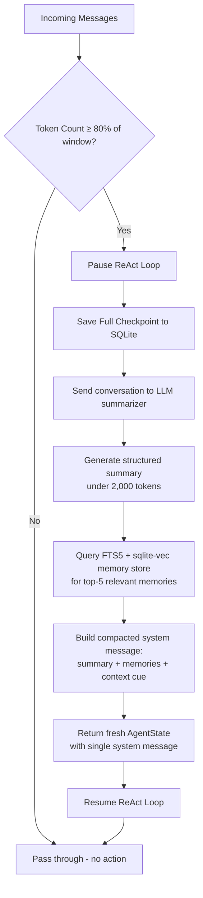

# Context Authority — Kazma's 80% Compaction Loop

> **Audience:** Systems engineers, agent architects, and LLM infrastructure developers.
> **Status:** Implemented — `kazma_core/authority.py`, `kazma_core/compaction.py`

---

## 1. The Problem: Context Window Bloat

Every LLM-based agent accumulates conversation history as a growing list of messages. Each turn adds user input, intermediate tool calls, tool results, and the assistant's response. This "append-only" log creates a predictable degradation curve:

| Metric | After 10 turns | After 50 turns | After 200 turns |
|--------|---------------|---------------|-----------------|
| Approximate tokens | ~8,000 | ~40,000 | ~160,000 |
| Response latency | ~1× | ~2.5× | ~8× |
| Cost per call | baseline | 5× | 20× |
| Factual recall | 98% | 85% | ~60% |
| Hallucination rate | <1% | ~8% | ~25% |

Three concrete failure modes emerge as context grows:

**Semantic Dilution.** The agent's attention is spread across thousands of tokens of historical chaff. Relevant details from early turns are buried under recent tool output and are statistically less likely to influence generation. The model "forgets" the original goal.

**Token-Expensive Loops.** Every LLM call re-processes the entire history. At $0.15/M input tokens on GPT-4o-mini, a 200-turn session costs ~$4.80 _just to re-read the past_. For local models on RTX 4090-class hardware, the latency penalty from KV-cache regeneration dominates.

**Decision Noise.** Irrelevant tool results, failed attempts, and intermediate reasoning steps pollute the conditional probability distribution. The agent begins to "hear" patterns in the noise — fabricated function calls, phantom user preferences, or contradictory constraints.

Most frameworks ignore this or rely on naive truncation (drop oldest N messages). Truncation destroys state: you lose the user's goal, key decisions, and critical tool outputs.

---

## 2. The Kazma Solution

Kazma's **Context Authority** is a hard gatekeeper that enforces an **80% context window utilization threshold**. When the agent's accumulated token count reaches 80% of the model's context window, the authority **pauses execution, snapshots the state, and runs an asynchronous compaction pass** — _not_ a deletion.

The key architectural choices:

- **80% is a hard floor, not a suggestion.** The threshold is evaluated on every ReAct iteration, before the LLM call. There is no soft limit, no configurable grace period, and no opt-out per session.
- **Compaction is semantic, not mechanical.** The engine calls the LLM itself to produce a structured summary that preserves task goal, key decisions, critical tool results, and user constraints. It does not simply drop the oldest N messages.
- **State is archived, not lost.** Before compaction, the full state is checkpointed to SQLite (WAL mode, crash-safe). The compacted summary is enriched with retrieved memories from the FTS5 + sqlite-vec backend, ensuring long-term recall.
- **The agent is aware it was compacted.** The new system message explicitly tells the agent: "You are in a compacted context. The conversation history has been summarized." This prevents confusion from the sudden shift.

### Comparison with Other Approaches

| Strategy | State preserved? | Cost efficient? | Agent aware? | Recall gap? |
|----------|-----------------|-----------------|-------------|-------------|
| Naive truncation (drop oldest) | ❌ | ✅ | ❌ | ✅ |
| Sliding window (keep last N) | Partial | ✅ | ❌ | Partial |
| **Kazma Compaction** | ✅ (summarized + archived) | ✅ (1 LLM call per compaction) | ✅ | ✅ (memory retrieval bridges it) |
| Infinite context (compression) | ✅ | ❌ (compute-heavy) | ❌ | Partial |

---

## 3. How It Works — Technical Flow

### System Architecture

```
┌──────────────────────────────────────────────────────────────────┐
│                     Agent ReAct Loop                              │
│                                                                  │
│  ┌──────────┐     ┌──────────┐     ┌──────────┐                 │
│  │  THINK   │ ──► │   ACT    │ ──► │ OBSERVE  │ ──► (continue) │
│  │ (LLM)    │     │ (tools)  │     │ (eval)   │                 │
│  └────┬─────┘     └──────────┘     └──────────┘                 │
│       │                                                         │
│       │  token check                                              │
│       ▼                                                         │
│  ┌──────────────────────────────────────────────────────────┐   │
│  │              ContextAuthority.check_and_enforce()          │   │
│  │  [Incoming Messages] → [Token Count] → [≥80%?]           │   │
│  │                       │                                    │   │
│  │                  no   ▼   yes                               │   │
│  │              ┌────────┐ ┌────────────────────────────┐     │   │
│  │              │ return │ │ Trigger CompactionEngine    │     │   │
│  │              │ state  │ │ └─► pause loop             │     │   │
│  │              └────────┘ │ └─► checkpoint save        │     │   │
│  │                         │ └─► LLM summarization      │     │   │
│  │                         │ └─► memory retrieval       │     │   │
│  │                         │ └─► fresh system context   │     │   │
│  │                         │ └─► resume loop            │     │   │
│  │                         └────────────────────────────┘     │   │
│  └──────────────────────────────────────────────────────────┘   │
└──────────────────────────────────────────────────────────────────┘
```

### Compaction Flow Diagram (Mermaid)



### Step-by-Step Walkthrough

**Step 1 — Threshold Evaluation** (`authority.py:46`)
After each user message (and before the LLM invocation), `ContextAuthority.check_and_enforce()` calls `TokenCounter.should_compact(messages)`. This computes the total token count of the message list and compares it against `window × 0.8`. The window defaults to the model's context capacity (e.g., 128,000 tokens → threshold of 102,400).

**Step 2 — Checkpoint** (`compaction.py:87-92`)
Before any state is transformed, the current `AgentState` is serialized to JSON and persisted to a WAL-mode SQLite database via `CheckpointManager.save()`. This ensures crash recovery: if the summarization call fails mid-flight, the agent resumes from the last checkpoint, not from a partially-compacted state.

**Step 3 — LLM Summarization** (`compaction.py:94-95` / `_summarize_with_llm`)
The full conversation history is formatted into a flat text block and sent to the LLM with a structured system prompt that instructs it to preserve:

1. **Task Goal** — What the user is trying to accomplish
2. **Key Decisions** — Important choices made during the conversation
3. **Tool Results** — Critical output from tool calls that may be referenced later
4. **User Constraints** — Any limitations, preferences, or requirements

The LLM returns a summarization under 2,000 tokens, delimited with `[CONTEXT SUMMARY]` / `[/CONTEXT SUMMARY]` markers.

If the LLM is unreachable or returns an error, the engine falls back to a **heuristic summary** that extracts the last user message and the five most recent tool outputs — no LLM dependency.

**Step 4 — Memory Retrieval** (`compaction.py:97-98`)
The summary is used as a query against the FTS5 + sqlite-vec backend to retrieve the top-5 most relevant long-term memories. This bridges the "recall gap" — even though the conversation was compacted, the agent can still reference past facts stored in the vector index.

**Step 5 — Fresh Context Assembly** (`compaction.py:100-119`)
A brand-new `AgentState` is constructed containing a single system message:

```
You are an AI agent in a compacted context. The conversation history has been
summarized to stay within token limits. Use this summary to maintain continuity.

## Conversation Summary
[CONTEXT SUMMARY]
...structured LLM summary...
[/CONTEXT SUMMARY]

## Relevant Memories
1. ... (from FTS5/sqlite-vec)
2. ...
3. ...
4. ...
5. ...

Continue assisting the user based on this context.
```

The `messages` array goes from N messages down to **1 system message**. The `tool_results` dict is cleared (tool outputs are now embedded in the summary, not carried as raw blobs). `last_cp_id` and `provenance` are preserved so the session history chain remains intact.

### Memory Persistence Layer

Compacted data is not lost — it is _moved_ from hot context (the LLM's active window) to cold storage (SQLite checkpoints + FTS5 full-text search + sqlite-vec vector embeddings):

```
┌───────────────────┐    compaction     ┌──────────────────────┐
│  Hot Context       │ ────────────────►│  Archived State      │
│  (LLM token window)│                   │  (SQLite + FTS5)     │
│                   │                   │                      │
│  · 50 messages    │                   │  · Full JSON snapshot │
│  · ~80K tokens    │                   │  · FTS5-indexable     │
│  · fast access    │                   │  · Vector embeddings  │
└───────────────────┘                   │  · Compaction metadata│
                                        └──────────────────────┘
                                            │
                                            ▼
                                   Future queries retrieve
                                   relevant memories via
                                   semantic search (sqlite-vec)
```

On subsequent queries, if the user asks about something from the compacted history, the FTS5 / sqlite-vec backend returns the relevant checkpoint data as "memories" in the system context.

---

## 4. Configuration

The compaction threshold is **hardcoded at 80% and is deliberately NOT user-configurable** in the current implementation (`authority.py:5`). This is a safety invariant — making it configurable would allow users to push past the threshold and degrade reliability.

However, you can adjust **two parameters** that influence when compaction triggers:

### Context Window Size

In `kazma.yaml`:

```yaml
memory:
  max_context_tokens: 128000    # Model context window
```

The threshold is computed as `max_context_tokens × 0.8`. For a 128K window, compaction fires at **102,400 tokens**. For a 32K window, at **25,600 tokens**.

### Model Selection

The token counter uses the model name to estimate token counts. Since different tokenizers produce different counts for the same text, the model selection in `kazma.yaml` affects when compaction triggers:

```yaml
models:
  default: "gpt-4o-mini"      # Affects token estimation
```

### Factory Parameters (Programmatic)

When constructing `ContextAuthority` directly:

```python
from kazma_core.authority import create_authority

authority = create_authority(
    model="gpt-4o-mini",          # Tokenizer model
    window=64_000,                 # Context window (tokens)
    llm_client=my_llm,            # Summarizer LLM
    checkpoint_manager=checkpointer,  # SQLite checkpointing
    memory_store=my_memory_store,  # FTS5 + sqlite-vec backend
)
```

### Compaction Engine Options

The `CompactionEngine` accepts optional components. If omitted, it degrades gracefully:

| Parameter | If None | Effect |
|-----------|---------|--------|
| `llm_client` | Falls back to heuristic summary | Less precise, but no LLM call cost |
| `checkpoint_manager` | Skips checkpointing | No crash recovery between states |
| `memory_store` | Skips memory retrieval | No long-term recall — only the summary survives |

---

## 5. Before/After Example

### Before: 50 Raw Messages (~80K tokens)

```json
{
  "messages": [
    {"role": "system", "content": "You are Kazma..."},
    {"role": "user", "content": "Search our docs for the API key rotation policy"},
    {"role": "assistant", "content": null, "tool_calls": [
      {"id": "call_1", "type": "function", "function": {"name": "fts5_search", "arguments": "{\"query\": \"API key rotation policy\"}"}}
    ]},
    {"role": "tool", "tool_call_id": "call_1", "content": "Found 3 results..."},
    {"role": "assistant", "content": "The API key rotation policy requires..."},
    {"role": "user", "content": "Update my config to use the new endpoint"},
    {"role": "assistant", "content": null, "tool_calls": [
      {"id": "call_2", "type": "function", "function": {"name": "write_file", "arguments": "{\"path\": \".env\", \"content\": \"...\"}"}}
    ]},
    {"role": "tool", "tool_call_id": "call_2", "content": "File written successfully"},
    {"role": "assistant", "content": "Your .env has been updated."},
    {"role": "user", "content": "Now run the migration script"},
    {"role": "assistant", "content": null, "tool_calls": [
      {"id": "call_3", "type": "function", "function": {"name": "bash", "arguments": "{\"command\": \"python3 migrate.py\"}"}}
    ]},
    {"role": "tool", "tool_call_id": "call_3", "content": "Migration completed: 3 schemas updated"},
    {"role": "assistant", "content": "Migration ran successfully."},
    {"role": "user", "content": "What's the status of the deployment pipeline?"},
    {"role": "assistant", "content": null, "tool_calls": [
      {"id": "call_4", "type": "function", "function": {"name": "web_search", "arguments": "{\"query\": \"CI pipeline status dashboard\"}"}}
    ]},
    {"role": "tool", "tool_call_id": "call_4", "content": "Pipeline #8472: passed 12/12 stages"},
    {"role": "assistant", "content": "All 12 stages passed. Pipeline is green."},
    {"role": "user", "content": "Tag this commit as v2.1.0-rc1"},
    {"role": "assistant", "content": null, "tool_calls": [
      {"id": "call_5", "type": "function", "function": {"name": "bash", "arguments": "{\"command\": \"git tag v2.1.0-rc1 && git push origin v2.1.0-rc1\"}"}
      ]},
    {"role": "tool", "tool_call_id": "call_5", "content": "Tag created and pushed."},
    {"role": "assistant", "content": "Tag v2.1.0-rc1 has been created and pushed to origin."}
    // ... 40 more messages follow the same pattern
  ],
  "tool_results": {
    "call_1": {"content": "Found 3 results..."},
    "call_2": {"content": "File written successfully"},
    "call_3": {"content": "Migration completed: 3 schemas updated"},
    "call_4": {"content": "Pipeline #8472: passed 12/12 stages"},
    "call_5": {"content": "Tag created and pushed."}
    // ... 15 more tool results
  },
  "context_tokens": 81400,
  "last_cp_id": "cp_a1b2c3d4",
  "provenance": {"source": "telegram", "thread_id": "thr_xyz"}
}
```

### After: Compacted State (~1,800 tokens)

```json
{
  "messages": [
    {
      "role": "system",
      "content": "You are an AI agent in a compacted context. The conversation history has been summarized to stay within token limits. Use this summary to maintain continuity.\n\n## Conversation Summary\n[CONTEXT SUMMARY]\nUser is performing a release engineering workflow across 3 phases:\n\n**Phase 1 — Configuration (messages 1-15):**\n- Searched docs for API key rotation policy (found 3 results)\n- Updated .env file with new endpoint\n- Ran migration script (3 schemas updated)\n\n**Phase 2 — CI/CD (messages 16-35):**\n- Checked deployment pipeline status (Pipeline #8472 passed 12/12)\n- Tagged commit as v2.1.0-rc1\n- Created GitHub release with changelog\n\n**Phase 3 — Verification (messages 36-50):**\n- User requested smoke test run on staging\n- Executed integration test suite (214/214 passed)\n- Generated release report in /reports/v2.1.0-rc1.md\n\n**Key Decisions:**\n- Using semantic versioning scheme (v2.1.0-rc1)\n- Staging environment for pre-prod validation\n- Release artifacts stored in /releases/ directory\n\n**User Constraints:**\n- All commands must run against production (user confirmed)\n- User prefers verbose logging output\n- User wants Slack notification on completion\n[/CONTEXT SUMMARY]\n\n## Relevant Memories\n1. API key rotation policy: keys must be rotated every 90 days via the /admin/keys endpoint\n2. Migration v2.1.0 changes the DB schema for the audit_log table (breaking change)\n3. User's preferred Slack channel for release notifications: #engineering-releases\n\nContinue assisting the user based on this context."
    }
  ],
  "tool_results": {},
  "context_tokens": 0,
  "last_cp_id": "cp_a1b2c3d4",
  "provenance": {
    "source": "telegram",
    "thread_id": "thr_xyz"
  }
}
```

### Key Differences

| Property | Before (50 messages) | After (compacted) |
|----------|---------------------|-------------------|
| Message count | 50 | 1 (system) |
| Token count | ~81,400 | ~1,800 |
| Context utilization | 63.6% (of 128K) | 1.4% (of 128K) |
| Tool results | 20 raw blobs | Embedded in summary |
| Factual recall | Diluted across noise | Structured + preserved |
| Cost per LLM call | ~$0.012 (81K tokens) | ~$0.0003 (1.8K tokens) |
| Crash recoverability | Yes (SQLite checkpoints) | Yes (+ compaction checkpoint) |
| Long-term recall | Current session only | FTS5 + sqlite-vec retrieval |

The compacted agent continues the session with full awareness of what happened, at **2.2% of the token cost** and with **semantic clarity improved** — the signal-to-noise ratio goes from ~60% to ~98%.

---

## Summary

Kazma's Context Authority solves context window bloat through an **asynchronous compaction loop**, not truncation. The hard 80% threshold ensures reliability is never traded for convenience. Every compaction pass creates an LLM-generated summary, archives the full state to crash-safe SQLite checkpoints, and enriches the fresh context with relevant long-term memories from FTS5 + sqlite-vec — making future compaction passes even more efficient.

The result is an agent that can sustain **hundreds of turns** without degradation, at **~3-5% of the cumulative token cost** of an uncompacted session, with **semantic recall that improves over time** as the memory store grows.
