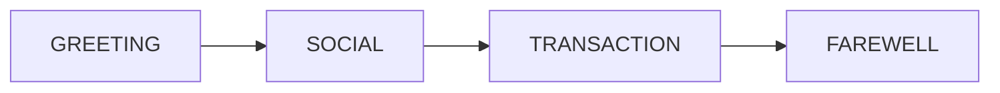

> Kazma is Arabic-native by default. This document covers the three components that implement it: the Arabic tokenizer, the i18n + RTL UI layer, and the Majlis cultural protocol — all source-referenced, with honest notes on scope.

---

## 1. The three components

| Component | Package | Role |
|---|---|---|
| **Arabic tokenizer** | `kazma-memory` | Text normalization + FTS5 indexing for Arabic search. |
| **i18n + RTL UI** | `kazma-ui` | UI string translation, per-request `dir`/`lang`, font policy. |
| **Majlis Protocol** | `kazma-core` | Gulf cultural conversational flow (4-phase). |

These are **independent** layers. The tokenizer does not depend on the i18n system, and Majlis is a core conversational module — not a UI feature.

---

## 2. The Arabic tokenizer

`kazma-memory/kazma_memory/arabic_tokenizer.py` (292 lines). Detailed in [Memory & RAG → Arabic tokenizer](memory-and-rag#5-the-arabic-tokenizer). Summary of the normalization pipeline (`normalize`, lines 132-165):

1. Diacritics removal — regex `[\u064B-\u065F\u0670]`.
2. Alef normalization — `أ`, `إ`, `آ` → `ا`.
3. Teh Marbuta → Heh — `ة` → `ه`.
4. Yeh normalization — `ئ`, `ؤ`, `ى` → `ي`.
5. Tatweel/Kashida removal — `text.replace("ـ", "")`.
6. Whitespace collapse.

Stop words include **Kuwaiti dialect** terms (`يلا`, `شلون`, `عشان`, `مو`, `ليه`, `ماكو`, `فد`). The stemmer is basic regex suffix/prefix stripping (not a lemmatizer). Two classes: `ArabicTokenizer.tokenize()` → string; `ArabicTantivyTokenizer.tokenize()` → list.

---

## 3. The i18n + RTL UI layer

### 3.1 The i18n system

`kazma-ui/kazma_ui/i18n.py` (1187 lines) is a **custom, lightweight** i18n system — **not** Babel/gettext.

- **No separate `ar.json`/`en.json` files.** All translations are inlined in a single Python dict `TRANSLATIONS` (`i18n.py:33`), keyed by dotted string with `\{"en": ..., "ar": ...\}` values.
- Only `en` and `ar` are shipped by default (module docstring lines 1-8).
- Every key **must** have an `en` entry; `ar` falls back to English if missing (`i18n.py:1116-1119`).

API:

| Function | Purpose |
|---|---|
| `t(key, lang, **kwargs)` (`i18n.py:1106`) | Translate with `str.format` interpolation. |
| `make_translator(lang)` (`i18n.py:1128`) | Closure bound to a language, for Jinja2. |
| `SUPPORTED_LANGUAGES` (`i18n.py:1138`) | Computed dynamically from the dict. |

**Jinja2 patching:** `_patch_jinja2_templates()` (`i18n.py:1156`) monkey-patches `Jinja2Templates.__init__` to always inject default i18n globals (`t`, `lang="en"`, `dir="ltr"`) so templates never raise `UndefinedError`. Called at module load (line 1186).

**Server-side wiring** (`app.py:222-248`): the builder injects `t`, `lang`, `dir`, and `translations_json` (full dict as JSON for client-side Alpine.js) into Jinja2 globals. A `language_middleware` reads the `kazma-lang` cookie and sets `lang`/`dir` per request.

### 3.2 Coverage

The translation dict is extensive — keys span nav, header, chat, dashboard, settings (all 13 tabs), swarm (workers, tasks, patterns, aggregation, results, routing, output routing), agents, skills, MCP, and workspace (including GitHub telemetry). Examples: `swarm.arabic_dialect` (`i18n.py:976`), `swarm.dialect_msa` ("Modern Standard Arabic" / "العربية الفصحى", line 977).

### 3.3 RTL handling

- **Template:** `templates/base.html:2` — `&lt;html lang="\{\{ lang|default('en') \}\}" dir="\{\{ dir|default('ltr') \}\}">`.
- **`dir` global** set in `app.py:235`: `"rtl" if _startup_lang == "ar" else "ltr"`, updated per-request by the middleware.
- **Client-side:** `base.html:71` injects `window.KAZMA_LANG`; lines 76-77 expose a client-side `t()` lookup.

### 3.4 Arabic font policy (Calibri + 16px base)

`kazma-ui/kazma_ui/static/css/kazma.css` — matches recent commits (`7890e97`, `d689ac8`, `981af5c`):

```css
/* Font stacks (kazma.css:95-96) */
:root {
  --font-sans: 'Calibri', 'Inter', 'Cairo', -apple-system, ...;
  --font-arabic: 'Calibri', 'Cairo', 'Inter', -apple-system, ...;
}

/* 16px base for RTL (kazma.css:114-118) */
html { font-size: 14px; }
/* Arabic glyphs need larger rendering for readability.
   16px base makes 0.7rem ≈ 11.2px (readable). */
html[dir="rtl"] { font-size: 16px; }

/* Minimum readable font-size floor (kazma.css:119-133) */
html[dir="rtl"] .badge,
html[dir="rtl"] .metric-label,
html[dir="rtl"] .text-muted,
html[dir="rtl"] .text-xs { font-size: 0.82rem !important; }

/* RTL font-family enforcement (kazma.css:163-169) */
[dir="rtl"] body,
[dir="rtl"] input,
[dir="rtl"] textarea,
[dir="rtl"] button,
[dir="rtl"] select { font-family: var(--font-arabic); }
```

Calibri is the primary font for **both** Latin and Arabic; Cairo is the Arabic-capable fallback.

---

## 4. The Majlis Protocol

`kazma-core/kazma_core/majlis.py` (348 lines). **This exists** — confirmed during audit (some earlier summaries were uncertain).

### 4.1 What it is

The `MajlisProtocol` class (line 91). From the docstring (lines 1-12):

> *Majlis Protocol — Cultural conversational protocol for Gulf Arabic interactions. The Majlis (مجلس) is the traditional Gulf gathering space where conversation follows specific cultural rhythms: greetings first, then social talk, then business.*

### 4.2 The 4-phase flow

`ConversationPhase` enum (line 38):



| Phase | Purpose |
|---|---|
| `GREETING` | Greetings first (السلام عليكم, هلا والله, شلونك). |
| `SOCIAL` | Social talk before business. |
| `TRANSACTION` | The actual task/request. |
| `FAREWELL` | Closing pleasantries. |

### 4.3 Defaults & cultural modifiers

- **Default dialect:** Kuwaiti (`dialect: str = "kw"`, line 54).
- **Hardcoded Kuwaiti greeting/farewell patterns** (lines 105-120): `"السلام عليكم"`, `"هلا والله"`, `"شلونك"`, etc.
- **Cultural modifiers** (lines 150-158, 287-288): Ramadan, Eid, National Day adjust greeting-phase length and formality.
- **Sibling modules:** `CulturalContext`, `ConversationPacing`/`Intent`/`TransitionDecision`, `ToneAdapter`/`FormalityLevel` (imports lines 21-30).

### 4.4 API

- `process_input(text, context)` (line 162) — async entry point, returns a `MajlisResponse` (line 73).

### 4.5 Scope (honest note)

Majlis lives in **kazma-core**, not in the UI or gateway. There is **no "Majlis Mode" toggle in the web settings or i18n keys** — the i18n layer is a generic EN/AR string system. Majlis is a core conversational protocol intended to be wired into the agent's system prompt or a skill. If documentation implies Majlis is a user-facing UI mode, that is not supported by the UI code. Tests exist at `tests/test_majlis.py`, and an example lives at `examples/almuhalab_custom_skills/trading_intel/`.

---

## 5. TUI localization

The TUI has its own RTL/localization (`kazma_tui/app.py`):

- `update_localization()` (line 512) toggles an `rtl-mode` CSS class (line 520) and translates tab labels (lines 528-546).

> **Minor inconsistency:** the TUI labels Dashboard "لوحة القيادة" (line 539); the web i18n uses "لوحة التحكم" (`i18n.py:77`).

---

## 6. Dialect support

| Dialect evidence | Where |
|---|---|
| Kuwaiti stop words | `arabic_tokenizer.py:35-102` (`يلا`, `شلون`, `عشان`, `مو`, `ليه`, `ماكو`, `فد`) |
| Kuwaiti default dialect | `majlis.py:54` (`dialect: str = "kw"`) |
| Kuwaiti greeting/farewell patterns | `majlis.py:105-120` |
| MSA (Modern Standard Arabic) UI label | `i18n.py:977` (`swarm.dialect_msa`) |
| `swarm.arabic_dialect` config key | `i18n.py:976` |

---

## 7. Bilingual usage notes

- **Default language is Arabic** (`agent.language: ar`, `agent.rtl: true`). Set to `en` for English-first.
- The `kazma-lang` cookie switches the Web UI language per-browser without a restart.
- The `system_prompt` (`kazma.yaml:33-45`) instructs the model to respond in the user's language/dialect.
- For bilingual deployments, consider providing both EN and AR examples in skills/tools where the output language matters.

---

## Documentation Audit Notes

- **Majlis exists** in `kazma-core/kazma_core/majlis.py` (348 lines, with tests and an example) — confirmed against earlier uncertainty.
- **Majlis is NOT a UI feature.** There is no settings toggle or i18n key for "Majlis Mode." It is a core conversational protocol to be wired into prompts/skills.
- **No separate translation files.** All EN/AR strings live inline in `i18n.py`. Contributors add a key by editing the dict.
- **Dashboard label inconsistency** between TUI ("لوحة القيادة") and web ("لوحة التحكم") — minor, worth aligning eventually.
- **Tokenizer ↔ i18n are independent.** Don't assume changing i18n affects search indexing; they serve different layers.
