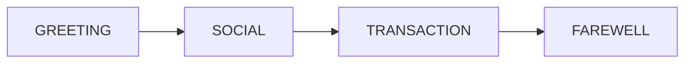

> Kazma is Arabic-native: Arabic works out of the box, beside English. This document covers the components that implement it: dialect detection and the tokenizers, Arabic in search, the i18n + RTL UI layer, and the Majlis cultural protocol — all source-referenced, with honest notes on scope.

---

## 1. The components

| Component | Package | Role |
|---|---|---|
| **Dialect detection + tokenizers** | `kazma-core` (`dialect_detector.py`, `tokenizer.py`) | Tell Kuwaiti from MSA and tokenize each, for the dialect router. |
| **Arabic in search** | `kazma-core` (`documents/arabic.py`) | One normal form for indexing and searching Arabic. |
| **i18n + RTL UI** | `kazma-ui` | UI string translation, per-request `dir`/`lang`, font policy. |
| **Majlis Protocol** | `kazma-core` | Gulf greetings and farewells on the chat-app path. |

These are **independent** layers. The tokenizers do not depend on the i18n system, and Majlis is a core conversational module — not a UI feature.

---

## 2. Dialect detection and the tokenizers

`kazma-core/kazma_core/tokenizer.py` (`DualEngineTokenizer`) detects the dialect first — `dialect_detector.py` tells Kuwaiti, Egyptian, Levantine, Maghrebi and MSA apart, with fasttext when it is installed and rules otherwise, the Kuwaiti markers coming from `arabic/kuwaiti_lexicon.py` — then hands Kuwaiti text to `KuwaitiTokenizer` (`kuwaiti_tokenizer.py`: dialect words kept as they are, Arabic–English code-switching, proper nouns) and everything else to `MSATokenizer` (`msa_tokenizer.py`). The dialect router (`kazma_core/router.py`, used by the routing engine) is what calls it.

`MSATokenizer` normalizes in two steps:

1. Diacritics removal — the tashkeel marks (`\u064B`–`\u0655`) and the small Quranic marks (`\u0610`–`\u061A`).
2. Alef unification — `أ`, `إ`, `آ`, `ٱ` → `ا`.

It does **not** fold taa marbuta (`ة`) or alef maqsura (`ى`): that loses grammatical information the tokenizer keeps. Search does fold them (§2.1).

### 2.1 Arabic in search

The Knowledge Library indexes and searches Arabic in one normal form, `fold_for_search` (`kazma_core/documents/arabic.py`), applied to the stored text and to the query alike: harakat, tatweel and bidi controls dropped; the alef-hamza forms, taa marbuta, alef maqsura, the hamza carriers and the Farsi/Urdu letter variants folded; Arabic-Indic digits turned ASCII; whitespace collapsed. Memory recall folds a question's words and a memory's the same way (`memory/query_terms.py`), drops English and Gulf/MSA stop words (`شنو`, `وش`, `شلون`, `وين`, `ليش`, `بس` …) and handles the article and one-letter prefixes ([Memory & RAG → `recall()`](memory-and-rag#recall)). There is no Arabic stemmer ([Troubleshooting → Arabic text in search](troubleshooting-and-workarounds#7-arabic-text-in-search)).

---

## 3. The i18n + RTL UI layer

### 3.1 The i18n system

`kazma-ui/kazma_ui/i18n/` is a **custom, lightweight** i18n system — **not** Babel/gettext. The strings live as one module per UI section under `i18n/catalog/` (including `x_studio.py`) and merge into `TRANSLATIONS` at import.

- **No separate `ar.json`/`en.json` files.** Keys are dotted strings with `{"en": ..., "ar": ...}` values.
- Only `en` and `ar` are shipped by default.
- Every key **must** have an `en` entry; `ar` falls back to English if missing.

API:

| Function | Purpose |
|---|---|
| `t(key, lang, **kwargs)` | Translate with `str.format` interpolation. |
| `t_plural(key, count, lang, **kwargs)` | The plural form for a count — Arabic has six. |
| `make_translator(lang)` | Closure bound to a language, for Jinja2. |
| `SUPPORTED_LANGUAGES` | Computed dynamically from the dict. |

**Jinja2 patching:** `_patch_jinja2_templates()` monkey-patches `Jinja2Templates.__init__` to always inject default i18n globals (`t`, `lang="en"`, `dir="ltr"`) so templates never raise `UndefinedError`. Called at module load.

**Server-side wiring** (`app.py`): the builder injects `t`, `lang`, `dir`, and `translations_json` (full dict as JSON for client-side Alpine.js) into Jinja2 globals. A `language_middleware` reads the `kazma-lang` cookie and sets `lang`/`dir` per request. With no cookie the page is in the install's language (`agent.language`). Python code that needs the request's language calls `i18n.current_language()`; only the middleware reads the cookie. Four routes used to read it themselves with English as the default, so an Arabic install showed parts of the Dashboard in English.

### 3.2 Coverage

The translation dict is extensive — keys span nav, header, chat, dashboard, settings, swarm, agents, skills, MCP, workspace, **X Studio** (`i18n/catalog/x_studio.py`), and scheduled. The entries live as one module per UI section under `kazma_ui/i18n/catalog/` and are merged at import, so `TRANSLATIONS` keeps its shape. Examples: `swarm.arabic_dialect`, `swarm.dialect_msa` ("Modern Standard Arabic" / "العربية الفصحى").

### 3.3 RTL handling

- **Template:** `templates/base.html` — `&lt;html lang="\{\{ lang()|default('en') \}\}" dir="\{\{ dir()|default('ltr') \}\}">`.
- **`dir`** is `"rtl"` for Arabic, set per request by the language middleware.
- **Client-side:** `base.html` injects `window.KAZMA_LANG` and a client-side `t()` lookup for Alpine expressions.

#### Text follows its own language

The UI language decides the page's layout and its own labels. It does not
decide how text is laid out: English text runs left to right and is aligned
left, and Arabic text runs right to left and is aligned right, in the Arabic
UI and the English UI alike. The rule was set on 2026-10-02. Before then, the
Arabic UI right-aligned English replies and tool output, and a mostly English
reply laid its Arabic paragraphs out left to right in both UIs.

- **Alignment is logical.** Stylesheets use `text-align: start`, which each
  paragraph resolves against its own direction. No rule picks `left` or
  `right` from the page's `dir`, unless it is declared with a reason (code,
  numbers, chart canvases).
- **Each paragraph takes its own direction.** The markdown renderer
  (`streaming.js`) gives every paragraph, heading, quote, list, list item and
  table cell a `dir` from its own words, using `KazmaBidi.blockDir`
  (`bidi.js`). A paragraph takes the language most of its words are written
  in. A URL, a path or an identifier counts as one word. A word with an
  Arabic letter or Arabic punctuation is Arabic, so "وDOCX" and "Telegram،"
  count as Arabic. A Latin word that looks like a name (an acronym,
  CamelCase, a word with a digit, a capital in mid-sentence) counts for a
  quarter, because Arabic technical writing is full of them: "WebDAV يعمل مع
  WD MyCloud OS5 وأي جهاز NAS" is an Arabic sentence. On a tie, the first
  letter decides. A block with no letters, such as a number, takes its container's
  direction, so a number column in an Arabic table stays on the right. The
  browser's own `dir="auto"` looks only at the first letter, which put "PDF
  الملف جاهز" left to right.
- **Isolation follows the paragraph.** The bidi helper isolates the words
  that differ from their paragraph's direction (Latin in Arabic, Arabic in
  English), never from the message's direction.
- **Content is marked.** Data a page shows (names, titles, model output,
  errors, paths) carries `translate="no"`. A global rule gives that element
  and every block inside it its direction from its own text
  (`unicode-bidi: plaintext`), except an element whose `dir` a script has
  already set, such as a renderer's paragraph or a tool call kept left to
  right. The same rule covers what you type into a field. Numbers are not
  marked, because a value with no letters is laid out
  left to right.
- **A line that mixes a label and content is split.** In the activity
  panel's "Memory used" row, each memory is its own line in its own
  language, with the kind label isolated from it. In the Arabic UI the label
  had decided the direction of the whole line.
- **A reply looks the same in both UIs.** No stylesheet rule keyed to the
  page's direction aligns a chat bubble.

Gates: `tests/test_text_follows_its_language.py` (the stylesheets, the
template bindings, the cookie) and
`tests/e2e/test_text_follows_its_language.py`. The browser test sends real
turns through the chat page in both UIs, measures where each line of each
paragraph and tool output sits, live and after a reload, and requires the
two UIs to lay every paragraph out the same way. `tests/js/test_block_direction.js`
covers the paragraph rule and the renderer.

### 3.4 Arabic font policy (IBM Plex, equal EN/AR size)

`kazma-ui/kazma_ui/static/css/kazma.css` — IBM Plex Sans / IBM Plex Sans Arabic
is the shared face with generated documents (`style_theme.THEME`) and the
Docusaurus docs. Amiri stays as a naskh fallback when Plex is absent. The
letterhead K is the product logo, favicon, and avatar.

EN and AR share the **same 14px root**. Plex Arabic matches the Latin optical
size, so an RTL-only base bump (the old 16px / 1.15× multiplier) made the
whole UI larger. Tiny labels still have a readability floor (~11px) because
0.6–0.7rem Arabic is illegible. The Settings font-size slider is the operator
size control and applies equally to both languages.

```css
/* Font stacks (kazma.css :root) */
:root {
  --font-sans: 'IBM Plex Sans', 'IBM Plex Sans Arabic', system-ui, ...;
  --font-arabic: 'IBM Plex Sans Arabic', 'IBM Plex Sans', system-ui, ...;
  --font-mono: 'JetBrains Mono', 'SF Mono', 'Fira Code', monospace;
}

html { font-size: 14px; }

html[dir="rtl"] .badge,
html[dir="rtl"] .metric-label,
html[dir="rtl"] .text-muted,
html[dir="rtl"] .text-xs { font-size: 0.82rem !important; }

[dir="rtl"] body,
[dir="rtl"] input,
[dir="rtl"] textarea,
[dir="rtl"] button,
[dir="rtl"] select { font-family: var(--font-arabic); }
```

Plex is the primary font for **both** Latin and Arabic. Tabular numerals
(`tnum`) apply on LTR only — never force Latin OpenType features on Arabic.

---

## 4. The Majlis Protocol

`kazma-core/kazma_core/majlis.py`. **Status: greetings and farewells only** (§4.5).

### 4.1 What it is

The `MajlisProtocol` class. From the module docstring:

> *Majlis Protocol — Cultural conversational protocol for Gulf Arabic interactions. The Majlis (مجلس) is the traditional Gulf gathering space where conversation follows specific cultural rhythms: greetings first, then social talk, then business.*

### 4.2 The 4-phase flow

`ConversationPhase` enum:


```mermaid
flowchart LR
    G[GREETING] --> S[SOCIAL]
    S --> T[TRANSACTION]
    T --> F[FAREWELL]
```

| Phase | Purpose |
|---|---|
| `GREETING` | Greetings first (السلام عليكم, هلا والله, شلونك). |
| `SOCIAL` | Social talk before business. |
| `TRANSACTION` | The actual task/request. |
| `FAREWELL` | Closing pleasantries. |

### 4.3 Defaults & cultural modifiers

- **Default dialect:** Kuwaiti (`dialect: str = "kw"`).
- **Hardcoded Kuwaiti greeting/farewell patterns** (`GREETING_PATTERNS`, `FAREWELL_PATTERNS`): `"السلام عليكم"`, `"هلا والله"`, `"شلونك"`, etc.
- **Cultural modifiers:** Ramadan, Eid, National Day adjust greeting-phase length and formality.
- **Sibling modules:** `CulturalContext`, `ConversationPacing`/`Intent`/`TransitionDecision`, `ToneAdapter`/`FormalityLevel`.

### 4.4 API

- `process_input(text, context)` — async entry point, returns a `MajlisResponse`.

### 4.5 Scope (honest note)

Majlis lives in **kazma-core**. On the chat-app path (Telegram, Discord, Slack), `majlis_runtime.maybe_majlis_short_circuit` — called from `kazma_gateway/agent_handler/graph.py` — answers a short greeting or farewell through `MajlisProtocol.process_input`; ordinary conversation does not enter the phase machine. Tone adaptation and cultural-context enrichment run beside it on that path, and the agent's system prompt carries a Kuwaiti/Gulf dialect instruction for Arabic replies (`cultural_context_enrichment.py`). There is **no "Majlis Mode" toggle** in the web settings or i18n keys. Tests exist at `tests/test_majlis.py`, and an example lives at `examples/almuhalab_custom_skills/trading_intel/`.

---

## 5. TUI localization

The TUI has its own RTL/localization (`kazma_tui/app.py`):

- `update_localization()` toggles an `rtl-mode` CSS class and translates the tab labels and the navigation rail from one table, `TAB_LABELS` (`kazma_tui/nav_rail.py`). A page the web UI also has takes the web's word (Dashboard is `لوحة التحكم` in both).
- **Ctrl+L** switches between English and Arabic (also in the command palette, *Switch language*), and the choice is saved.

---

## 6. Dialect support

| Dialect evidence | Where |
|---|---|
| Kuwaiti markers (dialect detection) | `arabic/kuwaiti_lexicon.py` (`CANONICAL_KUWAITI_MARKERS`), read by `dialect_detector.py` |
| Gulf/MSA stop words (memory search) | `memory/query_terms.py` (`شنو`, `وش`, `شلون`, `وين`, `ليش`, `بس` …) |
| Kuwaiti/Gulf replies in Arabic | `cultural_context_enrichment.py` (the dialect instruction in the system prompt) |
| Kuwaiti default dialect | `majlis.py` (`dialect: str = "kw"`) |
| Kuwaiti greeting/farewell patterns | `majlis.py` (`GREETING_PATTERNS`, `FAREWELL_PATTERNS`) |
| MSA (Modern Standard Arabic) UI label | `kazma_ui/i18n/catalog/swarm.py` (`swarm.dialect_msa`) |
| `swarm.arabic_dialect` config key | `kazma_ui/i18n/catalog/swarm.py` |

---

## 7. Bilingual usage notes

- **The shipped default is English** (`agent.language: en`, `agent.rtl: false`). Set `ar` and `true` for an Arabic-first install.
- The `kazma-lang` cookie switches the Web UI language per-browser without a restart.
- The `system_prompt` in `kazma.yaml` has the model answer in the language of the user's latest message (a mix gets a mix) and call itself كاظمه in Arabic; a per-turn language lock overrides it.
- For bilingual deployments, consider providing both EN and AR examples in skills/tools where the output language matters.

---

## Documentation Audit Notes

- **Majlis is wired for greetings and farewells only**, on the chat-app path (§4.5).
- **Majlis is NOT a UI feature.** There is no settings toggle or i18n key for "Majlis Mode." It is a core conversational protocol.
- **No separate translation files.** EN/AR strings live in `kazma_ui/i18n/catalog/`, one module per UI section; contributors add a key to its section's module.
- **Tokenizers, search folding and i18n are independent.** Changing i18n does not affect search indexing; the dialect tokenizers do not affect search either.
