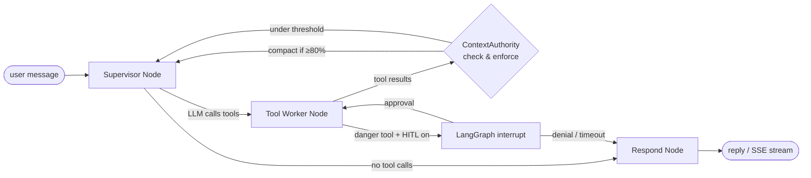
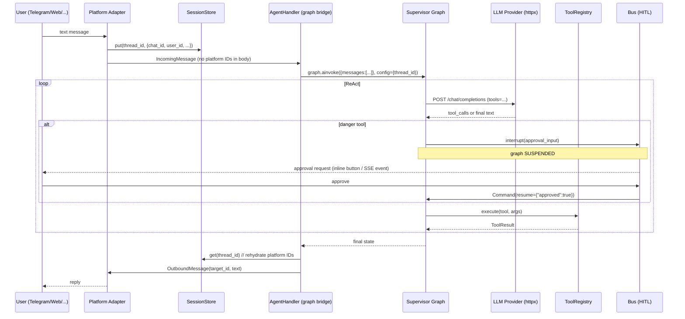
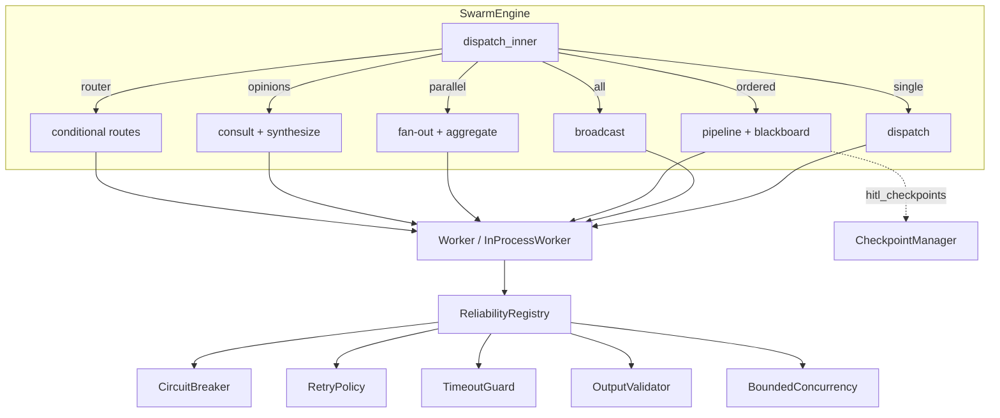

> A deep, source-referenced breakdown of the Kazma engine: the supervisor brain, the data path from user intent to tool execution, and the subsystems that make it durable, safe, and multilingual.

---

## 1. Philosophy: one brain, many mouths

Kazma is organized around a strict separation between **reasoning** (the LangGraph supervisor graph) and **transport** (the platform adapters). A single graph instance — built once by `build_supervisor_graph()` — serves every channel. The graph never sees platform-specific identifiers; adapters own those and re-attach them only when emitting a reply.

This yields three properties the rest of the system relies on:

1. **Provider freedom** — the brain talks to any OpenAI-compatible endpoint over `httpx`. No vendor SDK is imported.
2. **Channel parity** — a HITL pause, a tool call, and a streaming token are identical whether they originate from Telegram or the Web UI.
3. **Durable state** — because platform IDs live outside the graph, the graph state is purely conversational and can be checkpointed, replayed, and resumed across restarts.

---

## 2. Package topology

Kazma is a monorepo of seven installable packages (declared in `pyproject.toml` `[tool.hatch.build.targets.wheel]`):

| Package | Path | Responsibility |
|---|---|---|
| `kazma-core` | `kazma-core/kazma_core/` | Agent runner, LLM provider, model registry, swarm engine, ConfigStore, safety, memory, skills, MCP, hub, delegation, compaction, Majlis |
| `kazma-gateway` | `kazma-gateway/kazma_gateway/` | Telegram/Discord/Slack adapters, agent handler (graph bridge), slash commands, session store |
| `kazma-ui` | `kazma-ui/kazma_ui/` | FastAPI app factory, SSE chat, swarm panel, settings, dashboard, i18n, static assets |
| `kazma-tui` | `kazma-tui/kazma_tui/` | Textual TUI dashboard (read-mostly consumer of core singletons) |
| `kazma-memory` | `kazma-memory/kazma_memory/` | Arabic tokenizer + SQLite/FTS5 search backend |
| `kazma-skills` | `kazma-skills/kazma_skills/` | Skill manifests (data) |
| `kazma-cli` | `kazma-cli/kazma_cli/` | The `kazma` command surface |

Console scripts (`pyproject.toml:73-76`):

```
kazma     = "kazma_cli.main:main"
kazma-tui = "kazma_tui.app:main"
kazma-web = "kazma_ui.app:main"
```

---

## 3. The supervisor brain (LangGraph)

The core graph is a **ReAct loop** built in `kazma-core/kazma_core/agent/graph_builder.py`.

### 3.1 Node topology



- **Supervisor node** (`graph_builder.py:supervisor_node`) — calls the active LLM with the registered tools and conversation history. Routes based on whether the response contains tool calls.
- **Tool worker node** (`graph_builder.py:336 tool_worker_node`) — executes pending tool calls. This is where the HITL gate lives: if `hitl_config` is supplied and a tool is on the danger list, the node calls LangGraph `interrupt()` (line 493) and suspends until resumed.
- **ContextAuthority** (`authority.py:37 check_and_enforce`) — invoked inside the supervisor node (`graph_builder.py:167`) **before** the LLM call. If `should_compact()` returns true (token count ≥ 80% of the window), it summarises and rebuilds the message list.
- **Respond node** — finalises the assistant reply for streaming.

### 3.2 The ReAct loop in code

The graph is constructed by `build_supervisor_graph()` (`graph_builder.py:661`). The inner `_tool_worker` closure receives `hitl_config` (line 739) — this threading is what activates the gate. Two real build sites pass it (the third does not — see [Security & Safety](security-and-safety#the-graph-gate)).

```python
# agent_runner.py — the streaming graph used by the Web UI's SSE endpoint
def get_streaming_graph(self):
    hitl_config = {
        "enabled": self._config.get("safety.hitl.enabled", True),
        "require_approval_for": self._config.get(
            "safety.hitl.require_approval_for",
            DEFAULT_DANGER_TOOLS,
        ),
        "approval_timeout_seconds": self._config.get(
            "safety.hitl.approval_timeout_seconds", 60
        ),
    }
    graph = build_supervisor_graph(
        model=self.model,
        tools=self.tools,
        hitl_config=hitl_config,        # <-- gate active
        checkpointer=self._checkpointer,
    )
    return graph
```

### 3.3 Durable execution

- **Checkpointer:** `AsyncSqliteSaver` (from `langgraph-checkpoint-sqlite`) on `kazma-data/checkpoints.db` (configured in `kazma-ui/.../app.py:724-726`).
- **Thread identity:** each conversation has a `thread_id` (derived from sender id, e.g. `gw-telegram-12345`, or a fresh UUID4 — see `agent_handler/store.py:34 _resolve_thread`).
- **Crash recovery:** HITL pauses persist in the checkpointer. On restart, `restore_paused_tasks()` (`swarm/checkpoint_manager.py:182`) reloads paused swarm tasks and re-arms their auto-reject timeouts. Graph-path pauses survive because they live in the checkpointer.
- **Time travel:** `/replay list | &lt;iter> | compare &lt;a> &lt;b> | clear` (slash command) and `time_travel` config (`kazma.yaml:111-114`, `max_snapshots: 50`).

---

## 4. End-to-end data flow



Key invariants enforced along this path:

| Invariant | Enforced by | Location |
|---|---|---|
| Platform IDs never enter graph state | `_PLATFORM_KEYS` frozen set + `_build_initial_state` | `agent_handler/store.py:16,95` |
| Reply routes back to the correct chat | `_build_target_id(platform, ctx)` | `agent_handler/store.py:146` |
| Wrong-provider model never hits wrong endpoint | `get_client()` auto-correction | `model_registry.py:275-303` |
| Danger tools pause, never execute silently | `interrupt()` + `_hitl_approved` flag | `graph_builder.py:483-506` |
| Swapped provider invalidates stale clients | `set_active_model` clears cache | `model_registry.py:248` |

---

## 5. The LLM provider layer

`kazma-core/kazma_core/llm_provider.py` is a thin, **SDK-free** `httpx` client. It speaks the OpenAI Chat Completions wire format to anything compatible.

### 5.1 Provider resolution

`ModelRegistry.get_client(model=None)` (`model_registry.py:252`) returns a cached `LLMProvider` for the active profile. The critical safety net:

```python
# model_registry.py:275-303 (paraphrased)
if effective_model:
    owner = self.find_provider_for_model(effective_model)
    if owner and owner["name"].lower() != provider_name.lower():
        # e.g. a DeepSeek model requested while OpenAI is active
        provider_name = owner["name"]      # auto-correct
        if model is None:
            self._active_provider = owner_name
            self._config_store.set("registry.active_provider", owner_name, ...)
```

This is why "never change model without provider" is a hard rule — see [Provider/Model Resolution](#) warnings in [Configuration](configuration).

### 5.2 The NVIDIA NIM tool-fallback workaround

Some providers (notably NVIDIA NIM) reject tool definitions with `404 "Function not found"`. The client detects this and retries once **without** tools so the caller still gets a text answer (`llm_provider.py:285-300`):

```python
nim_function_not_found = status_code == 404 and "function" in detail_lower
tool_schema_error = (
    status_code in (400, 422)
    and any(tok in detail_lower for tok in ("tool", "function"))
)
if tools and (nim_function_not_found or tool_schema_error):
    logger.warning("Provider rejected tool definitions; retrying without tools.")
    payload.pop("tools", None)
    payload.pop("tool_choice", None)
    resp = await client.post("/chat/completions", json=payload)
```

> **Do not remove this branch.** Removing it breaks tool-using agents on NVIDIA NIM and other strict providers.

### 5.3 Streaming

Streaming is a standalone async generator `stream_chat()` in `streaming.py` (not a method on `LLMProvider`). It POSTs with `stream: True`, parses SSE `data:` lines, handles `[DONE]`, and yields typed `StreamEvent`s (`token`, `tool_call`, `done`, `error`). See [API & Extension Points](api-and-extension-points#sse-event-contract).

### 5.4 Cost & retry

| Concern | Mechanism | Location |
|---|---|---|
| Per-call cost | `(prompt_tokens * in_cost/1M) + (completion_tokens * out_cost/1M)` | `llm_provider.py:411-422` |
| Cost ceiling | `CostCircuitBreaker` (default $0.50, 5-min silence) — env `KAZMA_MAX_COST`, `KAZMA_SILENCE_WINDOW` | `cost_breaker.py` |
| Retries | `tenacity`-based decorators, network/timeout only, **no 4xx** | `retry.py:39-109` |
| Rate-limit (429) handling | **Not implemented** | — |

> The cost breaker is a standalone dataclass; the agent layer must drive it via `record_cost` / `should_halt`. It is not auto-wired into `chat()`.

---

## 6. Swarm orchestration (overview)

When the supervisor needs more than one agent, control passes to `SwarmEngine` (`kazma-core/kazma_core/swarm/engine.py:103`). Six dispatch patterns are supported as a `TaskType` enum (`swarm/task.py:65`): `DISPATCH`, `BROADCAST`, `PIPELINE`, `FAN_OUT`, `CONSULT`, `CONDITIONAL`.



Handoffs between workers are guarded against infinite recursion: `MAX_HANDOFF_DEPTH = 5` and `MAX_VISITS = 2` (per-worker visit count, not a boolean set) live in `swarm/handoff_guards.py:16-17`. See [Swarm Orchestration](swarm-orchestration) for the full pattern catalog.

---

## 7. The memory subsystems (overview)

Kazma contains **three memory subsystems**, each serving a distinct consumer. After the July 2026 memory overhaul, all three are correctly wired and active:

| Subsystem | Backing | Used by | Status |
|---|---|---|---|
| **VectorMemory** (RAG) | ChromaDB, `all-MiniLM-L6-v2` (384-d) | Chat agent (LLM tools + **compaction injection**) | ✅ Active — compaction now retrieves + injects memories |
| **SQLiteMemoryBackend** (FTS5) | SQLite + FTS5 + cosine vector search | 4-layer adapter's L3 | ✅ Active — bugs fixed (Arabic tokenization, `distance()`, vec detection) |
| **UnifiedMemoryAdapter** (4-layer RRF) | ChromaDB + NetworkX + FTS5 + sqlite-vec | Swarm: `self_improvement.py` + `phonebook.py` | ✅ Active — L1 import typo fixed, caller bug fixed |

Full details in [Memory & RAG](memory-and-rag).

---

## 8. Arabic & cultural layer

Kazma is Arabic-native by default (`agent.language: ar`, `agent.rtl: true`). Three components implement this:

1. **Arabic tokenizer** (`kazma-memory/kazma_memory/arabic_tokenizer.py`) — diacritics removal, Alef/Yeh/Teh-Marbuta normalization, Tatweel stripping, Kuwaiti-dialect stop words, basic stemmer. Feeds the FTS5 `content_arabic` column.
2. **i18n + RTL UI** (`kazma-ui/kazma_ui/i18n.py`, `static/css/kazma.css`) — inline `TRANSLATIONS` dict (EN/AR), per-request `dir`/`lang`, Calibri-first font stack, 16px RTL base, readability floor on small classes.
3. **Majlis Protocol** (`kazma-core/kazma_core/majlis.py`) — a 4-phase Gulf cultural conversational flow (GREETING → SOCIAL → TRANSACTION → FAREWELL) with Kuwaiti-dialect defaults and cultural modifiers (Ramadan, Eid, National Day).

See [Arabic & Cultural Features](arabic-cultural-features).

---

## 9. Observability (current state)

| Signal | Source | Status |
|---|---|---|
| Structured logs | `logging` (JSON format option in `kazma.yaml`) | ✅ Active |
| Swarm metrics | `MetricsCollector` (in-memory + SQLite) — `tasks_completed`, `tasks_failed`, `avg_latency`, `total_tokens`, `total_cost` | ✅ Active |
| Tracing spans | In-house `TraceStore` (ring buffer + WebSocket to dashboard) + `TracingEmitter` (swarm, stdlib-only) | ✅ Active |
| Web research tools | `read_url` / `web_search` / `crawl_site` / research save+digest (`tools/read_url.py`, `web_research.py`) | ✅ Active — [Web research](web-research) |
| SSE telemetry | `/api/chat/stream` events; telemetry router | ✅ Active |
| **Langfuse** | `KazmaTracer` with `backend="langfuse"`; enabled via `logging.langfuse.enabled: true` + keys | ✅ **Wired and functional** (dormant by default — activate with keys) |
| **OpenTelemetry** | — | 🔴 **Removed** (dead code + dead deps purged; Langfuse + Console remain) |
| **Prometheus** | — | 🔴 **Not implemented** |

### OpenTelemetry — removed (Option A)

OpenTelemetry was **declared as a dependency with real code, but was never reachable at runtime** — no config path selected `backend="opentelemetry"`. The `[tracing]` extra (6 packages) was pure dead weight (never imported).

**Removed in the July 2026 cleanup:**
- `_init_opentelemetry()` method + all four `_trace_*_otel()` methods from `KazmaTracer`
- `OPENTELEMETRY` enum value from `TracingBackend`
- `opentelemetry-api` + `opentelemetry-sdk` from core deps
- Entire `[tracing]` optional extra (6 packages) from `pyproject.toml`
- `otlp_endpoint` field + `"opentelemetry"` from valid backends in `TracingConfig`

Tracing now has two backends: **Langfuse** (primary, dormant by default) and **Console** (fallback). The in-house `TraceStore` (ring buffer + WebSocket dashboard) and the swarm's stdlib-only `TracingEmitter` (OTel-compatible span format, no OTel package) remain unchanged.

---

## 10. Cross-cutting data stores

All SQLite stores in Kazma share the same concurrency model, centralized in `config_store.py:apply_sqlite_pragmas()`:

```sql
PRAGMA journal_mode=WAL;       -- concurrent readers, single writer
PRAGMA busy_timeout=5000;      -- 5 s wait on lock
PRAGMA synchronous=NORMAL;     -- WAL-safe, faster than FULL
```

| Store | Path | Purpose |
|---|---|---|
| ConfigStore | `kazma-data/settings.db` | Runtime settings (overrides `kazma.yaml`) |
| LangGraph checkpointer | `kazma-data/checkpoints.db` | Conversation state, HITL pauses |
| TaskStore | `kazma-data/swarm_tasks.db` | Swarm tasks + worker metrics |
| Time-travel snapshots | `kazma-data/snapshots.db` | `/replay` history |
| Hub registry | `~/.kazma/hub/registry.db` | Installed skills |
| Vector memory | `~/.kazma/vector_memory` | ChromaDB persistent client |
| Session store (gateway) | configurable | Platform ID ↔ thread_id mapping |

---

## Documentation Audit Notes

- **Premise corrected:** Older docs placed the "4-layer memory" claim in AGENTS.md. It actually originates in `README.md` and `swarm/memory/__init__.py`. The 4 layers all exist as code but the adapter is **not** wired into the chat agent (see [Memory & RAG](memory-and-rag)).
- **Build-site line numbers refreshed:** AGENTS.md cited "app.py ~line 966" for the startup recompile. The real site is `kazma-ui/kazma_ui/app.py:741-751` inside `_on_startup()` (line 721). `graph_builder.py:966` is an unrelated `aiosqlite.connect`.
- **`agent_handler` is a package, not a file:** The gateway's `agent_handler.py` was decomposed into the `agent_handler/` package (`store.py`, `graph.py`, `commands.py`, …).
- **`UnifiedModelRegistry`** is just an alias for `ModelRegistry` (`model_registry.py:950`).
