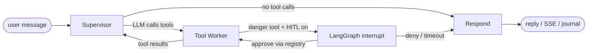
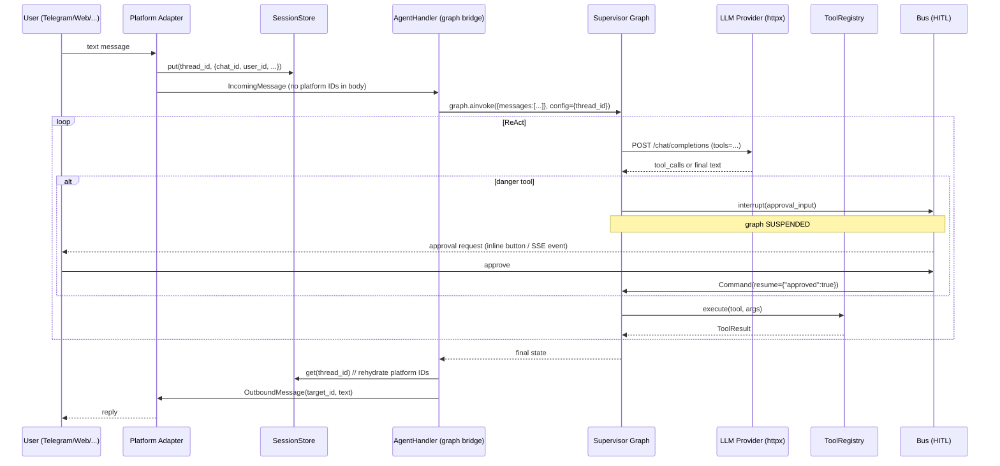
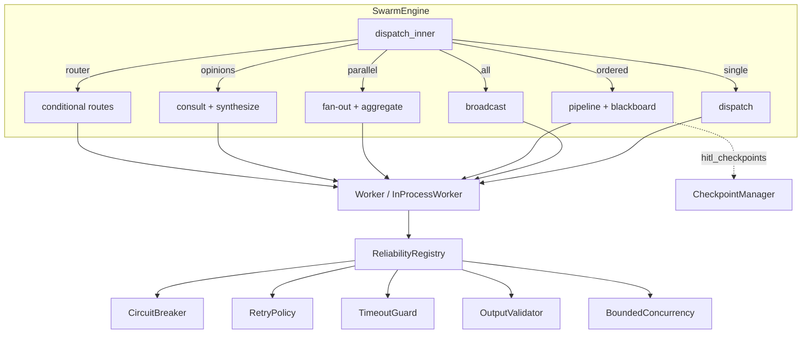

> A deep, source-referenced breakdown of the Kazma engine: the supervisor brain, the data path from user intent to tool execution, and the subsystems that make it durable, safe, and multilingual. Binding invariants live in [`AGENTS.md`](https://github.com/Mubder/kazma/blob/main/AGENTS.md); this page describes structure. Binding audit: [`AUDIT_DEEP_2026-09-01_EXEC.md`](https://github.com/Mubder/kazma/blob/main/docs/audits/AUDIT_DEEP_2026-09-01_EXEC.md) (waves 0–8 shipped).

---

## 1. Philosophy: one brain, many mouths

Kazma is organized around a strict separation between **reasoning** (the LangGraph supervisor graph) and **transport** (the platform adapters). A single graph instance — built once by `build_supervisor_graph()` — serves every channel. The graph never sees platform-specific identifiers; adapters own those and re-attach them only when emitting a reply.

The CLI (`kazma ask`) and ACP stdio (`kazma acp`) are additional mouths: they build the **same** supervisor in-process (no uvicorn). Tokens stream via `register_delta_queue`. HITL uses a MemorySaver checkpointer plus graph `interrupt()` — TTY `y/N`, or ACP `session/request_permission`.

This yields three properties the rest of the system relies on:

1. **Provider freedom** — the brain talks to any OpenAI-compatible endpoint over `httpx`. No vendor SDK is imported.
2. **Channel parity** — a HITL pause, a tool call, and a streaming token are identical whether they originate from Telegram, the Web UI, or `kazma ask`.
3. **Durable state** — because platform IDs live outside the graph, the graph state is purely conversational and can be checkpointed, replayed, and resumed across restarts.

---

## 2. Package topology

Kazma is a monorepo of **six** packages in one hatchling wheel (declared in `pyproject.toml` `[tool.hatch.build.targets.wheel]`). There is no separate `kazma-memory` package — V2 memory lives in `kazma_core.memory`.

| Package | Path | Responsibility |
|---|---|---|
| `kazma-core` | `kazma-core/kazma_core/` | Agent runner, LLM provider, model registry, swarm engine, ConfigStore, safety, V2 memory, **document intelligence** (`documents/`), skills, MCP, hub, compaction, Majlis |
| `kazma-gateway` | `kazma-gateway/kazma_gateway/` | Telegram/Discord/Slack adapters, agent handler (graph bridge), slash commands, session store |
| `kazma-ui` | `kazma-ui/kazma_ui/` | FastAPI app factory, SSE chat, swarm panel, settings, dashboard, i18n, static assets |
| `kazma-tui` | `kazma-tui/kazma_tui/` | Textual TUI dashboard (read-mostly consumer of core singletons) |
| `kazma-skills` | `kazma-skills/kazma_skills/` | Native skill manifests |
| `kazma-cli` | `kazma-cli/kazma_cli/` | The `kazma` command surface |

Console scripts (`pyproject.toml` `[project.scripts]`):

```
kazma     = "kazma_cli.main:main"
kazma-tui = "kazma_tui.app:main"
kazma-web = "kazma_ui.app:main"
```

---

## 3. The supervisor brain (LangGraph)

The core graph is a **ReAct loop**. `graph_builder.py` **wires** the nodes;
the bodies live in split modules. Do not hunt for HITL or retry inside
`graph_builder.py` — you will miss the gate.

| Node | Module | Role |
|------|--------|------|
| Supervisor | `graph_supervisor.py` (`supervisor_node`, `_call_llm_with_retry`) | LLM call + tool routing. Retries **transient** `LLMError` only. |
| Tool worker | `graph_tool_worker.py` (`tool_worker_node`, `_commitment_resolve_gate`) | Commitment first, then HITL `interrupt()`, then execute. |
| Respond | `graph_respond.py` (`respond_node`) | Final reply. **Skips synthesis** when `turn_failed` is set. |
| Wiring | `graph_builder.py` (`build_supervisor_graph`) | Assembles the graph; passes `hitl_config` into the tool-worker closure. |

### 3.1 Node topology


```mermaid
flowchart LR
    START([user message]) --> SUP[Supervisor]
    SUP -- "LLM calls tools" --> TW[Tool Worker]
    TW -- "tool results" --> SUP
    SUP -- "no tool calls" --> RESP[Respond]
    RESP --> END([reply / SSE / journal])
    TW -- "danger tool + HITL on" --> INT[LangGraph interrupt]
    INT -- "approve via registry" --> TW
    INT -- "deny / timeout" --> RESP
```

- **HITL** is active only when `hitl_config` is passed at **all three** build sites: `agent_runner.get_streaming_graph()`, `agent_runner._ensure_graph`, and `app.py` startup recompile into `_graph_holder`. Live config is `get_hitl_config()`; YAML default timeout is **300s** (`safety.hitl.approval_timeout_seconds`), not 60.
- **Decision vs execution:** `hitl_gates.db` owns whether the gate was answered; the LangGraph checkpoint owns whether the graph is paused. Web paints from the registry (`chat.js` `_serverGates`). See [AGENTS.md](https://github.com/Mubder/kazma/blob/main/AGENTS.md) §7 + §30 + §31.
- **Context:** two layers, do not flatten. `ContextAuthority` / `TokenCounter.should_compact` still trips at **80% of the model window**. Independently, **context-integrity trim** fires at `min(24K, window×0.6)` and the summary net runs on every drop of user/assistant turns (AGENTS.md §29). The old “summary at 80% of window” dead band is gone.
- **Turn Delivery:** the SSE/WS bubble is a **projection** of the turn journal. `close_turn` is the only closer. Token deltas append; only `turn_complete` replaces. Do not restore a second painter.

### 3.2 Durable execution

- **Checkpointer:** `AsyncSqliteSaver` on `kazma-data/checkpoints.db`, or Postgres `checkpoints*` when `KAZMA_DATABASE_URL` is set (those tables are in `KAZMA_PG_TABLES`).
- **Thread identity:** `thread_id` from sender (e.g. `gw-telegram-12345`) or UUID — `agent_handler/store.py`. Platform IDs never enter graph state.
- **Crash recovery:** graph HITL pauses live in the checkpointer; swarm pauses in `CheckpointManager.restore_paused_tasks()`. Registry `boot_sweep()` orphans stale claimed/resuming rows and **never** touches pending (the card must survive restart).
- **Shutdown:** `_on_shutdown()` must stop cron first, then drain swarm `_task_handles` / `stop_all()`, then close stores / HTTP pool / gateway. Hard-kill can corrupt SQLite.
- **Time travel:** `/replay` and `/fork` (slash); snapshots in `kazma-data/snapshots.db` (LRU 50 per thread). `/fork` writes a **new** thread and must not overwrite `active_thread.{sender}`.

---

## 4. End-to-end data flow


```mermaid
sequenceDiagram
    participant U as User (Telegram/Web/...)
    participant A as Platform Adapter
    participant S as SessionStore
    participant H as AgentHandler (graph bridge)
    participant G as Supervisor Graph
    participant L as LLM Provider (httpx)
    participant T as ToolRegistry
    participant M as Bus (HITL)

    U->>A: text message
    A->>S: put(thread_id, {chat_id, user_id, ...})
    A->>H: IncomingMessage (no platform IDs in body)
    H->>G: graph.ainvoke({messages:[...]}, config={thread_id})
    loop ReAct
        G->>L: POST /chat/completions (tools=...)
        L-->>G: tool_calls or final text
        alt danger tool
            G->>M: interrupt(approval_input)
            Note over G,M: graph SUSPENDED
            M-->>U: approval request (inline button / SSE event)
            U->>M: approve
            M->>G: Command(resume={"approved":true})
        end
        G->>T: execute(tool, args)
        T-->>G: ToolResult
    end
    G-->>H: final state
    H->>S: get(thread_id)  // rehydrate platform IDs
    H->>A: OutboundMessage(target_id, text)
    A-->>U: reply
```

Key invariants enforced along this path:

| Invariant | Enforced by | Location |
|---|---|---|
| Platform IDs never enter graph state | `_PLATFORM_KEYS` + `_build_initial_state` | `agent_handler/store.py` |
| Reply routes back to the correct chat | `_build_target_id(platform, ctx)` | `agent_handler/store.py` |
| Wrong-provider model never hits wrong endpoint | `get_client()` auto-correction | `model_registry.py` |
| Danger tools pause, never execute silently | `interrupt()` in `graph_tool_worker.py` + registry row | `graph_tool_worker.py`, `hitl_gates.py` |
| Swapped provider invalidates stale clients | `set_active_model` clears cache | `model_registry.py` |
| Failed LLM turn is not synthesized | `turn_failed` → `respond_node` skips | `graph_supervisor.py`, `graph_respond.py` |
| Client does not author HITL state | `_serverGates` / TurnDocument projection | `chat.js`, `turn_runtime.close_turn` |

---

## 5. The LLM provider layer

`kazma-core/kazma_core/llm_provider.py` is a thin, **SDK-free** `httpx` client. It speaks the OpenAI Chat Completions wire format to anything compatible. Most providers (OpenAI, DeepSeek, Groq, Mistral, Together, Cohere, Fireworks, Perplexity, AI21, xAI, OpenRouter, NVIDIA NIM, Ollama, LM Studio) work through this generic `LLMProvider` with `Authorization: Bearer`.

Four providers have **dedicated native classes** (their auth or request schema differs from the OpenAI wire format) and are dispatched in `model_registry.get_client()` / `get_model()` / `get_client_by_provider()`:

| Provider | Class | Why native |
|---|---|---|
| Google Gemini | `GeminiProvider` (`google_llm.py`) | Vertex AI, ADC, computed base URL |
| Anthropic | `AnthropicProvider` (`anthropic_llm.py`) | `/messages` schema, `x-api-key` + `anthropic-version` |
| Azure OpenAI | `AzureProvider` (`azure_llm.py`) | `api-key` header + `api-version` query param, deployment routing |
| AWS Bedrock | `BedrockProvider` (`bedrock_llm.py`) | SigV4 signing + Converse API |

See [LLM Providers](../reference/llm-providers) for the full list and setup.

### 5.1 Provider resolution

`ModelRegistry.get_client(model=None)` returns a cached `LLMProvider` for the active profile. The critical safety net:

```python
# model_registry.py (paraphrased)
if effective_model:
    owner = self.find_provider_for_model(effective_model)
    if owner and owner["name"].lower() != provider_name.lower():
        # e.g. a DeepSeek model requested while OpenAI is active
        provider_name = owner["name"]      # auto-correct
        if model is None:
            self._active_provider = owner_name
            self._config_store.set("registry.active_provider", owner_name, ...)
```

This is why "never change model without provider" is a hard rule — see [Provider/Model Resolution](#) warnings in [Configuration](configuration).

### 5.2 The NVIDIA NIM tool-fallback workaround

Some providers (notably NVIDIA NIM) reject tool definitions with `404 "Function not found"`. The client detects this and retries once **without** tools so the caller still gets a text answer:

```python
nim_function_not_found = status_code == 404 and "function" in detail_lower
tool_schema_error = (
    status_code in (400, 422)
    and any(tok in detail_lower for tok in ("tool", "function"))
)
if tools and (nim_function_not_found or tool_schema_error):
    logger.warning("Provider rejected tool definitions; retrying without tools.")
    payload.pop("tools", None)
    payload.pop("tool_choice", None)
    resp = await client.post("/chat/completions", json=payload)
```

> **Do not remove this branch.** Removing it breaks tool-using agents on NVIDIA NIM and other strict providers.

### 5.3 Streaming

Token streaming is `LLMProvider.chat_stream()` consumed by `invoke_llm_chat()` (`llm_stream.py`), which injects synthetic `on_chat_model_stream` events for SSE/WS. Kill-switch: `KAZMA_LLM_STREAM=0` (blocking `chat()`). See [API & Extension Points](api-and-extension-points#sse-event-contract).

### 5.4 Cost & retry

| Concern | Mechanism | Location |
|---|---|---|
| Per-call cost | `(prompt_tokens * in_cost/1M) + (completion_tokens * out_cost/1M)` | `llm_provider.py` |
| Cost ceiling | `CostCircuitBreaker` (default $0.50, 5-min silence) — env `KAZMA_MAX_COST`, `KAZMA_SILENCE_WINDOW` | `cost_breaker.py` |
| Retries | Supervisor: transient `LLMError` only (`graph_supervisor.py`). Provider: 429 + network. Permanent 4xx fail fast. | `graph_supervisor.py`, `llm_provider.py` |
| Rate-limit (429) handling | Retry-After + 3-attempt exponential backoff; exhausted 429 is `transient=True` + `kind=rate_limit_exhausted` (supervisor skips same-provider re-retry; failover still fires) | `llm_provider.py`, `anthropic_llm.py` |

> The cost breaker is a standalone dataclass; the agent layer must drive it via `record_cost` / `should_halt`. It is not auto-wired into `chat()`.

### 5.5 Strict schemas & structured outputs

Tool parameter objects generated from type hints (`agent/tool_schema.py`) are **closed JSON Schema**: `additionalProperties: false` on the root and nested objects that have `properties`. `required` is parameters without Python defaults (provider-safe). Free-form `dict[K, V]` parameters stay open (`additionalProperties` is the value schema) so `env={...}` still works.

OpenAI Structured Outputs for **tools** is opt-in: `KAZMA_STRICT_TOOLS=1` stamps `function.strict: true` and promotes every property into `required`, wrapping former optionals as `anyOf: [T, {type: null}]`. Tools that cannot satisfy that contract (open dicts) stay unstrict so Anthropic / Gemini / local servers do not 400.

Structured JSON **replies** (not tool calls) use `LLMProvider.chat(..., response_format={"type": "json_schema", ...})` / `json_object`. Helper: `json_schema_response_format()`. The supervisor loop does **not** attach this on every turn. Providers that reject `response_format` are retried once without it. Native Anthropic/Bedrock accept the kwarg for signature parity and ignore it.

### 5.6 Tool hooks (PreToolUse / PostToolUse)

Programmable callbacks around `LocalToolRegistry.execute` and MCP unified execute (`agent/tool_hooks.py`). Claude Code–style:

| Event | Can | Cannot |
|-------|-----|--------|
| **PreToolUse** | Deny the call, or rewrite arguments | Skip HITL, skip commitment, auto-approve danger tools |
| **PostToolUse** | Append a short observation note | Undo a tool that already ran |

In-process: `register_pre_tool_hook` / `register_post_tool_hook` (matcher glob or `a|b`). Operator commands: YAML/ConfigStore `agent.hooks.pre_tool` / `post_tool` — JSON on stdin, JSON on stdout (or exit 2 = deny). Spawned with `asyncio.to_thread(subprocess.run)` (Windows SelectorEventLoop). Empty lists = no-op. Kill-switch: `KAZMA_TOOL_HOOKS=0`. A crashing hook **fail-opens** (the tool still runs); security stays HITL + commitment.

### 5.7 Plan mode

First-class inspect-then-propose (`agent/plan_mode.py`). While `/plan` is on for a thread, the supervisor unions `read_only` + `no_writes` into `hard_constraints`. `filter_tools_for_constraints` removes write/exec tools from the LLM schema; the tool worker allowlist blocks them if the model still names one. YOLO cannot expand that allowlist.

`/plan go` or a short **Proceed** / **approve** reply exits plan mode, drops those tags, and injects an execute system note so the same graph run implements the plan. HITL still gates danger tools. Kill-switch: `KAZMA_PLAN_MODE=0`.

---

## 6. Swarm orchestration (overview)

When the supervisor needs more than one agent, control passes to `SwarmEngine` (`kazma-core/kazma_core/swarm/engine.py`). Six dispatch patterns are supported as a `TaskType` enum (`swarm/task.py`): `DISPATCH`, `BROADCAST`, `PIPELINE`, `FAN_OUT`, `CONSULT`, `CONDITIONAL`.


```mermaid
flowchart TB
    subgraph SwarmEngine
        DI[dispatch_inner]
        DI -->|single| DSP[dispatch]
        DI -->|all| BCAST[broadcast]
        DI -->|ordered| PIPE[pipeline + blackboard]
        DI -->|parallel| FAN[fan-out + aggregate]
        DI -->|opinions| CONS[consult + synthesize]
        DI -->|router| COND[conditional routes]
    end
    DSP & BCAST & PIPE & FAN & CONS & COND --> W[Worker / InProcessWorker]
    W --> REL[ReliabilityRegistry]
    REL --> CB[CircuitBreaker]
    REL --> RT[RetryPolicy]
    REL --> TO[TimeoutGuard]
    REL --> OV[OutputValidator]
    REL --> BC[BoundedConcurrency]
    PIPE -.->|hitl_checkpoints| CK[CheckpointManager]
```

Handoffs between workers are guarded against infinite recursion: `MAX_HANDOFF_DEPTH = 5` and `MAX_VISITS = 2` (per-worker visit count, not a boolean set) live in `swarm/handoff_guards.py`. Swarm FanOut HITL is **tri-state** (`True` settles; `False` is a vote until `expected_voters` or deadline) — not first-boolean-wins. See [Swarm Orchestration](swarm-orchestration) for the full pattern catalog.

The engine also exposes `get_autoscaler()` (lazy) — when a task has no matching registered worker, it auto-spawns one from `swarm_templates.json` and selects the best available model for the task kind. See [Swarm Orchestration §14](swarm-orchestration#14-dynamic-autoscaler--worker-templates).

---

## 7. The memory subsystems (overview)

Kazma's chat memory is the **V2 Cognitive Engine** (bi-temporal belief graph, PPR recall). The V1 4-layer RRF stack was removed in the V1→V2 cutover; V2 is the single stack. Supporting pieces:

| Subsystem | Backing | Used by | Status |
|---|---|---|---|
| **V2 Cognitive Engine** | Bi-temporal belief graph + 4-tier episodes + sqlite-vec (`memory_state.db`); **pgvector** when Postgres is on | Chat (per-turn recall, tools, auto-store, compaction) + swarm + self-improvement | ✅ **Chat default** — single read/write path (`recall()` from `memory/recall.py`) |
| **Local Ego-Graph PPR** | Personalized PageRank over the belief/episode graph (2-hop, N≤200) | V2 recall boost | ✅ `memory/ppr.py` |
| **Consolidator** | LLM/heuristic belief + episode extraction, prompt-fenced | Post-turn write pipeline | ✅ `memory/consolidator.py` |
| **Durable consolidation queue** | SQLite-backed worker queue (`memory_ops.db`) | Async belief extraction, macro-sleep, backup/export | ✅ `memory/task_queue.py` |
| **Knowledge Library** | Per-lib `kazma_kb_*` Chroma + SQLite chunks | Docs RAG (`knowledge_*` tools) | ✅ Isolated from chat memory |

Write path: `mutate_belief` is the single INSERT choke. Payload-object beliefs also get a hub `related_to` edge (`memory/ego_anchor.py`) so the canvas does not show disconnected concepts. Optional Postgres state mirror receives **tombstones** on invalidate/supersede/clear; optional Neo4j dual-write deletes those edges too.

Schedulers (all started from `start_memory_worker()` — add a new one there or it never runs): 6h `macro_sleep`; **6h** backup/export + `native_pg_backup` (not 24h); 24h reconsolidation; 15m commitment GC (also rides HITL-gate TTL); plus session purge, daily digest, weekly firing ledger, restore drill.

Config: `memory.*` flags use **ConfigStore ← kazma.yaml** (`kazma_core.memory.config`); V2 is on at `memory.v2.use_new_stack: true`. Full details in [Memory & RAG](memory-and-rag). Audit: [`AUDIT_MEMORY_SYSTEM_2026-08-24.md`](https://github.com/Mubder/kazma/blob/main/docs/audits/AUDIT_MEMORY_SYSTEM_2026-08-24.md).

---

## 8. Arabic & cultural layer

Kazma is Arabic-native by default (`agent.language: ar`, `agent.rtl: true`). Three components implement this:

1. **Arabic tokenizer** (`kazma_core/msa_tokenizer.py`) — MSA normalization (alef variants, diacritics). The old `kazma-memory` package was retired.
2. **i18n + RTL UI** (`kazma-ui/kazma_ui/i18n.py` + `i18n/catalog/`, `static/css/kazma.css`) — merged `TRANSLATIONS` dict (EN/AR), per-request `dir`/`lang`, IBM Plex Sans / IBM Plex Sans Arabic, shared 14px root, readability floor on small classes.
3. **Majlis Protocol** (`kazma-core/kazma_core/majlis.py`) — a 4-phase Gulf cultural conversational flow (GREETING → SOCIAL → TRANSACTION → FAREWELL) with Kuwaiti-dialect defaults and cultural modifiers (Ramadan, Eid, National Day).

See [Arabic & Cultural Features](arabic-cultural-features).

---

## 9. Observability (current state)

| Signal | Source | Status |
|---|---|---|
| Structured logs | `logging` (JSON format option in `kazma.yaml`) | ✅ Active |
| Swarm metrics | `MetricsCollector` (in-memory + SQLite) — `tasks_completed`, `tasks_failed`, `avg_latency`, `total_tokens`, `total_cost` | ✅ Active |
| Tracing spans | In-house `TraceStore` (ring buffer + WebSocket to dashboard) + `TracingEmitter` (swarm, stdlib-only) | ✅ Active |
| Web research tools | `read_url` / `web_search` / `crawl_site` / research save+digest (`tools/read_url.py`, `web_research.py`) | ✅ Active — [Web research](web-research) |
| SSE telemetry | `/api/chat/stream` events; telemetry router | ✅ Active |
| **Langfuse** | `KazmaTracer` with `backend="langfuse"`; `logging.langfuse.enabled: auto` turns on when keys exist | ✅ **Wired** (`KAZMA_LANGFUSE=0` kill-switch) |
| **OpenTelemetry** | — | 🔴 **Removed** (dead code + dead deps purged; Langfuse + Console remain) |
| **Prometheus** | `/metrics` + `/api/metrics` (`kazma_ui/metrics.py`) | ✅ Active |

### OpenTelemetry — removed (Option A)

OpenTelemetry was **declared as a dependency with real code, but was never reachable at runtime** — no config path selected `backend="opentelemetry"`. The `[tracing]` extra (6 packages) was pure dead weight (never imported).

**Removed in the July 2026 cleanup:**
- `_init_opentelemetry()` method + all four `_trace_*_otel()` methods from `KazmaTracer`
- `OPENTELEMETRY` enum value from `TracingBackend`
- `opentelemetry-api` + `opentelemetry-sdk` from core deps
- Entire `[tracing]` optional extra (6 packages) from `pyproject.toml`
- `otlp_endpoint` field + `"opentelemetry"` from valid backends in `TracingConfig`

Tracing now has two backends: **Langfuse** (primary, **auto-on when keys exist**) and **Console** (fallback). The in-house `TraceStore` (ring buffer + WebSocket dashboard) and the swarm's stdlib-only `TracingEmitter` (OTel-compatible span format, no OTel package) remain unchanged.

---

## 10. Cross-cutting data stores

All SQLite stores in Kazma share the same concurrency model, centralized in `config_store.py` `apply_sqlite_pragmas()`:

```sql
PRAGMA journal_mode=WAL;       -- concurrent readers, single writer
PRAGMA busy_timeout=5000;      -- 5 s wait on lock
PRAGMA synchronous=NORMAL;     -- WAL-safe, faster than FULL
```

| Store | Path | Purpose |
|---|---|---|
| ConfigStore | `kazma-data/settings.db` | Runtime settings (overrides `kazma.yaml`). Soul deltas: key `self_improvement.agent_evolution` |
| LangGraph checkpointer | `kazma-data/checkpoints.db` or Postgres `checkpoints*` | Conversation state, HITL **execution** pauses |
| HITL Gate Registry | `kazma-data/hitl_gates.db` | HITL **decision** truth (CAS). Single-process; not in `KAZMA_PG_TABLES` |
| Turn journal / artifacts | `kazma-data/` (turn journal + `agent_artifacts.db`) | Turn Delivery SoT; durable proposals |
| TaskStore | `kazma-data/swarm_tasks.db` | Swarm tasks + worker metrics |
| Time-travel snapshots | `kazma-data/snapshots.db` | `/replay` / `/fork` history |
| V2 memory (hot) | `kazma-data/memory_state.db` | Beliefs, episodes, entities, PPR |
| V2 memory (ops) | `kazma-data/memory_ops.db` | Durable queue, audit — do not merge with hot |
| Cron | `kazma-data/cron.db` | Reminders; `delivery_target` captured at schedule |
| Hub registry | `~/.kazma/hub/registry.db` | Installed skills |
| Vector / KB | `kazma-data/vector_memory`, `kazma_kb_*` | Isolated from chat memory |
| Session store (gateway) | configurable | Platform ID ↔ thread_id mapping (TTL 300s — not for reminders) |
| Document store | `{documents.storage_root}/documents.db` + CAS tree | Metadata + blobs; metadata may be Postgres when `KAZMA_DOCUMENTS_METADATA_BACKEND=postgres\|auto` |

### Document Intelligence (subsystem)

Durable document ingest/parse/OCR/index/generate lives under
`kazma_core/documents/`. **Public durable boundary:** `DocumentIngestionService`
(Web `/api/documents/*`, tools, gateway `/documents`, TUI). **Execution boundary:**
`DocumentService` (isolated subprocess parsers). Job claiming can use Postgres
(`jobs_pg.py`). Document **metadata** defaults to SQLite and moves to
`repository_pg.py` when `KAZMA_DOCUMENTS_METADATA_BACKEND=postgres|auto` and
the pool is up. Readiness must report single-replica whenever the **active**
metadata backend is SQLite — never claim HA from a path that is not in use.
Those catalog tables are on `KAZMA_PG_TABLES` (H-13). Full guide: [Document Intelligence](./document-intelligence.md) ·
[Phase map](./document-phases.md) · [Security](../security/document-security.md).

---

## Safety & resilience (cross-cutting)

Two cross-cutting subsystems sit across the supervisor and the tools:

- **Non-Stop & Self-Healing engine.** `supervised_invoke()` wraps graph
  execution with node heartbeats and stall detection; on a stall it rolls back
  to the last durable checkpoint, injects a `[KAZMA RECOVERY]` reflection, and
  resumes up to N attempts. Exhausted primary models fail over down
  `agent.nonstop.failover.chain` with per-model cooldowns (without mutating the
  active profile). A durable **LLM Call Ledger** (`kazma-data/llm_calls.db`)
  records every call; stranded swarm tasks are requeued on startup; and a
  watchdog auto-denies stale HITL approvals after
  `safety.hitl.approval_timeout_seconds`. Details: [Recent features → Non-Stop](./recent-features#4d-non-stop-execution--self-healing-engine-2026-08).
- **Commitment Layer (resolve-before-act).** A policy gate between the LLM and
  durable mutations. Before scheduling/sending/executing/config-changing,
  `authorize_effect` resolves intent against memory and policy; ambiguous acts
  raise a **semantic clarify/confirm** interrupt card on every platform. It runs
  in `graph_tool_worker.tool_worker_node` before the HITL split so it can rewrite
  tool args first. Dedicated guide: [Commitment Layer](./commitment-layer).
- **HITL Gate Registry.** One row per ask in `hitl_gates.db` (`pending → claimed
  → resuming → settled`). Surfaces render; they never mint. Swarm FanOut is
  tri-state; web `claim_gate` is first-claim 200 / second 409.
- **Approval cards.** Web chat has **no card rate limit** — every gate surfaces
  immediately. Distinct proposal-backed posts (`x_post`/`x_schedule_post` with
  a `proposal_id`) always surface their card on every path; the gateway's
  3-cards-per-4-minutes burst limit applies only to exec retry-loop storms on
  platform adapters and exempts X/proposal cards by design. Unattended cards
  auto-deny at `safety.hitl.approval_timeout_seconds` (default 300); the
  deadline is stamped as `approval_deadline` on the SSE payload, session-status
  gates, and pending-approval items, and the chat card counts down to it.
  **"Allow tool (session)"** grants one tool for ~30 minutes in the thread.
- **Turn Delivery V2.** Journal + `close_turn` are SoT; SSE/WS/`chat.js` project.
  A pending registry row keeps the turn open. No second painter.
- **Ops alerting.** Three paths only: Guard Telegram-direct (child is down),
  `ops_alerts` FanOut (in-app failures), `lifecycle_notifier` (boot/shutdown).
  Cause-quality for Guard 503 bodies is deferred:
  [`GUARD_OPS_ALERTING_CAUSE_QUALITY.md`](https://github.com/Mubder/kazma/blob/main/docs/plans/GUARD_OPS_ALERTING_CAUSE_QUALITY.md).
- **SSRF.** Direct scraping pins the validated IP (`PinHostAsyncTransport`);
  abort if the peer is private. Do not pin through `proxy=`.

---

## Documentation Audit Notes

- **Memory (2026-07 cutover):** V2 (bi-temporal beliefs + PPR recall) **is** the single memory stack. The V1 4-layer RRF adapter was removed; notes referencing `UnifiedMemoryAdapter` / `VectorMemory` as the chat path are obsolete.
- **Do not pin line numbers in this guide.** Modules move (`graph_tool_worker.py`, `sse_chat/` package, `agent_handler/` package). Name the module; [`AGENTS.md`](https://github.com/Mubder/kazma/blob/main/AGENTS.md) is the invariant list.
- **`agent_handler` is a package, not a file** (`store.py`, `graph.py`, `commands.py`, …).
- **`UnifiedModelRegistry`** is an alias for `ModelRegistry`.
- **`kazma-memory` package does not exist.** Arabic tokenizer is `kazma_core/msa_tokenizer.py`.
- Binding audit: [`AUDIT_DEEP_2026-09-01_EXEC.md`](https://github.com/Mubder/kazma/blob/main/docs/audits/AUDIT_DEEP_2026-09-01_EXEC.md). Do not follow dump Part 6.
