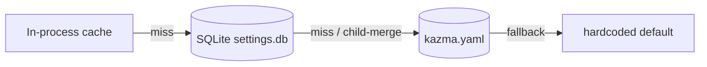

> **The exhaustive reference.** Every key in `kazma.yaml`, every environment variable, the ConfigStore override model, the provider/model registry, and the security config files — all traceable to source.

---

## 1. Configuration sources & precedence

Kazma resolves configuration from three layers. For the generic `ConfigStore.get(key)`, the order is:



| # | Layer | Wins? | Notes |
|---|---|---|---|
| 1 | **Env var** | Only in specific helpers (`get_kazma_secret`, `get_or_create_disclosure_key`) — **not** in the generic `get()`. | e.g. `KAZMA_SECRET` |
| 2 | **ConfigStore DB** (`kazma-data/settings.db`) | **Yes** for runtime reads via `get()`. | DB overrides YAML. |
| 3 | **`kazma.yaml`** | Baseline on first boot. | `reconcile_from_yaml()` seeds DB only for keys not already present. |
| 4 | **Hardcoded default** | Last resort. | e.g. `gpt-4o-mini`, `DEFAULT_DANGER_TOOLS`. |

### Override precedence (detailed) {#override-precedence}

- `ConfigStore.get(key)` (`config_store.py:471-516`): checks the in-process `_cache` first (with a `_MISSING` sentinel for known-absent keys), then an exact DB row, then a DB **child-key re-merge** via `_collect_prefixed` (rows whose key starts with `key.` are de-dotted into a nested dict), then a YAML dotted-key lookup.
- `ConfigStore.set(key, value)` writes one row and **clears the cache** for that key (`config_store.py:518-536`).
- `ConfigStore.batch_set(items)` is the **atomic** multi-key write — single `BEGIN`/`COMMIT`, rollback on any failure (`config_store.py:538-568`). Always prefer it for multi-key updates.
- `ConfigStore.transaction()` is a `@contextmanager` yielding the raw connection for caller-driven multi-op transactions (`config_store.py:572`).
- `reconcile_from_yaml()` seeds DB with `kazma.yaml` leaf values for keys **not already in DB** — it never overwrites existing DB keys (`config_store.py:678-685`). This is the startup step that makes ConfigStore authoritative.
- `export_yaml()` / `import_yaml()` round-trip DB overrides merged into YAML (`config_store.py:632, 650`).
- `reset_all()` deletes all DB rows → reverts to YAML defaults (`config_store.py:732`).

> **Singleton rule:** Always use `get_config_store()` (`config_store.py:760`), never `ConfigStore()` directly. On SQLite init failure it falls back to a thread-safe `_InMemoryStore` with TTL eviction (`config_store.py:777`) — settings then won't survive a restart.

---

## 2. `kazma.yaml` — complete reference

The full default file (`kazma.yaml`) with every key, type, and default. Line numbers reference the shipped file.

### `agent` (lines 1-5)

| Key | Type | Default | Description |
|---|---|---|---|
| `agent.name` | string | `kazma` | Bot display name. |
| `agent.version` | string | `0.2.0` | **Note:** diverges from `pyproject.toml` (`0.3.0`). Not auto-synced. |
| `agent.language` | string | `ar` | UI/agent language. `ar` → RTL + Arabic; `en` → English. |
| `agent.rtl` | bool | `true` | Master RTL switch. |

### `models` (lines 6-9)

| Key | Type | Default | Description |
|---|---|---|---|
| `models.default` | string | `gpt-4o-mini` | Default model id. |
| `models.router` | string | `litellm` | **String only.** Gates the fallback-model branch in `llm_provider.py:336`. Kazma does **not** `import litellm` — it treats LiteLLM as a compatible proxy endpoint on port 4000. |
| `models.fallback` | string | `gpt-4o-mini` | Model used on retry if `router == "litellm"` and a request fails (`llm_provider.py:335-347`). |

### `llm` (lines 10-18)

| Key | Type | Default | Description |
|---|---|---|---|
| `llm.base_url` | string | `https://api.openai.com/v1` | OpenAI-compatible endpoint. `/v1` is auto-appended if missing (except Ollama :11434 and LiteLLM :4000). |
| `llm.api_key` | string | `''` | Leave empty to load from env (`OPENAI_API_KEY` → `KAZMA_API_KEY` → `"not-needed"` for local). |
| `llm.model` | string | `gpt-4o-mini` | Model id sent in the payload. |
| `llm.max_tokens` | int | `4096` | Completion token cap. |
| `llm.temperature` | float | `0.7` | Sampling temperature. |
| `llm.timeout` | float | `60.0` | Per-request timeout (seconds). |
| `llm.input_cost_per_1m` | float | `0.15` | USD per 1M input tokens — used for cost accounting. |
| `llm.output_cost_per_1m` | float | `0.6` | USD per 1M output tokens. |

### `mcp` (lines 19-32)

| Key | Type | Default | Description |
|---|---|---|---|
| `mcp.servers` | list | see below | MCP server definitions. |
| `mcp.servers[].name` | string | — | Server identifier. |
| `mcp.servers[].transport` | string | `stdio` | `stdio` or `sse`. SSE supports an `auth` field (bearer/custom header). |
| `mcp.servers[].trust` | string | `trusted` | **Plain config string — not consumed by any trust-tier code.** |
| `mcp.servers[].command` | list | — | argv for stdio spawn. |
| `mcp.ide_server.enabled` | bool | `true` | Enable the in-process IDE/file MCP server. |
| `mcp.ide_server.root` | string | `.` | Workspace root. |
| `mcp.ide_server.max_file_size` | int | `1048576` | 1 MB file size cap. |

Shipped default server:

```yaml
mcp:
  servers:
    - name: filesystem
      transport: stdio
      trust: trusted
      command: [npx, -y, '@modelcontextprotocol/server-filesystem', 'kazma-data/workspace']
  ide_server:
    enabled: true
    root: .
    max_file_size: 1048576
```

### `system_prompt` (lines 33-45)

Multi-line string. The default is Arabic-aware: "You are Kazma (كاظمه), an autonomous AI agent framework…" and instructs the model to respond in the user's language/dialect.

### `storage` (lines 46-49)

| Key | Type | Default | Description |
|---|---|---|---|
| `storage.engine` | string | `sqlite` | Checkpointer engine. |
| `storage.path` | string | `kazma-data/checkpoints.db` | LangGraph checkpointer DB. |
| `storage.vector_dim` | int | `1536` | Declared vector dimension. **Note:** the actual `VectorMemory` uses `all-MiniLM-L6-v2` (384-d). This value is informational and not enforced consistently. |

### `memory` (lines 50-54)

| Key | Type | Default | Description |
|---|---|---|---|
| `memory.enabled` | bool | `true` | Master memory switch. |
| `memory.max_context_tokens` | int | `128000` | Context window for compaction. Compaction fires at 80% (= 102,400). |
| `memory.retrieval_top_k` | int | `5` | Top-K for memory retrieval (used by compaction's intended retrieval step — see [Memory & RAG](memory-and-rag)). |
| `memory.provenance` | bool | `true` | Tag memories with source metadata. |

### `skills` (lines 55-57)

| Key | Type | Default | Description |
|---|---|---|---|
| `skills.path` | string | `kazma-skills/manifests/` | Skill manifest directory. |
| `skills.auto_discover` | bool | `true` | Auto-load manifests on startup. |

### `connectors` (lines 58-68)

| Key | Type | Default | Token env var |
|---|---|---|---|
| `connectors.telegram.enabled` | bool | `true` | `TELEGRAM_BOT_TOKEN` |
| `connectors.discord.enabled` | bool | `false` | `DISCORD_BOT_TOKEN` |
| `connectors.slack.enabled` | bool | `false` | `SLACK_BOT_TOKEN` + `SLACK_APP_TOKEN` |

### `gateway` (lines 70-79)

| Key | Type | Default | Description |
|---|---|---|---|
| `gateway.rate_limits.telegram` | int | `30` | Requests per window. |
| `gateway.rate_limits.discord` | int | `5` | Requests per window. |
| `gateway.rate_limits.slack` | int | `1` | Requests per window. |
| `gateway.suggestions.enabled` | bool | `true` | Suggested-followup UI. |
| `gateway.voice.enabled` | bool | `false` | Voice/STT (Telegram only). |
| `gateway.voice.provider` | string | `openai` | One of `openai`, `local`, `groq`. |

### `safety.hitl` (lines 81-96)

| Key | Type | Default | Description |
|---|---|---|---|
| `safety.hitl.enabled` | bool | `true` | Master HITL switch (graph path). |
| `safety.hitl.require_approval_for` | list | see below | Danger tools for the **graph** path. |
| `safety.hitl.approval_timeout_seconds` | int | `60` | Pipeline-checkpoint auto-reject timeout. |
| `safety.hitl.auto_deny_on_timeout` | bool | `true` | Auto-reject paused tasks on timeout. |

Default `require_approval_for`:

```yaml
safety:
  hitl:
    enabled: true
    require_approval_for:
      - file_write
      - file_delete
      - shell_exec
      - code_exec
      - python_exec
      - spawn_agent
      - spawn_agents
      - schedule_task
      - cancel_scheduled
    approval_timeout_seconds: 60
    auto_deny_on_timeout: true
```

> The **swarm bus** uses a separate, broader list (`_EXTENDED_DANGER` adds `python_exec`, `code_exec`, `spawn_agent`, `spawn_agents`, `schedule_task`, `cancel_scheduled`, `run_tests`). The **MCP** path classifies dynamically by name pattern. See [Security & Safety → danger-tool lists](security-and-safety#danger-tool-lists-three-of-them).

### `ui` (lines 98-102)

| Key | Type | Default | Description |
|---|---|---|---|
| `ui.host` | string | `127.0.0.1` | Bind host. Switches to `0.0.0.0` under `kazma serve` only if `KAZMA_SECRET` is set. |
| `ui.port` | int | `8000` | Bind port. |
| `ui.rtl` | bool | `true` | UI RTL. |
| `ui.title` | string | `Kazma Dashboard` | Page title. |

### `logging` (lines 103-109)

| Key | Type | Default | Description |
|---|---|---|---|
| `logging.level` | string | `INFO` | Log level. |
| `logging.format` | string | `json` | `json` or plain. |
| `logging.langfuse.enabled` | bool | `false` | Langfuse tracing. **Roadmap** — dependency present, integration not active. |
| `logging.langfuse.public_key` | string | `''` | |
| `logging.langfuse.secret_key` | string | `''` | |

### `time_travel` (lines 111-114)

| Key | Type | Default | Description |
|---|---|---|---|
| `time_travel.enabled` | bool | `true` | Enable `/replay`. |
| `time_travel.max_snapshots` | int | `50` | Snapshot cap. |
| `time_travel.db_path` | string | `kazma-data/snapshots.db` | Snapshot DB. |

### `swarm` (lines 116-127)

| Key | Type | Default | Description |
|---|---|---|---|
| `swarm.enabled` | bool | `true` | Master swarm switch. |
| `swarm.group_chat_id` | int | `0` | Real value read from `SWARM_CHAT_ID` env. |
| `swarm.default_pattern` | str | `dispatch` | Fallback pattern: `dispatch` \| `pipeline` \| `consult` \| `fan_out` \| `broadcast`. |
| `swarm.auto_route` | bool | `true` | Enable semantic auto-routing (`UnifiedRouter`) for `workers=["auto"]`. |
| `swarm.max_concurrent_tasks` | int | `10` (1–100) | Max concurrent swarm tasks. |
| `swarm.max_concurrent` | int | `5` | Fan-out / broadcast / consult worker concurrency. |
| `swarm.orchestrator.name` | string | `Kazma Orchestrator` | Orchestrator display name. |
| `swarm.orchestrator.profile` | string | `default` | Orchestrator profile id. |
| `swarm.workers` | list | `[]` | Populated at runtime via Web UI / `POST /api/swarm/workers`. |
| `swarm.output_target` | obj | none | `\{bot_token, chat_id, platform, enabled\}` — when set, the token must match the active Telegram bot token. |

### `pipelines` (lines 129-162)

Two predefined pipelines (lists of stages, each with `worker`, `depends_on`, `system_prompt`):

- **`standard`** — 4 stages: `researcher` (worker `core`) → `refiner` (worker `bridge`) → `builder` (worker `core`) → `validator` (worker `bridge`).
- **`quick`** — 2 stages: `researcher` (worker `core`) → `builder` (worker `core`).

---

## 3. Environment variables

### 3.1 Documented in `.env.example`

| Variable | Purpose | Default |
|---|---|---|
| `TELEGRAM_BOT_TOKEN` | Telegram adapter token. | placeholder |
| `DISCORD_BOT_TOKEN` | Discord adapter token. | empty |
| `SLACK_BOT_TOKEN` | Slack bot token. | empty |
| `SLACK_APP_TOKEN` | Slack app token (Socket Mode). | empty |
| `OPENAI_API_KEY` | OpenAI key (also generic LLM fallback #2). | empty |
| `DEEPSEEK_API_KEY` | **Declared in `.env.example` but not read by code** — set the key via the provider list instead. | empty |
| `ANTHROPIC_API_KEY` | **Declared in `.env.example` but not read by code.** | empty |
| `GOOGLE_CLOUD_PROJECT` | GCP project for Vertex AI (if ADC lacks a default). | commented out |
| `SWARM_BOT_TOKEN` | Swarm output bot token. | empty |
| `SWARM_CHAT_ID` | Swarm group chat id (feeds `swarm.group_chat_id`). | empty |
| `KAZMA_SECRET` | HITL shared secret; binds `serve` to `0.0.0.0`; hub write-auth; `kazma hub sign`. | commented out |
| `KAZMA_VECTOR_PATH` | Vector memory dir. | `~/.kazma/vector_memory` |
| `KAZMA_VECTOR_COLLECTION` | ChromaDB collection name. | `agent_memory` |
| `KAZMA_VECTOR_MODEL` | Embedding model. | `all-MiniLM-L6-v2` |

### 3.2 Read in code, not in `.env.example`

| Variable | Purpose | Location |
|---|---|---|
| `KAZMA_AUTH_DISABLED` | If `true`/`1`/`yes`, `get_kazma_secret()` returns `""` (auth disabled). | `config_store.py:52` |
| `KAZMA_DISCLOSURE_KEY` | Disclosure HMAC key; auto-generated if unset. | `config_store.py:95` |
| `KAZMA_API_KEY` | LLM key fallback #3. | `llm_provider.py:142` |
| `KAZMA_MAX_COST` | Cost breaker ceiling (default `$0.50`). | `cost_breaker.py:42` |
| `KAZMA_SILENCE_WINDOW` | Cost breaker silence window (default `300`s). | `cost_breaker.py:44` |
| `KAZMA_SEMANTIC_CACHE` | Enable response cache (`"true"`, default off). | `llm_provider.py:212` |
| `KAZMA_HUB_DB` | Hub SQLite registry path. | `hub/cli.py:109` |
| `KAZMA_HUB_URL` | Hub API base (default `https://hub.kazma.ai`). | `hub/cli.py:115` |
| `KAZMA_PORT` | Server port override (default `8000`). | `gateway.py:36` |
| `HF_HUB_DISABLE_SYMLINKS_WARNING` / `HF_HUB_DISABLE_TELEMETRY` | Silence HuggingFace telemetry (set by CLI). | `main.py:9-10` |

> **No dedicated per-provider env vars** for DeepSeek/Anthropic/xAI/Groq/Gemini are read by `kazma_core`. Key those providers through the ConfigStore provider list or `kazma.yaml`.

---

## 4. API keys {#api-keys}

`LLMProvider._resolve_api_key()` (`llm_provider.py:136-146`) resolves in this order:

1. `self.config.api_key` (from `LLMConfig`)
2. `os.getenv("OPENAI_API_KEY")`
3. `os.getenv("KAZMA_API_KEY")`
4. `"not-needed"` (for local LM Studio/Ollama)

Provider-specific **dummy keys** for local servers (`url_utils.py:138-172`):

| Server | Dummy key |
|---|---|
| LM Studio (:1234) | `sk-lm-studio-dummy-key` |
| Ollama (:11434) | `ollama` |
| LiteLLM proxy (:4000) | `sk-litellm-dummy-key` |
| other localhost | `not-needed` |

**Google Vertex AI** uses Application Default Credentials only — no API key. `GeminiProvider._resolve_api_key()` returns `"adc-placeholder"` and the real bearer token is fetched per-call via `google.auth.default()` + `credentials.refresh()` (`google_llm.py:232-252`). Project resolution: explicit `project_id=` > `GOOGLE_CLOUD_PROJECT` > `google.auth.default()` > ADC `quota_project_id` > gcloud `config_default`.

Keys are stored per-provider in ConfigStore `providers.list` (each entry has `api_key`, `base_url`, `models`, …). Masked placeholders (`***`) are rejected on upsert unless a real key already exists (`model_registry.py:646-652`); keys are masked in all read-backs (`_mask_profile`).

---

## 5. The Model Registry

`ModelRegistry` (`model_registry.py:81`) is a process-wide singleton (module global `_registry`, thread-safe via `threading.RLock()`). Backward-compat alias: `UnifiedModelRegistry` (line 950).

### 5.1 Lifecycle

| Function | Purpose |
|---|---|
| `initialize_model_registry(config_store)` | Construct + deserialize + seed presets. |
| `get_model_registry()` | Retrieve singleton (raises `RuntimeError` if uninitialized). |
| `reset_model_registry()` | Teardown. |

### 5.2 Built-in provider presets

From `kazma-core/kazma_core/providers.py:13-84`:

| Key | Display name | `base_url` | `auth_header` |
|---|---|---|---|
| `openai` | OpenAI | `https://api.openai.com/v1` | `Bearer` |
| `anthropic` | Anthropic | `https://api.anthropic.com/v1` | `x-api-key` |
| `deepseek` | DeepSeek | `https://api.deepseek.com/v1` | `Bearer` |
| `google` | Google Gemini | *(computed per project/location)* | `Bearer` |
| `xai` | xAI / Grok | `https://api.x.ai/v1` | `Bearer` |
| `openrouter` | OpenRouter | `https://openrouter.ai/api/v1` | `Bearer` |
| `ollama` | Ollama (Local) | `http://127.0.0.1:11434/v1` | *(none)* |
| `lm-studio` | LM Studio (Local) | `http://localhost:1234/v1` | *(none)* |
| `nvidia` | NVIDIA NIM | `https://integrate.api.nvidia.com/v1` | `Bearer` |
| `custom` | Custom Endpoint | *(blank)* | `Bearer` |

Hardcoded `GEMINI_MODELS` (Vertex AI has no static `/models` endpoint): `gemini-2.5-flash`, `gemini-2.5-pro`, `gemini-2.0-flash`, `gemini-2.0-flash-lite`.

> **Default-enabled provider:** Only `google` is `enabled=True` out of the box (`model_registry_store.py:117`). All others must be configured before use. `custom` is excluded from preset seeding.

> **Anthropic auth caveat:** The preset declares `auth_header: x-api-key`, but `LLMProvider.chat()` always sends `Authorization: Bearer`. The preset header only takes effect during `discover_models()`. For chat, Anthropic may require routing through an OpenAI-compatible proxy.

### 5.3 Model discovery

`discover_models(provider_name)` (`model_registry.py:427`) hits `\{base_url\}\{models_endpoint\}` (default `/models`), parses the OpenAI `\{"data":[\{"id":...\}]\}` shape, with an **SSRF guard** (`kazma_core.security.ssrf.validate_url`). Results cached in `_discovered_models`.

### 5.4 ConfigStore keys (registry)

| Key | Purpose |
|---|---|
| `providers.list` | Stored provider array. |
| `providers.health.*` | Per-provider health. |
| `models.saved.*` | Saved model profiles. |
| `models.defaults.*` | Per-task defaults (`chat`, `code`, `summarize`, `translate`). |
| `llm.model`, `llm.base_url`, `llm.api_key` | Legacy fallbacks. |
| `registry.active_provider`, `registry.active_model`, `registry.discovered_models` | Active selection + cache. |

---

## 6. `retry` keys

The `tenacity`-based retry decorators read overrides from ConfigStore (`retry.py:69-86`):

| Key | Default | Description |
|---|---|---|
| `retry.max_attempts` | `3` | Max retry attempts. |
| `retry.min_wait` | `2` (s) | Min backoff. |
| `retry.max_wait` | `10` (s) | Max backoff. |

> Retries fire **only** on network/timeout exceptions (`ConnectionError`, `TimeoutError`, `asyncio.TimeoutError`, httpx `TimeoutException`/`ConnectError`/`RemoteProtocolError`). **4xx errors are never retried** (`retry.py:107-109`). There is no 429 backoff.

---

## 7. Security config files

### 7.1 `kazma-permissions.yaml`

Enterprise division-based MCP allow/deny lists (the "ALMuhalab" divisions):

```yaml
divisions:
  gas_oil:
    allowed_mcp_servers: [oil-pricing-api, contract-manager, supplier-directory]
    denied_mcp_servers:  [tourism-booking-api, general-inventory-api]
  tourism:
    allowed_mcp_servers: [booking-engine, hotel-api, flight-search]
    denied_mcp_servers:  [oil-pricing-api, contract-manager]
  general_trading:
    allowed_mcp_servers: [inventory-api, supplier-directory, procurement-api]
    denied_mcp_servers:  [oil-pricing-api, booking-engine]

cross_division_rules:
  require_explicit_approval: true
  max_approval_duration_hours: 24
  notify_admins: true
  audit_all_access: true
```

### 7.2 `kazma-security.yaml`

| Section | Key options |
|---|---|
| `scanning` | `enabled`, `interval: "24h"`, `sources: [osv, github_advisories, nvd]`, `auto_create_issues`, `severity_threshold: medium`, `ignore`. |
| `disclosure` | `enabled`, `response_window: "48h"`, `assessment_window: "7d"`, `pgp_key_url`, `encrypted_channels`. |
| `bug_bounty` | `enabled`, `min_payout: 50`, `max_payout: 2000`, `currency: USD`, `tiers` (`critical` `[500,2000]`, `high` `[200,500]`, `medium` `[50,200]`, `low` Hall of Fame). |
| `hardening` | `run_on_startup`, `fail_on_critical`, `auto_fix: false`, `checks` (8: `secrets_in_logs`, `input_validation`, `rbac_enforcement`, `tls_required`, `dependency_audit`, `least_privilege`, `audit_trail`, `config_integrity`). |

> These files declare a security **policy posture**. Whether every check is actively enforced at runtime should be verified against the hardening runner before relying on it in production — see [Security & Safety](security-and-safety).

### 7.3 `services.yaml`

```yaml
commands:
  install: "pip install -e kazma-tui/ -e kazma-core/"
  test: "python -m pytest kazma-tui/tests/ -v"
  lint: "python -m ruff check kazma-tui/kazma_tui/"
  typecheck: "python -m mypy kazma-tui/kazma_tui/"
services: {}
```

---

## Documentation Audit Notes

- **Version drift:** `pyproject.toml` is `0.3.0`; `kazma.yaml` `agent.version` is `0.2.0`; the CLI `--help` text prints `v0.2.0`. These are independent and unsynchronized — a known wart.
- **`storage.vector_dim: 1536`** does not match the actual embedding model (`all-MiniLM-L6-v2` = 384-d). Documented as-is.
- **`.env.example` lists `DEEPSEEK_API_KEY` / `ANTHROPIC_API_KEY`** but no code reads them — flagged to prevent user confusion.
- **`mcp.servers[].trust`** is a plain YAML string with no enforcing consumer — not a cryptographic trust tier.
