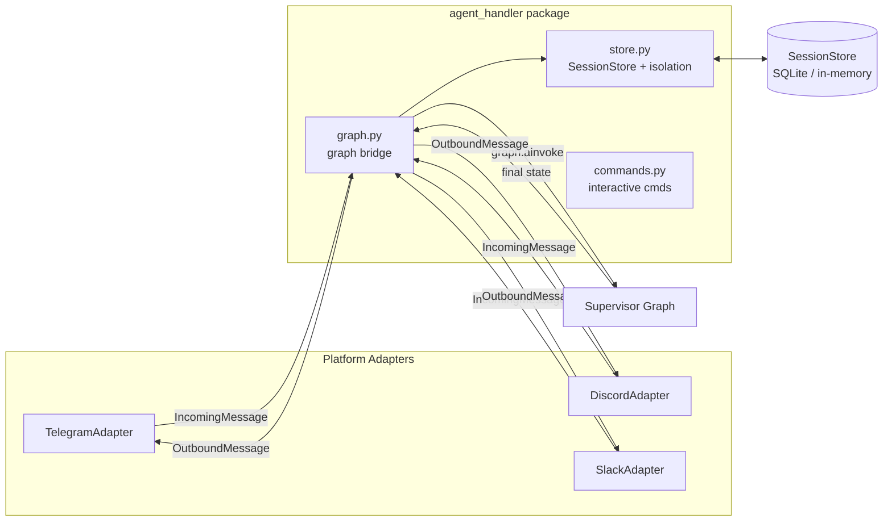

> How Kazma's one brain talks to many channels: the adapter layer, platform isolation, the session store, slash commands, and a feature-parity matrix — all verified against `kazma-gateway/`.

---

## 1. Architecture

Kazma's gateway package (`kazma-gateway/kazma_gateway/`) was refactored from a single `agent_handler.py` into an **`agent_handler/` package** (decomposition noted in `agent_handler/__init__.py:4`). The shape is:



- **Adapters** (`adapters/`) — one per platform; all extend `BaseAdapter` (`gateway.py:239`). Each translates platform-native events into Kazma's `IncomingMessage` and renders `OutboundMessage` back.
- **agent_handler package** — the bridge between adapters and the supervisor graph.
- **Bus adapters** (`adapters/*_bus.py`) — a *separate* set of adapters for swarm HITL approvals (Telegram/Discord/Slack). See [Security & Safety](security-and-safety#the-swarm-bus-gate).

---

## 2. Platform adapters

### 2.1 Telegram (`adapters/telegram.py`)

| Aspect | Detail |
|---|---|
| Class | `TelegramAdapter` (`telegram.py:70`), `name = "telegram"`. |
| Receive | Manual `getUpdates` **long-polling** (HTTP), 1-3 s jitter; optional webhook router `create_webhook_router()` mounted at `/api/webhooks/telegram`. |
| Send | `POST /sendMessage` with HTML `parse_mode`, 429 retry, message chunking. |
| Context keys | `chat_id` (int), `user_id` (int), `username` (str), `message_id` (int), `chat_type` (str). |
| Extras | Voice/STT (`telegram_stt.py`), inline keyboards (`telegram_keyboards.py`), reactions (✅/🎯/❌), typing indicator, registered command menu via `setMyCommands`. |
| Helper modules | `telegram_callbacks.py`, `telegram_keyboards.py`, `telegram_parse.py`, `telegram_send.py`, `telegram_stt.py`. |

Telegram is the **most feature-complete** adapter.

### 2.2 Discord (`adapters/discord.py`)

| Aspect | Detail |
|---|---|
| Class | `DiscordAdapter` (`discord.py:50`), `name = "discord"`. |
| Receive | Discord **Gateway WebSocket** (`wss://gateway.discord.gg/?v=10&encoding=json`). |
| Send | REST `POST /channels/\{channel_id\}/messages`, 429 retry, 2000-char chunking. |
| Context keys | `channel_id`, `guild_id`, `user_id`, `message_id`, `username`, `guild_name`. |
| Markdown | Plain text (Discord's own markdown is not generated). |

> **Slash commands:** Discord reserves `/`-prefixed commands for its own interaction system. Kazma receives them as plain text and parses internally.

### 2.3 Slack (`adapters/slack.py`)

| Aspect | Detail |
|---|---|
| Class | `SlackAdapter` (`slack.py:47`). |
| Receive | **Socket Mode** (when `xapp-` app_token present) OR fallback polling of `conversations.history`. |
| Send | REST Slack API `POST`. |
| Context keys | `channel_id`, `user_id`, `team_id`, `thread_ts`, `message_ts`, `username`. |

> **Slash commands:** Slack blocks bot-issued slash commands, so the HITL approval prompt is issued as `hitl approve|deny &lt;id>` **without** the `/` prefix (`graph.py:184`).

---

## 3. Platform isolation (the core invariant)

This is the single most important contract in the gateway. **The LangGraph state must never contain `chat_id`, `user_id`, or `message_id`.** Breaking it leaks platform IDs into the graph and corrupts sessions.

### 3.1 The forbidden keys

`_PLATFORM_KEYS` (`agent_handler/store.py:16-31`) is the authoritative frozen set:

```python
_PLATFORM_KEYS = frozenset({
    # Telegram
    "chat_id", "user_id", "message_id", "update_id", "chat_type",
    # Discord / Slack
    "channel_id", "guild_id", "team_id", "thread_ts", "message_ts",
})
```

### 3.2 How isolation is enforced

`_build_initial_state(msg, store)` (`store.py:95`):

1. Resolves a `thread_id` via `_resolve_thread` (`store.py:34`):
   - existing `thread_id` in context_metadata, else
   - deterministic from sender id (e.g. `"telegram:12345"` → `"gw-telegram-12345"`), else
   - fresh `UUID4`.
2. Persists **full** platform context to the SessionStore: `await store.put(thread_id, dict(ctx))`.
3. Builds a **minimal** graph state with only a `_gateway` block:

```python
state["_gateway"] = {
    "thread_id": thread_id,
    "display_name": ctx.get("username") or "unknown",
    "platform": msg.platform,
}
```

4. A defense-in-depth pass strips any leaked `_PLATFORM_KEYS` (`store.py:139-141`).

### 3.3 How replies route back

After `graph.ainvoke()` completes (`agent_handler/graph.py:316`), the handler does `ctx = await _store.get(thread_id)` to **rehydrate** platform IDs, then routes via `_build_target_id(platform, ctx)` (`store.py:146`):

- Telegram → `chat_id`
- Discord/Slack → `channel_id`
- Produces platform-prefixed IDs like `"telegram:12345"`.

> **Persistence by design:** Session entries are **not** deleted after a reply (`graph.py:312-315`) so crash-recovery routing can rehydrate context. Stale entries are evicted lazily by a 300-second TTL (`graph.py:98`, `_session_ttl_seconds`).

---

## 4. SessionStore

The SessionStore holds platform IDs ↔ thread_id mappings — **never** the graph.

| Implementation | Location | Use |
|---|---|---|
| `SessionStore` (abstract) | `gateway.py:185` | `get`, `put`, `delete`, optional `evict_older_than`. |
| `_InMemoryStore` | `agent_handler/store.py:63` | Testing/fallback; tracks monotonic timestamps for TTL. |
| SQLite `SessionStore` | `stores/sqlite.py` | Persistent. |
| LangGraph checkpointer | `stores/checkpoint.py` | Used by the UI for conversation state (`app.py:724`). |

The `IncomingMessage` docstring (`gateway.py:62-66`) states it plainly: *"The Brain never touches platform-specific fields. Raw platform IDs live inside context_metadata."*

---

## 5. Web UI transport (SSE)

The Web UI uses **Server-Sent Events**, not WebSocket, as the primary chat transport.

- **Endpoint:** `POST /api/chat/stream` (`sse_chat.py:353`) — accepts `\{message, session_id, model\}`, returns a `StreamingResponse` (`text/event-stream`).
- **Legacy WebSocket:** `GET /ws/chat` returns **410 Gone** (`chat.py:4`) and must not execute tools. Do not use it.
- **Client wiring:** `chat.js:332` calls `KS.sse('/api/chat/stream', \{...\})`.

The full SSE event contract (`token`, `tool_call`, `tool_result`, `approval_required`, `done`, `error`) is documented in [API & Extension Points](api-and-extension-points#sse-event-contract).

---

## 6. HITL approval surface per platform

| Platform | Mechanism | Callback id pattern | Handler |
|---|---|---|---|
| **Telegram** | Inline keyboard buttons | `hitl:approve:\{id\}` / `hitl:deny:\{id\}` | `telegram.py:733` |
| **Discord** | Components v2 buttons | `swarm_approve_\{task_id\}` / `swarm_reject_\{task_id\}` | `discord.py:312` |
| **Slack** | Interactive callback | swarm approval block | `slack.py:401` |
| **Web UI** | Button → `POST /api/approve/\{thread_id\}` + `approval_required` SSE event | — | `routes_direct.py:454` |

> The **bus adapter singleton** priority is Telegram > Discord > Slack (only one active at a time, wired in `app.py:506-556`). See [Security & Safety](security-and-safety#bus-adapter-priority).

---

## 7. Feature parity matrix

| Feature | Telegram | Discord | Slack | Web UI | TUI |
|---|:---:|:---:|:---:|:---:|:---:|
| Receive mechanism | HTTP long-poll | Gateway WS | Socket Mode / poll | HTTP POST (SSE) | local |
| HITL approval buttons | ✅ | ✅ | ✅ | ✅ | modal |
| Markdown rendering | → Telegram HTML | plain text | plain text | client-side | plain |
| Slash commands | full set (registered) | plain-text parse | `hitl` w/o `/` | UI buttons | — |
| Voice / STT | ✅ | ❌ | ❌ | ❌ | ❌ |
| Typing indicator | ✅ | ✅ | ✅ | n/a | n/a |
| Reactions | ✅ ✅/🎯/❌ | ❌ | ❌ | n/a | n/a |
| Model selector UI | ✅ inline keyboard | ❌ | ❌ | ✅ settings | read-only |

---

## 8. The Textual TUI (`kazma-tui`)

A read-mostly observability dashboard over the same core singletons.

| Aspect | Detail |
|---|---|
| Entry point | `kazma_tui.app:main` → `KazmaTUI().run()` (`app.py:576`). |
| Tabs | Dashboard (`MetricsDashboard`), Chat (`ChatPanel`), Files (`FilesPanel`), Traces (`TracesPanel`), Swarm (`SwarmPanel`), Settings (`SettingsPanel`). |
| Singleton init | `_initialize_core()` (`app.py:158`) initializes `ModelRegistry` and `SwarmEngine` if launched standalone. |
| HITL | Approval modal (`widgets/hitl_modal.py`); `_check_pending_approvals` (`app.py:443`), `_submit_hitl_decision` (`app.py:483`). |
| RTL | `update_localization()` (`app.py:512`) toggles an `rtl-mode` CSS class and translates tab labels. |

> **Minor inconsistency:** TUI labels Dashboard "لوحة القيادة" (`app.py:539`); Web i18n uses "لوحة التحكم" (`i18n.py:77`).

---

## 9. Telegram command registration

`_register_bot_commands` (`telegram.py:961`) calls Telegram's `setMyCommands` across three scopes (default, all_private_chats, all_group_chats). The registered list includes the standard slash commands **plus `/swarm`**. It does **not** register `/hitl` (because Slack needs the bare `hitl` form, and the registration is shared logic).

---

## Documentation Audit Notes

- **`agent_handler.py` no longer exists** as a single file — it is the `agent_handler/` package. Older docs referencing the file are stale.
- **The legacy WebSocket chat endpoint is dead** (410 Gone). Documentation that still describes `/ws/chat` as live is incorrect — SSE is the transport.
- **`/undo` and `/edit` slash commands are stubs** and should not be advertised as functional.
- **`/help` omits `/hitl` and `/swarm`** even though both work. This is a documentation gap in the in-app help text, not a missing feature.
