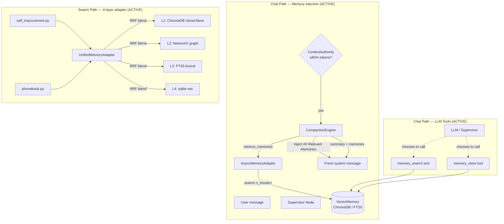

> A precise, source-referenced map of Kazma's memory subsystems — **updated July 2026** to reflect the comprehensive memory overhaul (Phases 1–4). All previously-documented bugs and wiring gaps have been fixed.

---

## 1. The memory architecture (post-overhaul)

Kazma's memory system was overhauled to close every gap the audit found. The architecture now looks like this:



### What changed in the overhaul

| Previous state | Current state (post-overhaul) |
|---|---|
| Compaction's memory retrieval was dead (`memory_store=None`) | **ACTIVE** — `AsyncMemoryAdapter` wires `VectorMemory` into `CompactionEngine.retrieve_memories()` |
| App.py initialization ordering defeated the wiring | **FIXED** — lazy resolution in `retrieve_memories()` re-checks the singleton at compaction time |
| 4-layer adapter L1 was dead (`GlobalVectorStore` typo) | **FIXED** — imports `VectorStore` (the real class) |
| 4-layer callers crashed (tuple-unpacking `MemoryHit`) | **FIXED** — uses `r.source_layer` / `r.content` attribute access |
| Arabic FTS5 search was asymmetric (`query_arabic` unused) | **FIXED** — tokenized query now passed to FTS5 MATCH |
| `_vector_search` used non-existent `distance()` SQL fn | **FIXED** — rewritten as proper cosine distance in Python |
| `_vec_available` misdetection (`sqlite_version()`) | **FIXED** — now probes `load_extension("vec0")` + `vec_version()` |
| BM25 sort inverted (worst results first) | **FIXED** — ascending sort (most negative = best = first) |
| VectorMemory had no `delete()`/`update()`/`clear()` | **ADDED** — all three, with chunk-aware deletion |
| No chunking (long docs embedded whole) | **ADDED** — 2000-char chunks with 200-char overlap |
| `SQLiteMemoryBackend` orphaned (never read/written) | **RESOLVED** — replaced by `VectorMemory` property delegation |
| Maintenance hot-reload ignored env vars | **FIXED** — reads `KAZMA_VECTOR_*` env vars |
| Alert dispatch silently no-op outside event loop | **FIXED** — deferred to `_pending_alerts`, flushed at startup |
| RAG failure logged at `debug` (invisible) | **FIXED** — elevated to `warning` |
| Arabic tokenizer dead/conflicting rules | **FIXED** — removed `ؤ` from yeh variants, dead stemmer rules, deduplicated stop words |
| No clitic splitting (`وسلام` wouldn't match `سلام`) | **ADDED** — conservative waw-conjunction splitting (4+ char stem) |
| Dead KG code (KazmaKG, KnowledgeGraphAdapter) causing confusion | **REMOVED** — ~1,000 lines of dead code deleted; Swarm uses its own `KnowledgeGraph` in `swarm/memory/graph.py` |
| Chat agent didn't use UnifiedMemoryAdapter | **FIXED** — `agent_runner.py` now wires `UnifiedMemoryAdapter` for chat memory |
| Compaction summaries not persisted | **ADDED** — auto-store now saves summaries to long-term memory |
| Chat FTS5 used English-only tokenizer | **FIXED** — now attempts Arabic tokenization from `kazma-memory` |

---

## 2. Subsystem A — VectorMemory (the RAG tools + compaction injection)

This is the canonical memory backend. It serves two paths:

1. **LLM-invoked tools** (`memory_search` / `memory_store`) — the LLM chooses to call them.
2. **Compaction injection** — when the conversation hits 80% of the context window, the `CompactionEngine` retrieves the top-5 relevant memories and injects them into the fresh system message as `## Relevant Memories`.

### 2.1 Initialization

`kazma-ui/kazma_ui/app.py:519-551`:

```python
vector_memory = VectorMemory(
    path=KAZMA_VECTOR_PATH,          # default ~/.kazma/vector_memory
    collection_name=KAZMA_VECTOR_COLLECTION,  # default "agent_memory"
    model_name=KAZMA_VECTOR_MODEL,   # default "all-MiniLM-L6-v2"
)
set_vector_memory(vector_memory)
```

`VectorMemory` (`memory/vector_store.py`):

- Storage: `chromadb.PersistentClient(path=...)` — on-disk persistence.
- Embedding: `SentenceTransformerEmbeddingFunction` (ChromaDB's native wrapper, pre-warms the shared `get_encoder()` singleton so the swarm doesn't double-load).
- Collection default: `agent_memory`.
- Dimension: **384** (`all-MiniLM-L6-v2`). Note: `kazma.yaml` `storage.vector_dim: 1536` does not match and is not enforced — known cosmetic drift.

### 2.2 Graceful degradation

The constructor catches **all exceptions** (not just ImportError), so corrupt-DB, disk-permission, and version-incompatibility errors also degrade to `FTS5Memory`. The degradation alert is deferred to `_pending_alerts` and flushed by `app.py`'s `_on_startup()` handler (fixing the old no-op-outside-event-loop bug).

### 2.3 Retrieval — two paths

**Path 1: LLM tool** (`tool_registry.py:591-605`):

```python
async def memory_search(query: str, limit: int = 5) -> str:
    mem = get_vector_memory()
    if mem is None:
        return "Error: VectorMemory not initialized. RAG not available."
    results = mem.search(query=query, n_results=limit)
    return json.dumps(results, ensure_ascii=False, indent=2)
```

**Path 2: Compaction injection** (`compaction.py:retrieve_memories()`):

When the conversation hits 80% of the context window, `retrieve_memories()` calls the `AsyncMemoryAdapter`, which runs `VectorMemory.search()` in a thread executor. If `memory_store` was `None` at construction time (the app.py ordering case), it **lazily resolves** the `VectorMemory` singleton at compaction time via `_resolve_memory_store()`.

The retrieved memories are injected into the fresh system message:

```
## Relevant Memories
1. User prefers dark mode for all interfaces
2. The API key is stored in the .env file
3. Last deployment used Docker Compose on port 9090
```

### 2.4 Storage — now with chunking

`memory_store` (`tool_registry.py:607-624`) calls `VectorMemory.add()`, which now splits long texts (>2000 chars) into overlapping chunks:

- **Chunk size:** 2000 characters
- **Overlap:** 200 characters
- **Word-boundary aware:** tries to break at `\n` for readability
- **Metadata:** each chunk gets `chunk_index`, `chunk_total`, `parent_id` so `delete()` can remove all chunks of a document

### 2.5 CRUD — now complete

| Method | Behavior |
|---|---|
| `add(text, metadata, doc_id)` | Chunks and stores; returns the base doc ID |
| `search(query, n_results)` | Cosine similarity via ChromaDB; tenant-filtered |
| `delete(doc_id)` | Deletes the doc + all its chunks (via `parent_id` metadata) |
| `update(doc_id, text, metadata)` | Delete + re-add |
| `clear()` | Deletes all documents from the collection |
| `count` (property) | Document count (handles FTS5 fallback's method-as-property) |

### 2.6 Shared embedding singleton

`VectorMemory` pre-warms `get_encoder(model_name)` during construction so the `all-MiniLM-L6-v2` model is loaded once and shared with the swarm's `VectorStore` (saving ~90MB vs. the old double-load).

---

## 3. Subsystem B — SQLiteMemoryBackend (FTS5)

`kazma-memory/kazma_memory/search_backend.py` — the hybrid FTS5 + vector backend.

### 3.1 Schema

- DB: `kazma-data/memory.db`, PRAGMAs `journal_mode=WAL`, `synchronous=NORMAL`.
- `memories` table: `id, content, content_arabic, metadata, timestamp, source, relevance, embedding BLOB, tenant_id`.
- FTS5 table `memories_fts` kept in sync by triggers, with columns `memory_id, content, content_arabic`.

### 3.2 Search — now with symmetric Arabic tokenization

`search()` runs FTS5 `MATCH` + `bm25(memories_fts)` first. **The tokenized Arabic query (`query_arabic`) is now actually used** in the FTS5 MATCH — previously it was computed but discarded, making Arabic search asymmetric (normalized at index, raw at query). Now both sides are normalized identically.

### 3.3 Vector search — now actually works

The old `_vector_search` used a non-existent `distance()` SQL function and always threw. It's been **rewritten as proper cosine distance computed in Python** over stored embeddings:

```python
# Deserialize float32 embeddings, compute cosine similarity
dot = sum(a * b for a, b in zip(query_vec, vec))
similarity = dot / (query_norm * norm)
```

Edge cases handled: empty embeddings, dimension mismatch, zero-norm vectors, corrupt blobs.

### 3.4 sqlite-vec detection — now correct

The old `_vec_available` detection ran `SELECT sqlite_version()` (which always succeeds on any SQLite), making it report `True` even when sqlite-vec wasn't loaded. **Fixed** to properly `load_extension("vec0")` and probe `SELECT vec_version()`.

### 3.5 Role in the current architecture

This backend is used internally by the **4-layer adapter's L3** (`FTS5LexicalStore`). The agent's `self.memory` property now delegates to the `VectorMemory` singleton (the old orphaned `SQLiteMemoryBackend` assignment was removed).

---

## 4. Subsystem C — the 4-layer UnifiedMemoryAdapter

The "4-layer memory" referenced in `README.md` and `swarm/memory/__init__.py`. All four layers are now **active and correctly wired**:

| Layer | File | Status | Notes |
|---|---|---|---|
| 1. Vector | `swarm/memory/vector.py` | ✅ **Fixed** (`GlobalVectorStore` typo → `VectorStore`) | ChromaDB; shared `get_encoder()` singleton |
| 2. Graph | `swarm/memory/graph.py` | ✅ Active | NetworkX MultiDiGraph, JSON-persisted |
| 3. Lexical | `swarm/memory/fts5.py` | ✅ **Fixed** (BM25 sort corrected to ascending) | FTS5 + BM25 |
| 4. sqlite-vec | `swarm/memory/sqlite_vec.py` | ✅ Active | Correct vec0 MATCH syntax |

### 4.1 RRF blending

`UnifiedMemoryAdapter.query()` fans out to all 4 layers in parallel (`asyncio.gather`) and blends with **Reciprocal Rank Fusion**, `_RRF_K = 60`: score contribution `1.0 / (_RRF_K + rank)`. Results deduped by uid.

### 4.2 Callers — now working correctly

The two callers (`self_improvement.py:131,194` and `phonebook.py:69`) previously crashed because they unpacked `MemoryHit` as a 5-tuple (`for text, _, layer, _, _ in results`). **Fixed** to use attribute access: `r.source_layer`, `r.content`. The adapter's results are now structurally usable.

---

## 5. The Arabic tokenizer (improved) {#5-the-arabic-tokenizer}

`kazma-memory/kazma_memory/arabic_tokenizer.py` — feeds the FTS5 `content_arabic` column.

### 5.1 Normalization pipeline (fixed)

1. Diacritics removal — regex `[\u064B-\u065F\u0670]`.
2. Alef normalization — `أ`, `إ`, `آ` → `ا`.
3. Teh Marbuta → Heh — `ة` → `ه`.
4. Yeh normalization — `ئ` → `ي`, `ى` → `ي`. (**`ؤ` removed** — was conflicting with the `ؤ→و` rule below.)
5. Waw Hamza — `ؤ` → `و` (no longer dead-coded by step 4).
6. Tatweel/Kashida removal — `text.replace("ـ", "")`.
7. Whitespace collapse.

### 5.2 Clitic splitting (new — conservative)

Arabic commonly attaches the conjunction `و` (and) to the following word. The tokenizer now splits waw-conjunctions, but **only when the stem is 4+ characters**, to avoid corrupting legitimate words:

- `وسلام` → `و سلام` ✓ (conjunction + 4-char stem)
- `والكتاب` → `و الكتاب` ✓ (conjunction + 5-char stem)
- `واصل` → `واصل` ✓ (preserved — only 3-char stem, it's a real word)

`ل` and `ب` prefixes are **not** split (too many false positives: `لابد`, `بريد`).

### 5.3 Stop words (deduplicated)

~45 entries in a `set[str]` (structural dedup). Particles, pronouns, connectors, and Kuwaiti-dialect terms (`يلا`, `شلون`, `عشان`, `مو`, `ليه`, `ماكو`, `فد`).

### 5.4 Stemmer (dead rules removed)

Regex suffix/prefix stripping. The dead `ة$` rule (Teh Marbuta already converted to `ه` before stemming), `^بـ`/`^كـ` (tatweel removed before stemming), and `ين$` (missing raw prefix) have been fixed/removed.

---

## 6. Context compaction (now memory-enriched)

### 6.1 The flow (post-overhaul)

1. **Token check** — `TokenCounter.should_compact()` at 80% of `memory.max_context_tokens`.
2. **Checkpoint save** — *if `checkpoint_manager` is provided* (currently not passed by default).
3. **LLM summarise** — preserves Task Goal, Key Decisions, Tool Results, User Constraints.
4. **Memory retrieval** — `retrieve_memories()` calls `AsyncMemoryAdapter` → `VectorMemory.search()` in a thread executor. **This step is now ACTIVE** — previously dead.
5. **Build fresh system message** — summary + `## Relevant Memories` block.
6. **Return** new state with `messages = [single system message]`, `context_tokens = 0`.

### 6.2 The lazy-resolution safety net

Even if the `memory_store` is `None` at construction time (the app.py initialization-ordering case where `KazmaAgent` is built before `set_vector_memory()`), the `CompactionEngine._resolve_memory_store()` method **lazily resolves** the `VectorMemory` singleton at compaction time and caches it. This means memory injection works regardless of construction order.

### 6.3 Threshold

Hardcoded `int(window * 0.8)`. With the default `memory.max_context_tokens: 128000`, compaction fires at **102,400 tokens**.

### 6.4 Token counting

`TokenCounter` uses `tiktoken` if installed, else a **chars/4 heuristic**. `tiktoken` is **not** a declared dependency — the heuristic is the default.

---

## 7. Honest status notes (updated) {#honest-status-notes}

These are the items that remain as design decisions or future work (all the bugs are fixed):

1. **Short-term→permanent consolidation is still explicit-only.** There is no background process that promotes conversation fragments to vector memory. Permanent memory is written only when (a) the LLM calls `memory_store`, or (b) **auto-store during compaction** (NEW — saves summaries to memory). This is a deliberate design choice — automatic promotion without LLM curation risks storing noise.

2. **`checkpoint_manager` is still not passed** to `create_authority()`. The pre-compaction checkpoint save is skipped. The LLM summarise + memory retrieval + injection all work; only the checkpoint step is inert. This is low-risk because the LangGraph checkpointer already persists conversation state independently.

3. **Chat agent now uses UnifiedMemoryAdapter** (via `AsyncMemoryAdapter`). The chat path gets the same 4-layer RRF memory as Swarm, fixing the earlier divergence. The `VectorMemory` singleton still serves as the primary write target.

4. **`sqlite-vec` is not a declared dependency.** It appears in `uv.lock` only as a transitive dependency of `langgraph-checkpoint-sqlite`. Available at runtime as a side effect.

5. **No automatic rate-limit handling for memory operations.** If ChromaDB is slow under load, there's no backpressure mechanism. The `AsyncMemoryAdapter` runs in a thread executor, so it won't block the event loop, but very large collections could be slow to search.

6. **Dead KG code removed.** The old `KazmaKG` class and `KnowledgeGraphAdapter` were deleted (~1,000 lines). The Swarm continues to use its dedicated `KnowledgeGraph` class in `swarm/memory/graph.py`.

---

## Documentation Audit Notes

- **All 8 previously-documented gaps are now closed.** This file was substantially rewritten for the July 2026 memory overhaul.
- The "three disjoint subsystems" framing is retained but each is now correctly wired — they serve different consumers (chat / swarm / FTS5-layer) rather than being broken duplicates.
- The `storage.vector_dim: 1536` vs actual 384-d mismatch remains as cosmetic drift (documented, not load-bearing).
- For the full list of code changes, see the commit history for the memory overhaul (Phases 1–4).
