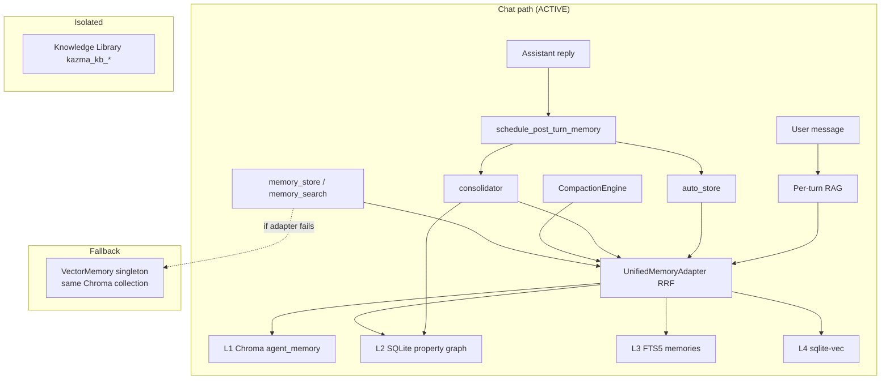

> **Live SoT (2026-07).** Chat memory is real and automatic by default when
> `.[rag]` is installed. Remaining backlog lives in
> [`docs/plans/MEMORY_REMAINING.md`](https://github.com/Mubder/kazma/blob/main/docs/plans/MEMORY_REMAINING.md).

---

## 1. Architecture

```mermaid
flowchart TB
    subgraph "Chat path (ACTIVE)"
        UV[User message]
        SUP[Per-turn RAG]
        REPLY[Assistant reply]
        POST[schedule_post_turn_memory]
        AS[auto_store]
        CON[consolidator]
        COMP[CompactionEngine]
        TOOLS[memory_store / memory_search]
        ADAPT[UnifiedMemoryAdapter RRF]
        L1[L1 Chroma agent_memory]
        L2[L2 SQLite property graph]
        L3[L3 FTS5 memories]
        L4[L4 sqlite-vec]
        UV --> SUP --> ADAPT
        REPLY --> POST
        POST --> AS --> ADAPT
        POST --> CON
        CON --> ADAPT
        CON --> L2
        COMP --> ADAPT
        TOOLS --> ADAPT
        ADAPT --> L1 & L2 & L3 & L4
    end

    subgraph "Fallback"
        VM[VectorMemory singleton<br/>same Chroma collection]
        TOOLS -.->|if adapter fails| VM
    end

    subgraph "Isolated"
        KB[Knowledge Library kazma_kb_*]
    end
```

| Layer | Backend | Role |
|-------|---------|------|
| **L1** | Chroma `agent_memory` under `kazma-data/vector_memory/` | Semantic vectors |
| **L2** | SQLite property graph `kazma-data/knowledge_graph.db` | Entities, SPO triples, FTS + multi-hop |
| **L3** | FTS5 `memories` / `memories_fts` in `memory.db` | BM25 lexical (+ Arabic via `kazma-memory`) |
| **L4** | sqlite-vec `kazma-data/vector.db` | Local per-worker vectors |
| **Blend** | Reciprocal Rank Fusion (`_RRF_K = 60`) | Single ranked list for chat |

**Fail-closed writes:** `adapter.store()` returns a document id only if L1, L3, or L4 confirmed a write. L2 alone is structural, not “durable text store” success.

---

## 2. What runs on every chat turn

### 2.1 Per-turn RAG (read)

- **When:** Supervisor iteration 0, if `memory.enabled` and `memory.per_turn_retrieval` (ConfigStore ← yaml).
- **How:** `authority.compactor.retrieve_memories(user_text, limit=top_k)`.
- **Injects:** system block `## Relevant context from memory`.
- **Code:** `agent/graph_builder.py`.

### 2.2 Post-turn write pipeline

One background task: `schedule_post_turn_memory(messages)`:

1. **auto_store** — heuristic durable facts + optional turn snapshots (`memory.auto_store`, mode `both` default).
2. **consolidator** — LLM (optional) + heuristic extract of clean facts + subject–predicate–object triples; prompt-injection fence; near-dup skip vs auto_store texts; writes adapter + graph.

**Code:** `memory/auto_store.py`, `memory/consolidator.py`, hook in `graph_builder.py`.

### 2.3 Tools

| Tool | Behavior |
|------|----------|
| `memory_search` | `get_adapter().search` first; VectorMemory fallback |
| `memory_store` | `get_adapter().store` fail-closed; VectorMemory fallback; never claims success with empty id |

### 2.4 Compaction

At ~80% of `memory.max_context_tokens`: summarize conversation, optionally store summary, retrieve top memories into the compacted system message. `memory_store` on the authority is the **UnifiedMemoryAdapter** (with VectorMemory lazy fallback).

---

## 3. Configuration

Precedence: **ConfigStore `memory.*` → `kazma.yaml` → defaults**  
(`kazma_core.memory.config.read_memory_cfg`).

| Key | Default | Meaning |
|-----|---------|---------|
| `memory.enabled` | `true` | Master switch (per-turn + auto-store + consolidator) |
| `memory.per_turn_retrieval` | `true` | Inject memories every user turn |
| `memory.auto_store` | `true` | Heuristic writes after reply |
| `memory.auto_store_mode` | `both` | `durable` \| `turns` \| `both` |
| `memory.retrieval_top_k` | `5` | Top-K for per-turn / compaction |
| `memory.max_context_tokens` | `128000` | Compaction window |
| `memory.consolidation.enabled` | `true` | Librarian on |
| `memory.consolidation.use_llm` | `true` | LLM extract (heuristic fallback) |
| `memory.consolidation.min_user_chars` | `24` | Skip tiny turns |
| `memory.consolidation.every_n_turns` | `1` | Cost: run every N turns |
| `memory.consolidation.skip_adapter_if_auto_stored` | `true` | Dedup bias vs auto_store |
| `memory.consolidation.skip_llm_in_demo` | `true` | No LLM under `KAZMA_DEMO_MODE` |
| `memory.embedding.provider` | `local` | `local` or remote OpenAI-compatible |
| `memory.embedding.model` | `all-MiniLM-L6-v2` | 384-d default |
| `memory.embedding.dim` | `384` | Must match embedder |

Env: `KAZMA_VECTOR_COLLECTION` (default `agent_memory`), `KAZMA_EMBED_*`, `KAZMA_DEMO_MODE` (skips VectorMemory boot).

Install: `pip install -e ".[rag]"` (chromadb, sentence-transformers, sqlite-vec).

---

## 4. Layer details

### 4.1 L1 — Chroma (`swarm/memory/vector.py` + `memory/vector_store.py`)

- Shared collection `agent_memory`.
- Embeddings via pluggable `get_embedder()` (local MiniLM or remote).
- `VectorMemory` is the boot singleton (tools fallback, health count); adapter L1 is the primary write path for chat.

### 4.2 L2 — SQLite property graph (`swarm/memory/graph.py`)

- Tables: `kg_nodes`, `kg_edges`, `kg_nodes_fts`.
- `upsert_triple(subject, predicate, object, fact=...)`.
- Search: FTS; traversal: BFS `query_related`.
- Singleton: `get_knowledge_graph()`.
- Dashboard: canvas + search + clear under Memory & Governance.
- HTTP: `GET /api/memory/graph`, `?q=`, `/search`, `/stats`, `POST /clear`.

### 4.3 L3 — FTS5

- Adapter uses `FTS5LexicalStore` → `kazma_memory.SQLiteMemoryBackend`.
- Degrade path `FTS5Memory` writes the **same** `memories` schema (legacy `memory_fts` migrated).

### 4.4 L4 — sqlite-vec

- Declared in `[rag]` extra; per-worker tables + side `_docs` for text return.

### 4.5 RRF adapter (`swarm/memory/adapter.py`)

- Parallel query L1–L4 → RRF → drop empty content → top-N.
- `store` / `index` report per-layer success; durable = L1|L3|L4.

---

## 5. Consolidator safety

- Extracted facts and triple fields pass `kazma_core.safety.prompt_fence.is_override_delta`.
- Injection-like strings are **rejected** (logged), never stored.
- Near-duplicate detection vs auto_store `texts` (containment + content-token overlap).

---

## 6. Knowledge Library (not chat memory)

Documentation corpora use **isolated** collections `kazma_kb_<library_id>` and SQLite chunks in settings DB. See [Knowledge Library](knowledge-library). Never mixed into `agent_memory` RRF.

---

## 7. Arabic tokenizer

`kazma-memory` Arabic normalization feeds FTS `content_arabic` on the L3 backend (diacritics, Alef/Yeh, Teh Marbuta, conservative waw split). See [Arabic & cultural features](arabic-cultural-features).

---

## 8. Health & ops

- `build_memory_health()` → Dashboard component board (embedder, VectorMemory, L1–L4, consolidator, packages).
- Zero-vector embedder → **error** / DEGRADED.
- L2 row shows node/edge counts.
- DR: back up `vector_memory/`, `memory.db`, `knowledge_graph.db`, `vector.db` with other `kazma-data`.

---

## 9. Honest limits

| Limit | Notes |
|-------|--------|
| Single-node files | Chroma / FTS / graph / sqlite-vec are process-local disks |
| Compaction checkpoint_manager | Often not passed; LangGraph checkpointer still persists turns |
| Dual Chroma clients | VectorMemory + L1 share collection; cleanup is polish |
| No nightly full-corpus merge | Only per-turn consolidator |
| Scale-out | Needs remote vector/graph — see MEMORY_REMAINING S1–S2 |

---

## 10. Related docs

- [Architecture § memory](architecture#7-the-memory-subsystems-overview)
- [Configuration](configuration) · [FAQ](faq) · [Diagnosis map §9](../ops/diagnosis-map)
- [API routes](../reference/api-routes) · [MEMORY_REMAINING plan](https://github.com/Mubder/kazma/blob/main/docs/plans/MEMORY_REMAINING.md)
