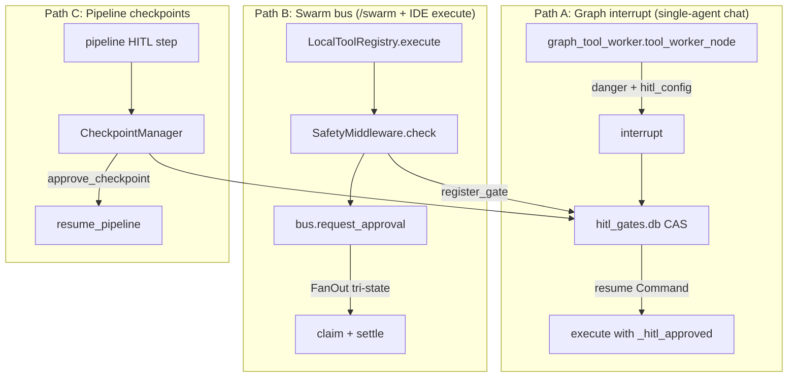

> Kazma's safety model: **three HITL execution paths + one gate registry**, default-deny tool tiers, fail-closed bus, CSRF / trusted-proxy, SSRF pin-IP, HMAC skills, and hardening. Invariants: [`AGENTS.md`](https://github.com/Mubder/kazma/blob/main/AGENTS.md) §7, §26, §30–§32.

**Also see:** [Document security](../security/document-security) — hostile intake,
sandbox, fencing, malware scan, redaction model for Document Intelligence.

---

## 1. Three HITL execution paths + one registry

Kazma has **three independent HITL execution paths**. Each covers a different
tool-running path. Breaking any one creates an unattended-danger-tool gap.
**Decision truth** is a fourth piece: the HITL Gate Registry
(`kazma-data/hitl_gates.db`). Execution truth remains the LangGraph
checkpoint (or pipeline SQLite). Surfaces **render**; they never infer
Approved from a missing row.

| Path | Where it lives | Approval surface |
|---|---|---|
| **A** | `agent/graph_tool_worker.py` (wired from `graph_builder.py`) | `POST /api/approve/{thread_id}` (`routes_direct/misc.py`) or gateway `/hitl approve\|deny` |
| **B** | `swarm/safety.py` + `tool_registry.py` | Bus adapter buttons (Telegram / Discord / Slack) |
| **C** | `swarm/checkpoint_manager.py` | `POST /api/swarm/tasks/{id}/approve` |

**Not extra HITL gates:**

- **Tool hooks** (`agent/tool_hooks.py`) — cannot auto-approve danger, skip commitment, or replace the YAML list. Broken hook fail-opens. `KAZMA_TOOL_HOOKS=0`.
- **Plan mode** — `/plan on` *removes* write/exec tools. `/plan go` returns them; danger still needs approval.
- **Commitment clarify/confirm** — same interrupt bus, different `kind` (below).

---

## Critical: `hitl_config` at every resumable graph

The gate is active only when `hitl_config` is passed to `build_supervisor_graph()`. Live reader: `get_hitl_config()`. YAML timeout default is **300s**.

| Build site | HITL? | Notes |
|---|---|---|
| `KazmaAgent._ensure_graph()` | ✅ | Run path; checkpointer so `interrupt()` can resume |
| `app.py` startup recompile into `_graph_holder` | ✅ | **SSE SoT** — checkpointer + HITL. Omitting it = dormant Web gate |
| `KazmaAgent.get_streaming_graph()` | ⚠️ `auto_deny` | Cached **without** a checkpointer (sync). Voice/boot-window consumers cannot resume `interrupt()`, so danger tools **deny** instead of minting an unresumable pause |

There is **no** `create_supervisor_graph()` factory. Do not pin `app.py` line numbers.

**H-8:** `LocalToolRegistry.execute` on the web/chat path must **not** mint a second gate. Graph ContextVars (`_graph_hitl_gate_ctx` / `_hitl_approved_ctx`) skip the bus re-prompt. Clarify/confirm from `execute()` fail closed (“run from chat”).

---

## 2. Path A — the graph gate (single-agent chat) {#the-graph-gate}

### 2.1 How it works

`tool_worker_node` lives in **`graph_tool_worker.py`**, not `graph_builder.py`. When `hitl_config` is supplied:

1. Commitment `authorize_effect` runs **first** (may rewrite args or raise a semantic card).
2. Each tool is tested with `requires_approval(name, hitl_config)` (`safety/hitl.py`). Unclassified tools are **gated** (`TOOL_TIERS`; default-deny F-04).
3. Danger tools call LangGraph **`interrupt()`** — the graph suspends. A registry row is registered (`pending`).
4. On approval, `_hitl_approved` is injected so `execute()` does not re-prompt the bus. The registry **claims** then **settles**.
5. On denial, a `ToolResult` with `is_error=True` is returned.

If `hitl_config` is falsy, **all** tools skip this gate. That is why every resumable build site must pass it.

Web paints from `_serverGates` / TurnDocument (`chat.js`). `close_turn` keeps the turn **open** while a pending row exists. Absence of a row is an unregistered pending gate (backfill), never an inferred Approved stamp.

### Auth: `KAZMA_SECRET` vs opaque sessions

**Never rely on cookie-based `KAZMA_SECRET` for multi-user safety.** A `kazma-secret=<KAZMA_SECRET>` cookie is the raw shared secret: theft = admin until rotation; no revocation table; no per-user identity.

**Use** opaque server-side sessions (`kazma-session` random ID → hashed row + expiry). Keep `KAZMA_SECRET` for machine-to-machine header auth. If unset, `get_kazma_secret()` may return `""` and approval endpoints become **unauthenticated** — always set it off localhost.

Behind a reverse proxy, **peer address is not a credential**. Set `KAZMA_TRUSTED_PROXIES`. Honour `X-Forwarded-*` only from those addresses. An undeclared proxy latches `undeclared_proxy_detected()` and **revokes peer trust** for the process (AGENTS.md §26A). Rate limit / login throttle must use `auth.client_address(request)`, never `request.client.host`.

### 2.2 Resume

`POST /api/approve/{thread_id}` (`kazma_ui/routes_direct/misc.py` `approve_tool`) — not `app.py`. Claims the registry row, then `graph.ainvoke(Command(resume=…), config)`. Ownership mismatch → **403**. WS `approve_tool` is off unless `KAZMA_WS_GRAPH=1`.

Paused turns persist in the **checkpointer**. Registry `boot_sweep()` orphans stale claimed/resuming rows and **never** touches pending (the card must survive restart).

---

## 3. Path B — the swarm bus gate (`/swarm` + IDE) {#the-swarm-bus-gate}

### 3.1 Execution path

`LocalToolRegistry.execute()`:

1. Pops `_hitl_approved`.
2. If not already approved, `get_safety()`.
3. `is_danger_tool(name)` **must** call `requires_approval()` (H-9 — tier floor, not a name list that can un-gate by omission).
4. `await safety.check(...)`. Denied → `is_error=True`.
5. **Fail-closed:** any exception in the safety check → blocked.

### 3.2 SafetyMiddleware

`swarm/safety.py` — class `SafetyMiddleware` (not `SafetyGate` / `SafetyChecker`).

| Method | Behavior |
|---|---|
| `check()` (async) | Danger tools: NullBus + `allow_headless_danger=False` → reject; else `bus.request_approval` |
| `check_sync()` | **Fail-closed.** Sync path cannot wait on a bus; blocks unless headless escape |
| `is_danger_tool` | Classification via `requires_approval` / `TOOL_TIERS` / `ALWAYS_HITL_TOOLS` |

`allow_headless_danger=False` is the default. Tests/dev set it true. Do not in production.

Danger list: `_EXTENDED_DANGER = list(CANONICAL_DANGER_TOOLS)` — **not** a second SoT. Spawn tools only if they are on CANONICAL.

### 3.3 Bus adapters {#bus-adapter-priority}

`TelegramBusAdapter` / `DiscordBusAdapter` / `SlackBusAdapter`. Process-local singleton `get_message_bus()`.

**App wiring (`app.py`):** collect every configured platform. **One** → that adapter. **Two or more** → `FanOutBusAdapter`. **None** → `NullBusAdapter` (fail-closed danger).

FanOut `request_approval` is **tri-state** (Wave 6 H-12): `True` settles; `False` is a vote until `expected_voters` or the deadline. A Discord Deny must not kill a Telegram Approve. This is **not** web `claim_gate` (first claim 200 / second 409).

Pytest skips real adapters (`_skip_real_adapters`).

### 3.4 Callbacks

Each adapter `handle_callback()` resolves the platform button onto the shared approval. Telegram `swarm_approve_<task_id>` / `swarm_reject_<task_id>`; Discord components; Slack interactive.

---

## 4. Path C — pipeline checkpoints

See [Swarm Orchestration → Pipeline checkpoints](swarm-orchestration#8-pipeline-checkpoints-hitl).

- `CheckpointManager.handle_pipeline_checkpoint` also `_gate_register_pipeline`.
- Auto-reject timeout if `checkpoint_timeout > 0`.
- Approve / reject **settle** the registry row. **T-2:** timeout must finalize the task **and** `settle_gate`.
- `restore_paused_tasks()` re-arms timeouts after restart.
- Endpoints: `POST /api/swarm/tasks/{id}/approve` / `/reject`.

---

## Semantic clarify / confirm interrupts (the Commitment Layer)

The **same unified HITL bus** that carries danger-tool approvals (Gates A/B/C
above) also carries a second *kind* of interrupt: **semantic clarify/confirm
cards** produced by the [Commitment Layer](./commitment-layer).

These are **not** danger-tool approvals — they fire when the agent's *intent*
is ambiguous or critical *before* a durable mutation, not because the tool is
dangerous. Example: the user says *"remind me about the meeting"* and the model
calls the schedule tool with an ambiguous time. The Commitment gate
(`authorize_effect`) returns `clarify`, and the graph suspends via `interrupt()`
with a payload carrying a **question** and a list of **options** (each with a
`slots_patch`).

| Interrupt kind | When it fires | Payload `kind` |
|---|---|---|
| Danger-tool approval | A tool is on the danger list (Gates A/B/C) | `hitl_approval` |
| **Semantic clarify** | Intent is ambiguous (e.g. relative time + nearby event) | `semantic_clarify` |
| **Semantic confirm** | A critical act needs explicit OK | `semantic_confirm` |

**Renders on every platform** — Web (chat + sidebar), Telegram, Discord, and
Slack. Each semantic card renders **one button per option**; the existing
Approve/Deny buttons map to *best-option* / *cancel* (`build_resume_value` in
`commitment/resume.py`). On resume, the chosen option's `slots_patch` is applied
to the tool arguments and the turn continues; `cancel` is terminal.

The full decision mapping (`allow` / `clarify` / `confirm` / `deny` +
rewrite-on-allow), the act resolvers (remind, exec denylist, config protected
keys, outbound allowlist), scope tokens, the soul-confirm gate, modes, and
kill-switches are documented in the dedicated guide:
**[Commitment Layer (resolve-before-act)](./commitment-layer)**.

---

## 5. Danger-tool lists {#danger-tool-lists-three-of-them}

Canonical + YAML + Settings must stay one **set**. Swarm `_EXTENDED_DANGER` is a copy of CANONICAL. MCP is pattern-based (unknown → danger). `TOOL_TIERS` is the floor for anything registered.

### 5.1 Path A (graph) — `kazma.yaml safety.hitl.require_approval_for`

Default (`kazma.yaml` `safety.hitl.require_approval_for`, must match `CANONICAL_DANGER_TOOLS`): includes `file_write`, `file_apply_patch`, `file_delete`, `shell_exec`, `code_exec`, `python_exec`, `computer_use`, git/GitHub mutators, vault, installers, email send/delete, `request_path_access`, `x_post`, `x_delete_post`, `x_schedule_post`, `x_cancel_scheduled_post`. Parity-tested.

**Always-HITL (X ToU):** `ALWAYS_HITL_TOOLS` (`x_post`, `x_delete_post`, `x_schedule_post`, `x_cancel_scheduled_post`) require approval even when YOLO, standing grants, or HITL-disabled would skip other danger tools. That is the **chat/agent** path. On the Web, X Studio (`/x`) and `/api/scheduled/x` treat the operator click as the approval (they call `publish_x_post` / `book_x_post` / `delete_x_post` directly — they do not invoke the chat tools). Official API only — see [X publisher](x-publisher).

**Git-write always-gate (2026-08):** `git commit`, `push`, `merge`,
`rebase`, `reset`, `checkout --`, `restore`, `clean`, `rm` and friends
require an approval card on **every** execution path — **YOLO cannot
auto-approve repo mutations** (a misread intent must cost a dialog, never a
commit; 2026-08-27 incident). Read-only git (`status`/`log`/`diff`) is
exempt. YOLO windows also default to **1 hour** (was 4) —
`KAZMA_YOLO_TTL_SECONDS` overrides. See [Task Ledger](task-ledger).

Code fallback if unset: `DEFAULT_DANGER_TOOLS = ["file_write", "file_delete", "shell_exec", "vault_retrieve", "vault_delete"]` (`safety/hitl.py:41`). The vault tools protect secret retrieval/deletion.

> **Narrowing guard (2026-08-19):** the effective list can drift below the
> canonical set via Settings/YAML — a warning repeats every 15 minutes
> naming the drifted tools. Strict deployments can enforce
> `KAZMA_HITL_CANONICAL_FLOOR=1`, which unions the canonical danger tools
> back into the effective list so narrowing below them is impossible.

### 5.2 Path B (swarm bus) — `_EXTENDED_DANGER`

`_EXTENDED_DANGER = list(CANONICAL_DANGER_TOOLS)` — a materialized copy because CANONICAL is a tuple. **Same contents.** Adding a danger tool means CANONICAL **and** `kazma.yaml` (parity tests compare sets). Spawn tools only if they are on CANONICAL.

Plus `_SENSITIVE_READS = ["sqlite_query", "file_search"]` — allowed but **logged**.

### 5.3 MCP — `classify_mcp_tool()`

`mcp/manager.py:71-88` — dynamic name-pattern matching (MCP tools are runtime-discovered):

- **danger** if any of: `write, delete, remove, exec, run, shell, bash, command, kill, terminate, install, deploy, upload, download, fetch, request, post, put, patch`.
- **safe** if any of: `read, list, search, get, info, status, check, describe, query, count, exists, help`.
- **unknown** otherwise.

> **Unknown defaults to danger.** `UnifiedToolExecutor.execute()` requires approval for **both** `danger` and `unknown`. Never weaken this. Local tools: `requires_approval()` ends on `TOOL_TIERS` — an unclassified registered tool is gated (F-04). Add a tier (`read` / `write` / `danger`) when you register a tool.

---

## 6. Cryptographic integrity (beyond HITL)

### 6.1 Skill HMAC signing (Hub)

Verified in [Skills, MCP & Tools → Cryptographic signing](skills-mcp-and-tools#cryptographic-signing). Summary:

- `kazma hub sign` writes `checksum` (SHA-256) + `signature` (HMAC-SHA256 over checksum, keyed by `KAZMA_SECRET`) into `skill_manifest.yaml`.
- `SkillLoader._load_module_from_file` verifies both with `hmac.compare_digest` (constant-time) and refuses to load tampered/unsigned-by-required skills.

### 6.2 Delegation Ed25519 + AES-256-GCM

`delegation/security.py` (`DelegationSecurity`, line 30):

- **Signing:** Ed25519 (lines 81-119).
- **Encryption:** X25519 key agreement + AES-256-GCM (lines 121-161).
- Requests signed on send (`protocol.py:153`), verified on receipt with **fail-closed** on missing/invalid signature (`:179-208`).

This is inter-agent delegation — unrelated to MCP or skills.

### 6.3 HITL endpoint secret

`POST /api/approve/{thread_id}` is protected by session / `KAZMA_SECRET` (`secrets.compare_digest`). `get_kazma_secret()` resolves env → `KAZMA_AUTH_DISABLED` → pytest skip → DB `security.secret` → auto-generate. Off localhost, always set `KAZMA_SECRET`.

---

## 7. Fail-closed behaviors (inventory)

| Component | Fail-closed behavior |
|---|---|
| `SafetyMiddleware.check_sync` | Blocks danger tools when no real bus + `allow_headless_danger=False`. |
| `ToolRegistry.execute` | Any safety-check exception → "blocked — SafetyMiddleware unavailable". |
| `classify_mcp_tool` | `unknown` → requires approval. |
| `SkillLoader` | Tampered/missing signature → `SkillLoadError`, no load. |
| Hub write API | No `KAZMA_SECRET` → all writes rejected. |
| Delegation receive | Missing/invalid signature → reject. |
| HITL approval endpoint | Cross-user approval → 403; no `KAZMA_SECRET` → see warning below. |

> **⚠ Production warning:** if `KAZMA_SECRET` is **unset**, `get_kazma_secret()` may return `""` and approval endpoints become **unauthenticated**. Always set `KAZMA_SECRET` for any non-localhost deployment. (`kazma serve` only binds `0.0.0.0` when `KAZMA_SECRET` is set — this is by design.)

---

## 8. Security config files

`kazma-security.yaml` declares posture across `scanning`, `disclosure`, `bug_bounty` (**disabled** — no paid program), and `hardening` (8 checks: `secrets_in_logs`, `input_validation`, `rbac_enforcement`, `tls_required`, `dependency_audit`, `least_privilege`, `audit_trail`, `config_integrity`). See [Configuration → security config](configuration#7-security-config-files) and root [`SECURITY.md`](https://github.com/Mubder/kazma/blob/main/SECURITY.md). `kazma-permissions.yaml` defines division-based MCP allow/deny lists (the ALMuhalab divisions) with cross-division rules (`require_explicit_approval`, `max_approval_duration_hours: 24`, `audit_all_access`).

### 8.1 Hardening runner (`security/hardening.py`)

`SecurityHardeningRunner` runs the checks at startup; keys are `run_on_startup: true`, `fail_on_critical: true`, `auto_fix: false`. Each yaml check label maps to an implemented method:

| Check (yaml label) | Implemented method | Severity |
|---|---|---|
| `secrets_in_logs` | `check_no_hardcoded_secrets` (regex scan for `api_key`/`secret`/`token`/`password`/`AWS`/`PRIVATE_KEY`) | critical |
| `tls_required` | `check_encrypted_communications` (TLS/SSL/HTTPS/mTLS scan) | high |
| `rbac_enforcement` | `check_rbac_enforcement` | high |
| `dependency_audit` | `check_dependency_vulnerabilities` → `DependencyScanner` | critical |
| (MCP sandboxing) | `check_mcp_sandboxing` | high |
| (Skill manifests) | `check_skill_manifest_validity` | medium |
| (Audit logging) | `check_audit_logging` | high |
| (Escalation) | `check_permission_escalation` (`os.system`, `subprocess(...shell=True)`, `eval`, `exec`, `__import__`, `setattr(...__...)`) | critical |
| `least_privilege`, `config_integrity` | ⚠ roadmap (no dedicated implementation) | — |

`fix_issues(auto_fix)` can create a `.env` and amend `.gitignore` for the secrets check.

### 8.2 Dependency scanning (`security/dependency_scanner.py`)

| Scanner | Sources | Cache / history |
|---|---|---|
| `DependencyScanner` | **OSV** (`api.osv.dev`) | JSON cache `kazma-data/vuln_cache.json` |
| `DependabotStyleScanner` | **OSV + GitHub Advisories + NVD** | SQLite `kazma-data/security_scan.db`; dedupes by `(package, vuln_id)` |

Both parse `requirements.txt` and `pyproject.toml`. `DependabotStyleScanner` additionally runs `scan_skill_manifests()` (flags suspicious MCP configs: `eval`/`exec`/`system` in command, env `TOKEN`/`SECRET`/`KEY`, `--privileged`, `network: host`; escalation patterns like `sudo`/`chmod 777`/`setuid`), `create_github_issue()` via the `gh` CLI, `generate_advisory()`, and `check_for_updates()`.

`kazma-security.yaml`: `scanning` interval 24 h, `severity_threshold: medium`, `auto_create_issues: true`.

### 8.3 Disclosure workflow (`security/disclosure.py`)

SQLite `kazma-data/disclosure.db` enforces the transition chain `submitted → acknowledged → investigating → confirmed → patched → closed`. `publish_advisory()` mints an internal **`KAZMA-ADV-YYYY-…`** id (not a MITRE CVE) plus a markdown template, only from `patched`/`closed` states. `encrypt_report()` HMAC-SHA256-signs the JSON payload with `KAZMA_DISCLOSURE_KEY`.

`kazma-security.yaml`: response window 48 h, assessment 7 d, `security_txt_url` (RFC 9116 contact file — **not** a PGP key), channels email + GitHub private reporting. **`bug_bounty.enabled: false`** (no paid bounty). Canonical policy: root `SECURITY.md` and [Vulnerability reporting](../security/vulnerability-reporting).

> **Verify runtime enforcement** of `kazma-security.yaml` checks against the hardening runner before relying on them. The file declares policy; confirm the runner enforces each check at startup (`hardening.run_on_startup: true`, `fail_on_critical: true`).

---

## 9. Hardening recommendations

1. **Always set `KAZMA_SECRET`** for non-localhost deployments. Generate with `openssl rand -hex 32`.
2. **Run stdio MCP servers in a sandbox.** The stdio transport has no auth and inherits the process environment.
3. **Prefer SSE MCP with bearer auth** for any remote MCP server.
4. **Sign all skills** (`kazma hub sign`) and keep `KAZMA_SECRET` consistent across load — signature verification fails otherwise.
5. **Keep all three HITL execution paths + the registry active.** Do not pass `hitl_config=None` on a resumable production graph. Do not mint a second web gate from `execute()`.
6. **Do not set `allow_headless_danger=True` in production.** It's the test/dev escape hatch.
7. **Run as the non-root `kazma` user** in Docker (the Dockerfile already does this).
8. **Bind `127.0.0.1`** unless you have a reverse proxy + `KAZMA_SECRET` in place.
9. **Multi-operator: set platform allowlists + `KAZMA_GATEWAY_STRICT_ALLOWLIST=1`** (2026-08-19) — by default the Telegram/Discord/Slack adapters run allow-all for backward compatibility with single-operator installs; strict mode fails closed on an empty allowlist.
10. **Set `KAZMA_HITL_CANONICAL_FLOOR=1`** on strict deployments so the danger-tool approval list cannot be narrowed below the canonical set.
11. **Set `KAZMA_TRUSTED_PROXIES`** when behind nginx/Caddy/Docker. Peer `127.0.0.1` is not a credential.
12. **Do not pin scraping through `proxy=`.** Direct hops use `PinHostAsyncTransport`; peer-private abort always.

---

## Default-deny, CSRF, SSRF (2026-08-29 / Wave 8)

These sit **beside** HITL, not inside it.

| Rule | Where |
|------|--------|
| Unclassified tool is gated | `requires_approval()` → `TOOL_TIERS` (deny wins) |
| Allowlisting a binary is not allowlisting what it runs | `shell_exec` `_EXEC_CAPABLE_ARGS` (`find -exec`, `git -c`, …) |
| Secret masking recurses | `settings.mask_deep()` — lists and JSON strings too |
| CSRF | `csrf.py`: non-GET `/api/*` mismatched Origin/Referer host → 403. Use `request.url.hostname` (Starlette has no `.host`) |
| `/health/details` is sensitive | L-1; `/health/live` and `/health/ready` stay public |
| SSRF pin-IP | `validate_url` returns public IPs; `PinHostAsyncTransport` when no proxy; `assert_peer_public` after each hop |
| Errors | API `safe_error` / `validation_error`; no internals in 4xx/5xx bodies |
| Fenced tool output | Fetched pages / search / MCP resources go through `prompt_fence` |

CI: `tests/test_audit_2026_08_29_regressions.py`, `tests/test_audit_wave8.py`, `test_every_registered_tool_has_a_tier`.

---

## Documentation Audit Notes

- **Class name:** swarm safety is `SafetyMiddleware`, not `SafetyGate`/`SafetyChecker`.
- **Approve endpoint:** `routes_direct/misc.py` `approve_tool`, not `app.py`.
- **Do not pin line numbers.** `tool_worker_node` is `graph_tool_worker.py`; SSE SoT is the app.py recompile, not `get_streaming_graph()` (that path is checkpointer-less `auto_deny`).
- **FanOut, not Telegram-only.** Multiple platforms → `FanOutBusAdapter` tri-state.
- **`_EXTENDED_DANGER` is CANONICAL**, not a longer private list. MCP `classify_mcp_tool` remains pattern-based (unknown → danger).
- **"Trust tiers" do not exist** as a product feature — boolean `certified` plus unused `trust: trusted`.
- **MCP stdio has no auth.** Sandbox accordingly.
- Binding audit: [`AUDIT_DEEP_2026-09-01_EXEC.md`](https://github.com/Mubder/kazma/blob/main/docs/audits/AUDIT_DEEP_2026-09-01_EXEC.md).
